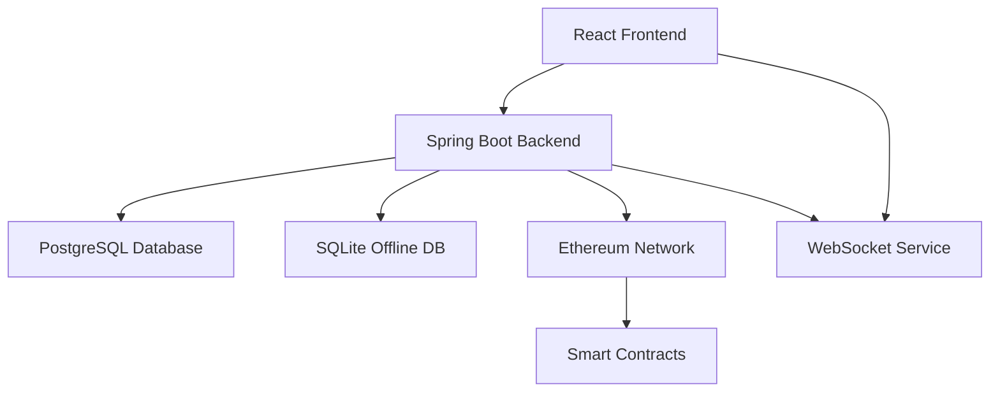

# Modulo

A comprehensive note-taking and knowledge management application with blockchain integration, real-time synchronization, and multi-database support.

<!-- Updated for Issue #97 multi-arch Docker builds with SBOM -->

[](https://github.com/Ikey168/Modulo/actions/workflows/ci.yml)
[](https://github.com/Ikey168/Modulo/actions/workflows/release-please.yml)
[](https://opensource.org/licenses/MIT)

## Features

- 📝 **Rich Note-Taking**: Create, edit, and organize notes with full-text search
- 🔗 **Blockchain Integration**: Secure note storage and verification using smart contracts
- 🌐 **Real-time Sync**: WebSocket-based synchronization across devices
- 🔄 **Offline Support**: SQLite database for offline functionality
- 🔐 **Multi-Auth**: Google OAuth, Azure AD, and MetaMask authentication
- 🗄️ **Multi-Database**: PostgreSQL for production, SQLite for offline
- 🐳 **Containerized**: Docker and Kubernetes deployment ready
- 📱 **Responsive**: Modern React-based UI with TypeScript

## Project Structure

```
├── frontend/           # React + TypeScript + Vite frontend
├── backend/           # Spring Boot REST API + WebSocket
├── smart-contracts/   # Ethereum smart contracts (Hardhat)
├── database/         # Database schemas and migrations
├── k8s/              # Kubernetes deployment manifests
├── azure/            # Azure deployment scripts
└── docs/             # Documentation
```

## Quick Start

### Prerequisites

- **Node.js** 18+ 
- **Java** 11+
- **Maven** 3.8+
- **Docker** & **Docker Compose**

### Setup

1. **Clone and setup the project:**
   ```bash
   git clone https://github.com/Ikey168/Modulo.git
   cd Modulo
   ./setup.sh
   ```

2. **Start with Docker Compose:**
   ```bash
   npm run start
   ```

3. **Access the application:**
   - Frontend: http://localhost:3000
   - Backend API: http://localhost:8080
   - Database: localhost:5432

### Development Setup

1. **Install dependencies:**
   ```bash
   npm install                    # Root dependencies & Git hooks
   cd frontend && npm install     # Frontend dependencies
   ```

2. **Start development servers:**
   ```bash
   # Backend (Spring Boot)
   cd backend
   mvn spring-boot:run

   # Frontend (Vite dev server)
   cd frontend  
   npm run dev

   # Database (PostgreSQL)
   docker-compose up postgres
   ```

## Available Scripts

```bash
npm run build          # Build both frontend and backend
npm run build:frontend # Build frontend only
npm run build:backend  # Build backend only  
npm run start          # Start with Docker Compose
npm run start:dev      # Start development environment
npm run test           # Run all tests
npm run clean          # Clean all build artifacts
```

## Architecture



### Technology Stack

**Frontend:**
- React 18 with TypeScript
- Vite for build tooling
- Tailwind CSS for styling
- Redux Toolkit for state management
- React Query for API state
- Ethers.js for Web3 integration

**Backend:**
- Spring Boot 2.7 with Java 11
- Spring Security for authentication
- Spring WebSocket for real-time features
- JPA/Hibernate for database access
- Web3j for blockchain integration
- Flyway for database migrations

**Infrastructure:**
- PostgreSQL (primary database)
- SQLite (offline support)
- Redis (caching & sessions)
- Docker & Docker Compose
- Kubernetes deployment
- GitHub Actions CI/CD

## Releases & Versioning

This project uses [Conventional Commits](https://www.conventionalcommits.org/) and automated releases:

- **Automatic versioning** based on commit types
- **Automated changelog** generation
- **GitHub releases** with artifacts (JAR, SBOM, Docker digests)
- **Semantic versioning** (SemVer)

### Commit Message Format

```
<type>[optional scope]: <description>

Examples:
feat(auth): add MetaMask authentication support
fix(websocket): resolve connection timeout issues  
docs: update deployment instructions
```

See [Conventional Commits Guide](docs/CONVENTIONAL_COMMITS.md) for details.

## Deployment

### Docker Compose (Recommended)

```bash
# Production
docker-compose up -d

# Development  
docker-compose -f docker-compose.dev.yml up -d
```

### Kubernetes

```bash
cd k8s
kubectl apply -f .
```

### Azure

```bash
cd azure
./deploy-infrastructure.sh
./deploy-app-service.sh
```

## Authentication

Modulo supports multiple authentication methods:

1. **Google OAuth 2.0** - Social login
2. **Azure Active Directory** - Enterprise SSO
3. **MetaMask** - Web3 wallet authentication

Configure in `backend/src/main/resources/application.yml`:

```yaml
app:
  oauth:
    google:
      client-id: your-google-client-id
      client-secret: your-google-client-secret
    azure:
      client-id: your-azure-client-id
      client-secret: your-azure-client-secret
```

## API Documentation

- **Swagger UI**: http://localhost:8080/swagger-ui.html
- **OpenAPI Spec**: http://localhost:8080/v3/api-docs

## Contributing

1. **Fork the repository**
2. **Create feature branch**: `git checkout -b feature/amazing-feature`
3. **Follow conventional commits**: See [commit guide](docs/CONVENTIONAL_COMMITS.md)
4. **Create Pull Request**

### Development Workflow

```bash
# 1. Create branch from main
git checkout main
git pull origin main
git checkout -b feature/your-feature

# 2. Make changes with conventional commits
git commit -m "feat(scope): add new feature"

# 3. Push and create PR
git push origin feature/your-feature
```

## License

This project is licensed under the MIT License - see the [LICENSE](LICENSE) file for details.

## Support

- 📖 **Documentation**: [/docs](docs/)
- 🐛 **Bug Reports**: [GitHub Issues](https://github.com/Ikey168/Modulo/issues)
- 💬 **Discussions**: [GitHub Discussions](https://github.com/Ikey168/Modulo/discussions)

---

Built with ❤️ using modern web technologies and best practices.
