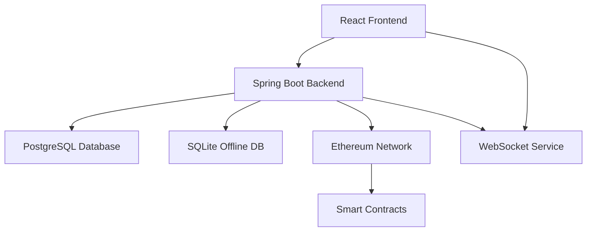

# Modulo

A comprehensive note-taking and knowledge management application with blockchain integration, real-time synchronization, and multi-database support.

<!-- Updated for Issue #97 multi-arch Docker builds with SBOM -->

[](https://github.com/Ikey168/Modulo/actions/workflows/ci.yml)
[](https://github.com/Ikey168/Modulo/actions/workflows/codeql.yml)
[](https://github.com/Ikey168/Modulo/actions/workflows/release-please.yml)
[](https://opensource.org/licenses/MIT)

## Features

- 📝 **Rich Note-Taking**: Create, edit, and organize notes with full-text search
- 🔗 **Blockchain Integration**: Secure note storage and verification using smart contracts
- 🌐 **Real-time Sync**: WebSocket-based synchronization across devices
- 🔄 **Offline Support**: SQLite database for offline functionality
- 🔐 **Multi-Auth**: Google OAuth, Azure AD, and MetaMask authentication
- 🗄️ **Multi-Database**: PostgreSQL for production, SQLite for offline
- 🐳 **Containerized**: Docker and Kubernetes deployment ready
- 📱 **Responsive**: Modern React-based UI with TypeScript

## Project Structure

```
├── frontend/           # React + TypeScript + Vite frontend
├── backend/           # Spring Boot REST API + WebSocket
├── smart-contracts/   # Ethereum smart contracts (Hardhat)
├── database/         # Database schemas and migrations
├── k8s/              # Kubernetes deployment manifests
├── azure/            # Azure deployment scripts
└── docs/             # Documentation
```

## Quick Start

### Prerequisites

- **Node.js** 18+ 
- **Java** 11+
- **Maven** 3.8+
- **Docker** & **Docker Compose**

### Setup

1. **Clone and setup the project:**
   ```bash
   git clone https://github.com/Ikey168/Modulo.git
   cd Modulo
   ./setup.sh
   ```

2. **Start with Docker Compose:**
   ```bash
   npm run start
   ```

3. **Access the application:**
   - Frontend: http://localhost:3000
   - Backend API: http://localhost:8080
   - Database: localhost:5432

### Development Setup

1. **Install dependencies:**
   ```bash
   npm install                    # Root dependencies & Git hooks
   cd frontend && npm install     # Frontend dependencies
   ```

2. **Start development servers:**
   ```bash
   # Backend (Spring Boot)
   cd backend
   mvn spring-boot:run

   # Frontend (Vite dev server)
   cd frontend  
   npm run dev

   # Database (PostgreSQL)
   docker compose up postgres
   ```

## Available Scripts

```bash
npm run build          # Build both frontend and backend
npm run build:frontend # Build frontend only
npm run build:backend  # Build backend only  
npm run start          # Start with Docker Compose
npm run start:dev      # Start development environment
npm run test           # Run all tests
npm run clean          # Clean all build artifacts
```

## Architecture



### Technology Stack

**Frontend:**
- React 18 with TypeScript
- Vite for build tooling
- Tailwind CSS for styling
- Redux Toolkit for state management
- React Query for API state
- Ethers.js for Web3 integration

**Backend:**
- Spring Boot 2.7 with Java 11
- Spring Security for authentication
- Spring WebSocket for real-time features
- JPA/Hibernate for database access
- Web3j for blockchain integration
- Flyway for database migrations

**Infrastructure:**
- PostgreSQL (primary database)
- SQLite (offline support)
- Redis (caching & sessions)
- Docker & Docker Compose
- Kubernetes deployment
- GitHub Actions CI/CD with CodeQL security scanning

## Releases & Versioning

This project uses [Conventional Commits](https://www.conventionalcommits.org/) and automated releases:

- **Automatic versioning** based on commit types
- **Automated changelog** generation
- **GitHub releases** with artifacts (JAR, SBOM, Docker digests)
- **Semantic versioning** (SemVer)

### Commit Message Format

```
<type>[optional scope]: <description>

Examples:
feat(auth): add MetaMask authentication support
fix(websocket): resolve connection timeout issues  
docs: update deployment instructions
```

See [Conventional Commits Guide](docs/CONVENTIONAL_COMMITS.md) for details.

## Deployment

### Docker Compose (Recommended)

```bash
# Production
docker compose up -d

# Development  
docker compose -f docker-compose.dev.yml up -d
```

### Kubernetes

```bash
cd k8s
kubectl apply -f .
```

### Azure

```bash
cd azure
./deploy-infrastructure.sh
./deploy-app-service.sh
```

## Observability & Monitoring

Modulo includes a comprehensive observability stack with **Golden Signals monitoring**, distributed tracing, and alerting:

### 🚀 Golden Signals Dashboards

- **🔥 Application Performance**: Request rate, error rate, P95 latency, CPU/memory saturation
- **☕ JVM Performance**: Heap usage, GC metrics, thread states, class loading
- **🗄️ Database Performance**: Connection pool monitoring, query performance, HikariCP metrics  
- **🔗 Sync & Blockchain**: WebSocket connections, blockchain transactions, sync operations

### 📊 Technology Stack

- **Prometheus**: Metrics collection and alerting (v2.47.2)
- **Grafana**: Dashboard visualization (v10.1.5)
- **Alertmanager**: Alert routing and notifications (v0.26.0)
- **Tempo**: Distributed tracing with OpenTelemetry
- **Loki**: Log aggregation and correlation

### 🚨 Alerting Rules

**Golden Signal Alerts:**
- High error rate (>5% critical, >1% warning)
- High P95 latency (>1000ms critical, >500ms warning)
- CPU/Memory saturation (>85%)
- Database connection pool alerts
- WebSocket connection monitoring
- Blockchain operation failures

### Quick Start

```bash
# Deploy observability stack
cd k8s
./deploy-observability.sh

# Access dashboards
kubectl port-forward -n observability svc/grafana 3000:3000 &
kubectl port-forward -n observability svc/prometheus 9090:9090 &
kubectl port-forward -n observability svc/alertmanager 9093:9093 &
```

**Dashboard Access:**
- Grafana: http://localhost:3000 (admin/admin)
- Prometheus: http://localhost:9090  
- Alertmanager: http://localhost:9093

**Test Alert:**
```bash
# Simulate high error rate to test alerting
curl -X POST http://localhost:8080/api/test/error-rate
```

For detailed configuration, see [Observability Documentation](k8s/observability/README.md).

## 📊 Performance Testing & Load Testing

Modulo includes comprehensive performance testing using k6 to validate SLO compliance and detect regressions:

### 🎯 Key Features

- **SLO-Aligned Tests**: k6 thresholds directly map to service level objectives
- **Nightly Baselines**: Automated performance baseline creation and comparison
- **Regression Detection**: Fail builds on performance degradations >15%
- **SLO Validation**: Block deployments on SLO violations
- **Multi-Profile Testing**: Smoke, normal load, and stress testing

### 🚀 Quick Start

```bash
cd k6-tests
npm install

# Run performance tests locally
npm run test:crud        # CRUD API operations
npm run test:sync        # Blockchain sync operations  
npm run test:websocket   # WebSocket real-time features

# Run all tests
npm run test:all

# Baseline management
npm run baseline:save    # Save current results as baseline
npm run baseline:compare # Compare against baseline
```

### 📊 Test Profiles

| Profile | VUs | Duration | Use Case |
|---------|-----|----------|----------|
| **Smoke** | 1 | 30s | PR validation |
| **Normal** | 10 | 5m | Nightly baselines |
| **Stress** | 50 | 2m | Capacity planning |

### 🎯 SLO Compliance

| Test Type | SLO Metric | Threshold | k6 Threshold |
|-----------|------------|-----------|--------------|
| CRUD Operations | Read P95 Latency | < 200ms | `p(95)<200` |
| CRUD Operations | Write P95 Latency | < 500ms | `p(95)<500` |
| Sync Operations | Sync P95 Latency | < 1000ms | `p(95)<1000` |
| All Operations | Availability | > 99.9% | `rate<0.001` |

### 🔄 CI/CD Integration

**Nightly Performance Testing:**
- Schedule: 2 AM UTC daily
- Environment: Staging  
- Profile: Normal load (10 VUs, 5 minutes)
- Artifacts: Baselines, results, reports (30-90 day retention)

**PR Performance Validation:**
- Trigger: Backend/frontend changes
- Environment: Development (Docker)
- Profile: Smoke testing (1 VU, 30 seconds)
- Failure: SLO violations or >15% regressions

See [Performance Testing Guide](docs/PERFORMANCE_TESTING.md) for detailed information.

## 🔍 Synthetic Monitoring & Uptime

Modulo includes comprehensive synthetic monitoring to ensure service availability and validate user journeys:

### 🎯 Key Features

- **99.9% Uptime SLO**: Continuous monitoring with health probe validation
- **End-to-End Journey Testing**: Complete user flows (login → create note → sync → search)
- **Real-time Alerting**: Immediate notification on SLO violations
- **Multiple Environments**: Staging, production, and development monitoring
- **Automated Scheduling**: Business hours (5min) and off-hours (15min) monitoring

### 🚀 Quick Start

```bash
cd k6-tests

# Local uptime monitoring
npm run synthetic:uptime

# Local user journey testing
npm run synthetic:journey

# Production monitoring
npm run monitor:uptime -- --env TARGET_URL=https://api.modulo.app
npm run monitor:journey -- --env TARGET_URL=https://api.modulo.app --env FRONTEND_URL=https://modulo.app
```

### 🔄 Monitoring Types

| Type | Frequency | Duration | Focus |
|------|-----------|----------|-------|
| **Uptime Probe** | Every 5s | Continuous | Health endpoints, availability |
| **User Journey** | Every 5m | 30m sessions | End-to-end functionality |
| **Extended** | Post-deploy | 60m sessions | Comprehensive validation |

### 🎯 SLO Compliance

| Metric | SLO Target | Monitoring |
|--------|------------|------------|
| Application Uptime | > 99.9% | Health probes every 5 seconds |
| Journey Success Rate | > 99.9% | E2E tests every 5 minutes |
| Response Time P95 | < 2000ms | Continuous probe monitoring |
| Journey Duration P95 | < 10000ms | Full user flow validation |

### 🤖 Automated Monitoring

**GitHub Actions Schedule:**
- **Business Hours** (9 AM - 6 PM UTC, Mon-Fri): Every 5 minutes
- **Off Hours & Weekends**: Every 15 minutes  
- **Post-Deployment**: Immediate validation after staging/production deploys
- **Manual Triggers**: On-demand with environment selection

**Health Endpoints:**
- `/api/actuator/health/liveness` - Pod liveness (Kubernetes integration)
- `/api/actuator/health/readiness` - Service readiness (traffic routing)
- `/api/actuator/health` - Overall application health
- `/api/health/detailed` - Comprehensive health checks (database, memory, services)

### 🚨 Alerting & SLO Violations

**Automatic Alerts:**
- Uptime drops below 99.9%
- User journey success rate < 99.9%
- Response times exceed P95 thresholds
- Health endpoint failures

**Integration Ready:**
- GitHub Actions workflow failure notifications
- PagerDuty, Slack, or custom webhook integration
- Detailed monitoring artifacts and reports

See [Synthetic Monitoring Guide](k6-tests/synthetic/README.md) for detailed information.

## 🔒 CodeQL Security Scanning

Modulo implements comprehensive static security analysis using GitHub CodeQL to detect vulnerabilities and maintain code quality:

### 🛡️ Security Coverage
- **Multi-language Analysis**: Java (Spring Boot backend) and TypeScript (React frontend)
- **CWE Detection**: Cross-site scripting, SQL injection, code injection, path traversal, and more
- **Security-focused Queries**: Extended security and quality query suites
- **PR Security Gates**: Automatic blocking of pull requests with high-severity findings

### 🔍 Analysis Scope

| Language | Framework | Coverage | Key Vulnerabilities |
|----------|-----------|----------|-------------------|
| **Java** | Spring Boot 2.7 | Backend security | SQL injection, XSS, deserialization, path traversal |
| **TypeScript** | React 18 + Vite | Frontend security | XSS, open redirect, encoding issues, code injection |

### 🚨 Security Gates & Alerts
- **High-severity Blocking**: PRs automatically blocked if critical security issues detected
- **Real-time Notifications**: Security findings posted as PR comments
- **Compliance Tracking**: SARIF results uploaded to GitHub Security tab
- **Scheduled Scanning**: Weekly comprehensive analysis (Sundays 2 AM UTC)

### 🔄 Workflow Integration

**Automatic Triggers:**
- **Push Events**: All feature branches and main
- **Pull Requests**: Security validation before merge
- **Scheduled**: Weekly comprehensive security scan

**Manual Testing:**
```bash
# View CodeQL results in GitHub Security tab
https://github.com/Ikey168/Modulo/security/code-scanning

# Run local CodeQL analysis (requires CodeQL CLI)
gh extension install github/gh-codeql
codeql database create --language=java --source-root=backend
codeql database analyze --format=sarif-latest
```

### 📊 Security Metrics & Compliance
- **OWASP Top 10**: Comprehensive vulnerability coverage
- **CWE/SANS 25**: Most dangerous software error detection
- **SOC 2 Type II**: Continuous security monitoring
- **SARIF Export**: Machine-readable security findings with 30-day retention

**Security Status:**
- ✅ High-severity findings: **0 active alerts**
- ✅ Security gate: **Passing** (blocks PRs with critical issues)
- ✅ Analysis coverage: **Java + TypeScript**
- ✅ Last scan: **Automated weekly + per-PR**

## 🔐 Secret Scanning & Pre-commit Hooks

Modulo implements comprehensive secret protection with multi-layered security controls to prevent credential exposure:

### 🛡️ Protection Layers

- **Pre-commit Hooks**: Local secret detection before commits reach the repository
- **CI/CD Scanning**: Automated gitleaks scanning on every push and pull request
- **GitHub Secret Scanning**: Native GitHub protection with push protection enabled
- **Historical Analysis**: Full repository history scanning for existing secrets

### 🔧 Secret Detection Tools

| Tool | Purpose | Scope | Integration |
|------|---------|-------|-------------|
| **Gitleaks** | Primary secret detection | Local + CI/CD | Custom rules for Modulo patterns |
| **detect-secrets** | Baseline management | Pre-commit | False positive handling |
| **GitHub Native** | Push protection | Repository-wide | Automatic blocking |
| **Pre-commit** | Development workflow | Local commits | 15+ security hooks |

### 🚀 Quick Setup

```bash
# One-command security setup
./scripts/setup-security.sh

# Manual setup
pip install pre-commit
pre-commit install
pre-commit run --all-files
```

### 📋 Protected Secret Types

- **API Keys**: Modulo, third-party services, cloud providers
- **JWT Secrets**: Authentication and session tokens  
- **Blockchain Keys**: Private keys, wallet addresses, mnemonic phrases
- **Database Credentials**: Connection strings, passwords
- **OAuth Tokens**: GitHub, Google, Azure AD
- **High-entropy Strings**: Base64, hex strings, cryptographic material

### 🚨 Security Workflow

1. **Local Protection**: Pre-commit hooks scan staged files
2. **Push Protection**: GitHub blocks pushes containing secrets
3. **PR Validation**: CI/CD scanning before merge approval
4. **Alert Response**: Automatic notifications and remediation guidance

**Security Status:**
- ✅ **Pre-commit Protection**: Active with 15+ security hooks
- ✅ **Secret Scanning**: Gitleaks + GitHub native protection  
- ✅ **Push Protection**: Enabled for all secret types
- ✅ **Historical Scan**: Clean repository history

For detailed setup and configuration, see [Secret Scanning Implementation Guide](docs/SECRET_SCANNING_IMPLEMENTATION.md).

See [CodeQL Security Guide](docs/CODEQL_SECURITY_SCANNING.md) for detailed information.

## 🕷️ OWASP ZAP Dynamic Security Testing

Modulo implements dynamic application security testing (DAST) using OWASP ZAP to identify runtime vulnerabilities and security misconfigurations:

### 🛡️ Security Testing Features
- **Dynamic Vulnerability Scanning**: Real-time security testing of running applications
- **Baseline + Active Scans**: Comprehensive coverage from passive to intensive testing
- **Staging Environment Integration**: Automated testing against live staging deployments
- **Exploitable Vulnerability Detection**: Focus on high-risk security issues that can be exploited

### 🔍 Scan Types & Coverage

| Scan Type | Duration | Coverage | Use Case |
|-----------|----------|----------|----------|
| **Baseline** | 2-5 minutes | Passive security checks | PR validation, quick security checks |
| **Active** | 15-30 minutes | Active vulnerability probing | Comprehensive security validation |
| **Full** | 45+ minutes | Deep security analysis | Release security validation |

### 🎯 Vulnerability Detection

**OWASP Top 10 Coverage:**
- A01: Broken Access Control
- A02: Cryptographic Failures  
- A03: Injection (SQL, NoSQL, Command)
- A04: Insecure Design
- A05: Security Misconfiguration
- A06: Vulnerable Components
- A07: Authentication Failures
- A08: Software Integrity Failures
- A09: Security Logging Failures
- A10: Server-Side Request Forgery

**Additional Security Checks:**
- XSS (Reflected, Stored, DOM-based)
- CSRF Protection
- HTTP Security Headers
- SSL/TLS Configuration
- Session Management
- Information Disclosure

### 🚨 Security Gates & Blocking

**High-Risk Blocking:**
```yaml
# Automatically blocks deployment on:
- High-severity exploitable vulnerabilities
- Missing critical security headers
- Authentication bypass vulnerabilities
- SQL injection findings
- XSS vulnerabilities with exploitation potential
```

**Risk Thresholds:**
- **Critical (CVSS 9.0+)**: Immediate blocking, manual review required
- **High (CVSS 7.0-8.9)**: Automatic blocking, security team notification
- **Medium (CVSS 4.0-6.9)**: Warning, tracked for remediation
- **Low (CVSS 0.1-3.9)**: Informational, included in security reports

### 🔄 Workflow Integration

**Automatic Triggers:**
- **Staging Deployments**: Full ZAP scan after successful deployment
- **Release Branches**: Comprehensive security validation before production
- **Scheduled**: Weekly baseline scans on staging environment
- **Manual**: On-demand security testing via GitHub Actions

**Environment Testing:**
```bash
# Staging environment (automated)
Target: https://staging.modulo.app
Scan: Baseline + Active
Duration: ~20 minutes

# Production monitoring (scheduled)  
Target: https://api.modulo.app
Scan: Baseline only
Frequency: Weekly
```

### 📊 Security Reporting & Artifacts

**Generated Reports:**
- **HTML Report**: Human-readable vulnerability findings
- **JSON Report**: Machine-readable results for security dashboards
- **SARIF Report**: GitHub Security integration
- **XML Report**: Integration with security tools

**Artifact Retention:**
- **Staging Scans**: 30 days
- **Production Scans**: 90 days
- **Release Scans**: Permanent (compliance)

### 🛠️ Manual Testing & Local Development

**Local ZAP Testing:**
```bash
# Run ZAP against local development
cd .github/zap
docker run -v $(pwd):/zap/wrk/:rw \
  ghcr.io/zaproxy/zaproxy:stable \
  zap-baseline.py -t http://localhost:3000 \
  -c baseline-scan.conf

# Test staging environment
docker run -v $(pwd):/zap/wrk/:rw \
  ghcr.io/zaproxy/zaproxy:stable \
  zap-full-scan.py -t https://staging.modulo.app \
  -c active-scan.conf
```

**Manual Security Review:**
```bash
# View ZAP scan results
https://github.com/Ikey168/Modulo/actions/workflows/owasp-zap.yml

# Access staging environment for testing
https://staging.modulo.app

# Security findings dashboard
https://github.com/Ikey168/Modulo/security
```

### 🎯 Compliance & Standards

**Security Frameworks:**
- **OWASP ASVS**: Application Security Verification Standard compliance
- **NIST SP 800-53**: Security controls validation
- **ISO 27001**: Information security management alignment
- **SOC 2 Type II**: Dynamic security testing requirements

**Compliance Features:**
- Automated vulnerability scanning
- Security finding tracking and remediation
- Regular security assessment schedules
- Audit trail with detailed security reports

### 📈 Security Metrics & Monitoring

**Key Performance Indicators:**
- **Mean Time to Detection (MTTD)**: < 24 hours for new vulnerabilities
- **Mean Time to Remediation (MTTR)**: < 7 days for high-severity findings
- **Security Debt**: Tracked and reported in security dashboards
- **Zero High-Risk Deployments**: Block releases with exploitable vulnerabilities

**Security Status:**
- ✅ Active vulnerability scanning: **Enabled**
- ✅ Security gate enforcement: **Active** 
- ✅ Staging security validation: **Automated**
- ✅ Last security scan: **Weekly + per-deployment**

See [OWASP ZAP Security Guide](docs/OWASP_ZAP_SECURITY_SCANNING.md) for detailed information.

## Authentication

Modulo supports multiple authentication methods:

1. **Google OAuth 2.0** - Social login
2. **Azure Active Directory** - Enterprise SSO
3. **MetaMask** - Web3 wallet authentication

Configure in `backend/src/main/resources/application.yml`:

```yaml
app:
  oauth:
    google:
      client-id: your-google-client-id
      client-secret: your-google-client-secret
    azure:
      client-id: your-azure-client-id
      client-secret: your-azure-client-secret
```

## API Documentation

- **Swagger UI**: http://localhost:8080/swagger-ui.html
- **OpenAPI Spec**: http://localhost:8080/v3/api-docs

## Contributing

1. **Fork the repository**
2. **Create feature branch**: `git checkout -b feature/amazing-feature`
3. **Follow conventional commits**: See [commit guide](docs/CONVENTIONAL_COMMITS.md)
4. **Create Pull Request**

### Development Workflow

```bash
# 1. Create branch from main
git checkout main
git pull origin main
git checkout -b feature/your-feature

# 2. Make changes with conventional commits
git commit -m "feat(scope): add new feature"

# 3. Push and create PR
git push origin feature/your-feature
```

## License

This project is licensed under the MIT License - see the [LICENSE](LICENSE) file for details.

## Support

- 📖 **Documentation**: [/docs](docs/)
- 🐛 **Bug Reports**: [GitHub Issues](https://github.com/Ikey168/Modulo/issues)
- 💬 **Discussions**: [GitHub Discussions](https://github.com/Ikey168/Modulo/discussions)

---

Built with ❤️ using modern web technologies and best practices.
