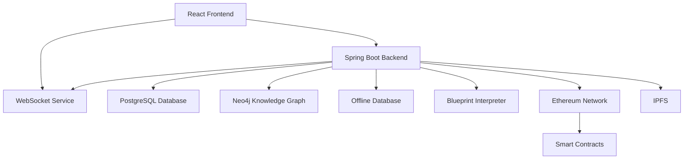

# Modulo

Modulo is a decentralized knowledge-management workspace. It combines linked
Markdown notes and a knowledge graph with a visual **workflow** engine and a
**plugin marketplace**, plus optional on-chain anchoring for verifiable
authorship. The experience is workflow-first: automations you build in the
Blueprint editor sit at the center, with notes, graph, and marketplace as
installable capabilities around them.

[](https://github.com/Ikey168/Modulo/actions/workflows/ci.yml)
[](https://github.com/Ikey168/Modulo/actions/workflows/codeql.yml)
[](https://github.com/Ikey168/Modulo/actions/workflows/policy-ci.yml)
[](https://github.com/Ikey168/Modulo/actions/workflows/release-please.yml)
[](https://opensource.org/licenses/MIT)

## Contents

- [Features](#features)
- [Project Structure](#project-structure)
- [Quick Start](#quick-start)
- [Local Development](#local-development)
- [Scripts](#scripts)
- [Architecture](#architecture)
- [Authentication](#authentication)
- [API Documentation](#api-documentation)
- [Configuration and Secrets](#configuration-and-secrets)
- [Observability](#observability)
- [Security](#security)
- [Performance and Monitoring](#performance-and-monitoring)
- [Deployment](#deployment)
- [Releases and Versioning](#releases-and-versioning)
- [Contributing](#contributing)
- [License](#license)
- [Support](#support)

## Features

- **Workflow automation.** A visual Blueprint editor (built on React Flow) lets
  you wire triggers, actions, and logic nodes into automations — for example,
  "on note saved, summarize it and anchor the digest on-chain." Blueprints run
  in a sandboxed interpreter and can be packaged and shared as **packs**.
- **Plugin marketplace.** A store-style marketplace with search, categories, a
  featured row, and a detail dialog. Capabilities install and uninstall at
  runtime — even the Notes editor and Knowledge Graph ship as (pre-installed)
  plugins, so the workspace is composed rather than fixed.
- **Linked notes.** A Markdown editor with wiki-style `[[note]]` links, tags,
  full-text search, and a sandboxed, sanitized Markdown/HTML renderer.
- **Knowledge graph.** A force-directed graph of notes and their links, with a
  canvas that follows the active theme.
- **Real-time and offline.** Live sync across clients over WebSocket
  (STOMP/SockJS), plus offline support backed by a local database with conflict
  resolution on reconnect.
- **On-chain provenance.** Optional anchoring records a content hash on-chain,
  and IPFS content addressing gives notes and attachments verifiable
  authorship (integrity and provenance, not confidentiality — see
  [Security](#security)).
- **Unified workspace.** One authenticated app at `/app`, presented through a
  minimal icon rail: Dashboard (a workflow command center), Marketplace,
  Blueprints, Notes, and Graph. The default landing is the Dashboard.
- **Multiple sign-in methods.** OpenID Connect (Keycloak), Google, Azure AD,
  and MetaMask.
- **Design system.** A shadcn/ui component library on Tailwind design tokens,
  with a dark-first "emerald terminal" theme plus light/blue/green/purple
  variants driven entirely by CSS variables.
- **Containerized.** Docker Compose for local and production-style runs, with
  Kubernetes manifests for cluster deployment.

## Project Structure

```
frontend/          React + TypeScript + Vite single-page app
backend/           Spring Boot REST API and WebSocket server
smart-contracts/   Ethereum smart contracts (Hardhat)
services/          Supporting services (e.g. audit-collector)
database/          Database schemas and migrations
k8s/               Kubernetes deployment manifests
azure/             Azure deployment scripts
k6-tests/          Load and synthetic monitoring tests
docs/              Documentation
```

## Quick Start

### Prerequisites

- Node.js 18 or newer
- Java 17
- Maven 3.8 or newer
- Docker and Docker Compose

### Run with Docker Compose

```bash
git clone https://github.com/Ikey168/Modulo.git
cd Modulo
npm run start          # docker compose up
```

Once the stack is running:

- Frontend: http://localhost:3000
- Backend API: http://localhost:8080 (REST endpoints are served under `/api`)
- PostgreSQL: localhost:5432

Sign in, and the workspace opens at http://localhost:3000/app on the
**Dashboard** — a command center for your workflows. The icon rail on the left
switches between Dashboard, Marketplace, Blueprints, Notes, and Graph; the
rail only shows capabilities you have installed, so uninstalling a view plugin
(for example the Knowledge Graph) removes it from the rail until you reinstall
it from the Marketplace.

> The production-style `docker compose up` serves the built frontend on
> **http://localhost** (port 80) instead of `:3000`. It bakes the UI at build
> time and registers a service worker, so after changing the frontend, rebuild
> the image (`docker compose build frontend`) and hard-reload past the old
> cached page.

## Local Development

Install dependencies:

```bash
npm install                 # root tooling and Git hooks
cd frontend && npm install  # frontend dependencies
```

Run the services individually:

```bash
# Backend (Spring Boot, http://localhost:8080)
cd backend
mvn spring-boot:run

# Frontend (Vite dev server, http://localhost:3000)
cd frontend
npm run dev

# Database only
docker compose up db
```

The Vite dev server proxies `/api` to the backend, so the frontend can call the
API with relative paths during development.

## Scripts

Root `package.json` scripts:

```bash
npm run build            # Build frontend and backend
npm run build:frontend   # Build the frontend only
npm run build:backend    # Build the backend only (mvn clean package)
npm run start            # Start the full stack with Docker Compose
npm run start:dev        # Start the development compose file
npm run test             # Run smart-contract tests (Hardhat)
npm run clean            # Remove build artifacts
```

Frontend scripts (run inside `frontend/`):

```bash
npm run dev              # Start the dev server
npm run build            # Type-check and build for production
npm run test             # Run unit tests (Vitest)
npm run test:e2e         # Run end-to-end tests (Playwright)
```

## Architecture


```mermaid
graph TB
    A[React Frontend] --> B[Spring Boot Backend]
    A --> F[WebSocket Service]
    B --> C[PostgreSQL Database]
    B --> H[Neo4j Knowledge Graph]
    B --> D[Offline Database]
    B --> I[Blueprint Interpreter]
    B --> E[Ethereum Network]
    B --> J[IPFS]
    B --> F
    E --> G[Smart Contracts]
```

### Technology Stack

Frontend:

- React 18 with TypeScript, Vite build tooling
- shadcn/ui components on Tailwind CSS design tokens (dark-first, theme-aware)
- Redux Toolkit for state, React Router for routing
- React Flow (`@xyflow/react`) for the Blueprint workflow editor
- react-markdown with remark-gfm and rehype-sanitize for safe Markdown/HTML
- d3-force, Sigma, and Graphology for the knowledge graph
- ethers.js for Web3, oidc-client-ts for authentication
- STOMP over SockJS for real-time updates

Backend:

- Spring Boot 2.7 on Java 17
- Spring Security for authentication and authorization
- Spring WebSocket for real-time features
- JPA/Hibernate for persistence, Flyway for migrations
- Web3j for blockchain integration

Infrastructure:

- PostgreSQL as the primary database
- Docker and Docker Compose, Kubernetes manifests
- OpenTelemetry, Prometheus, Grafana, Loki, and Jaeger for observability
- Open Policy Agent for authorization policies
- GitHub Actions for CI/CD with CodeQL scanning

## Authentication

Modulo supports several authentication methods:

1. OpenID Connect via Keycloak (the primary web flow)
2. Google OAuth 2.0
3. Azure Active Directory
4. MetaMask wallet authentication

The frontend OIDC client is configured through environment variables
(`VITE_KEYCLOAK_URL`, `VITE_KEYCLOAK_CLIENT_ID`). Backend OAuth providers are
configured in `backend/src/main/resources/application.yml`:

```yaml
app:
  oauth:
    google:
      client-id: your-google-client-id
      client-secret: your-google-client-secret
    azure:
      client-id: your-azure-client-id
      client-secret: your-azure-client-secret
```

## API Documentation

- Swagger UI: http://localhost:8080/swagger-ui.html
- OpenAPI spec: http://localhost:8080/v3/api-docs

Core REST resources include `/api/notes`, `/api/tags`, and `/api/note-links`.

For everything else — architecture, plugins, mobile, sync, security, authz,
observability, deployment, and more — see the
[documentation hub](docs/README.md).

## Configuration and Secrets

Local development secrets are managed with SOPS and direnv, keeping encrypted
secrets in the repository and loading them automatically per directory. In
Kubernetes, the External Secrets Operator synchronizes secrets from Azure Key
Vault and supports zero-downtime rotation.

```bash
# Local development secrets
./scripts/setup-local-secrets.sh
./scripts/manage-secrets.sh edit .env.encrypted

# Kubernetes / Azure Key Vault
./scripts/setup-azure-keyvault.sh
./scripts/deploy-external-secrets.sh
```

See [Local Development Secrets](docs/LOCAL_DEVELOPMENT_SECRETS.md) and
[External Secrets Implementation](docs/EXTERNAL_SECRETS_IMPLEMENTATION.md).

## Observability

The observability stack provides golden-signal dashboards, distributed tracing,
log aggregation, and alerting.

```bash
cd k8s
./deploy-observability.sh

kubectl port-forward -n observability svc/grafana 3000:3000 &
kubectl port-forward -n observability svc/prometheus 9090:9090 &
kubectl port-forward -n observability svc/alertmanager 9093:9093 &
```

Components include Prometheus (metrics and alerting), Grafana (dashboards),
Alertmanager (routing), Tempo and Jaeger (tracing), and Loki (logs). Alerts
cover error rate, latency, saturation, database connection pools, WebSocket
health, and blockchain operations. See
[Observability Documentation](k8s/observability/README.md).

## Security

Modulo applies multiple layers of automated security control:

- Static analysis with GitHub CodeQL for Java and TypeScript, with PR security
  gates. See [CodeQL Security Scanning](docs/CODEQL_SECURITY_SCANNING.md).
- Dynamic application security testing with OWASP ZAP against staging. See
  [OWASP ZAP Security Scanning](docs/OWASP_ZAP_SECURITY_SCANNING.md).
- Secret scanning with Gitleaks, detect-secrets, and pre-commit hooks, plus
  GitHub push protection. See
  [Secret Scanning Implementation](docs/SECRET_SCANNING_IMPLEMENTATION.md).
- Role-based access control with least-privilege defaults and Open Policy Agent
  policies. See the [Role Matrix](docs/authz/role-matrix.md) and
  [Migration Guide](docs/authz/migration-guide.md).

Set up the local security tooling with:

```bash
./scripts/setup-security.sh
# or
pip install pre-commit && pre-commit install
```

### Data protection: current model vs. planned

On-chain anchoring and IPFS are used for **integrity and provenance, not
confidentiality**. To avoid misunderstandings about what is and isn't private:

- **Authentication and authorization** protect the API today: OpenID Connect
  (Keycloak) / JWT for authentication, and Spring Security plus Open Policy
  Agent for authorization.
- **On-chain anchoring stores a hash, not the note.** When a note is anchored,
  the contract records a SHA-256 hash of its contents (tamper-evidence and
  verifiable authorship) — the note text is not written to the chain.
- **Note content is not end-to-end encrypted.** Notes live in PostgreSQL, and
  any content published to IPFS is currently stored **unencrypted** — anyone
  with the IPFS CID can read it. The on-chain access-control contract is a
  permission registry; it does **not** cryptographically restrict who can
  decrypt content. Do not treat anchored or IPFS-published notes as private.
- **Planned: end-to-end encrypted sharing.** Client-side encryption,
  per-recipient key wrapping, and on-chain delivery of wrapped keys are tracked
  in the [end-to-end encrypted sharing epic](https://github.com/Ikey168/Modulo/issues/243).

## Performance and Monitoring

Load and performance tests use k6, with thresholds aligned to service level
objectives and regression detection against saved baselines.

```bash
cd k6-tests
npm install
npm run test:all          # CRUD, sync, and WebSocket tests
npm run baseline:compare  # Compare against the saved baseline
```

| Profile | VUs | Duration | Use case        |
|---------|-----|----------|-----------------|
| Smoke   | 1   | 30s      | PR validation   |
| Normal  | 10  | 5m       | Nightly baseline|
| Stress  | 50  | 2m       | Capacity planning|

Synthetic monitoring validates uptime and end-to-end user journeys against a
99.9% availability objective. See
[Performance Testing](docs/PERFORMANCE_TESTING.md) and
[Synthetic Monitoring](k6-tests/synthetic/README.md).

## Deployment

### Docker Compose

```bash
docker compose up -d                              # Production-style
docker compose -f docker-compose.dev.yml up -d    # Development
```

### Kubernetes

```bash
cd k8s
kubectl apply -f .
```

### Azure

```bash
cd azure
./deploy-infrastructure.sh
./deploy-app-service.sh
```

## Releases and Versioning

The project follows [Conventional Commits](https://www.conventionalcommits.org/)
and uses automated releases with semantic versioning, generated changelogs, and
GitHub releases that include the JAR, SBOM, and Docker digests.

```
<type>[optional scope]: <description>

feat(auth): add MetaMask authentication support
fix(websocket): resolve connection timeout issues
docs: update deployment instructions
```

See the [Conventional Commits Guide](docs/CONVENTIONAL_COMMITS.md).

## Contributing

1. Fork the repository.
2. Create a feature branch: `git checkout -b feature/your-feature`.
3. Use conventional commit messages.
4. Open a pull request.

```bash
git checkout main
git pull origin main
git checkout -b feature/your-feature
git commit -m "feat(scope): add new feature"
git push origin feature/your-feature
```

## License

This project is licensed under the MIT License. See the [LICENSE](LICENSE) file
for details.

## Support

- Documentation: [docs/](docs/README.md)
- Bug reports: [GitHub Issues](https://github.com/Ikey168/Modulo/issues)
- Discussions: [GitHub Discussions](https://github.com/Ikey168/Modulo/discussions)
