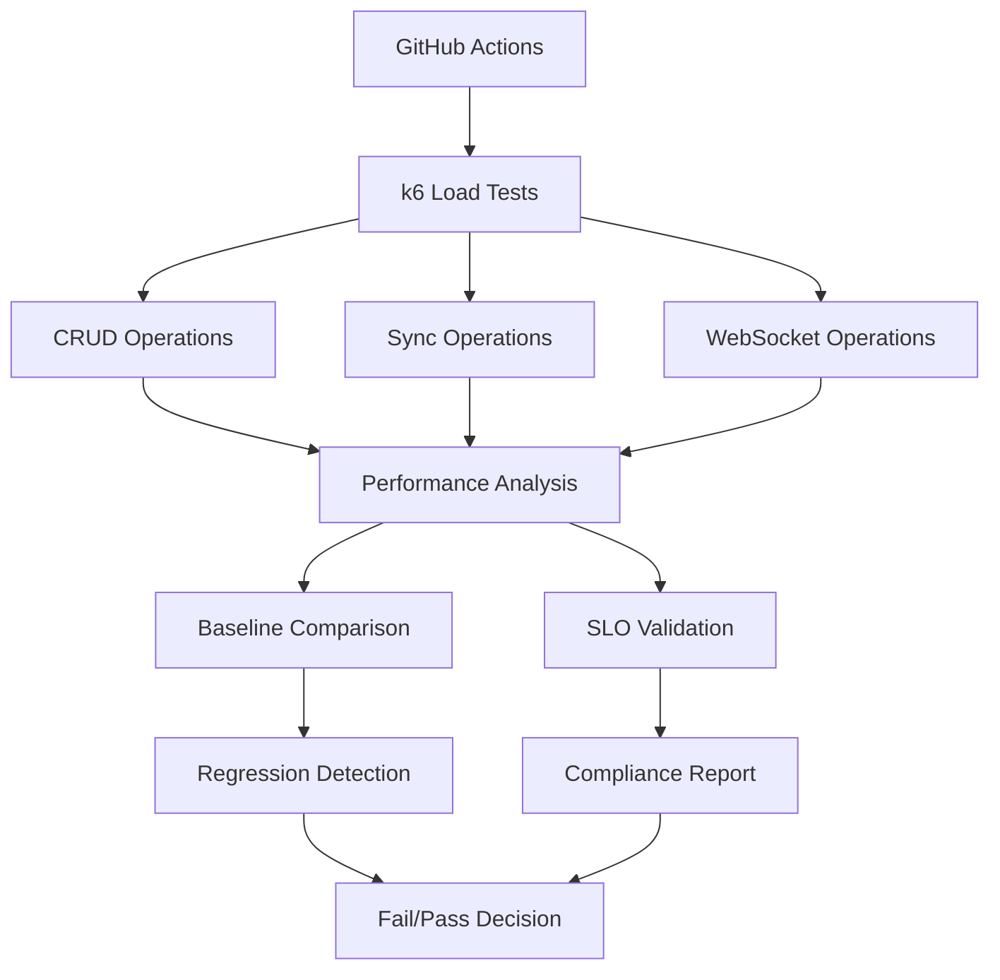

# 📊 Performance Testing Implementation

## 🎯 Overview

This document outlines the comprehensive k6 load testing implementation for Modulo, designed to validate SLO compliance and detect performance regressions.

## 🏗️ Architecture

### Test Framework Components



### SLO Alignment

| Test Suite | SLO Metric | Threshold | Business Impact |
|------------|------------|-----------|-----------------|
| CRUD Operations | Read P95 Latency | < 200ms | User experience, page load times |
| CRUD Operations | Write P95 Latency | < 500ms | Content creation responsiveness |
| Sync Operations | Sync P95 Latency | < 1000ms | Real-time collaboration |
| All Operations | Availability | > 99.9% | Service reliability |
| WebSocket | Message Latency | < 200ms | Real-time features |

## 🚀 Implementation Details

### Test Scenarios

#### 1. CRUD Operations (`crud-operations.js`)
```javascript
// Read Operations - SLO: P95 < 200ms
- GET /api/notes (list notes)
- GET /api/notes/{id} (get specific note)

// Write Operations - SLO: P95 < 500ms  
- POST /api/notes (create note)
- PUT /api/notes/{id} (update note)
- DELETE /api/notes/{id} (delete note)
```

#### 2. Sync Operations (`sync-operations.js`)
```javascript
// Sync Status - SLO: P95 < 1000ms
- GET /api/blockchain/sync/status
- GET /api/blockchain/metrics
- GET /api/blockchain/blocks/latest
- POST /api/blockchain/sync/trigger
```

#### 3. WebSocket Operations (`websocket-operations.js`)
```javascript
// Real-time Communication
- WebSocket connection establishment
- Message round-trip latency
- Subscription management
- Connection reliability
```

### Load Profiles

#### Smoke Testing (PR Validation)
- **Purpose**: Quick validation for pull requests
- **Load**: 1 VU for 30 seconds
- **Frequency**: On every PR to main
- **Environment**: Local Docker stack

#### Normal Load (Baseline)
- **Purpose**: Establish performance baselines
- **Load**: 10 VUs for 5 minutes
- **Frequency**: Nightly at 2 AM UTC
- **Environment**: Staging

#### Stress Testing (Capacity Planning)
- **Purpose**: Find system breaking points
- **Load**: 50 VUs for 2 minutes
- **Frequency**: Manual trigger
- **Environment**: Staging

## 📊 Baseline Management

### Baseline Creation
```bash
# Automatic baseline creation during nightly runs
node scripts/save-baseline.js

# Baseline structure
{
  "metadata": {
    "created": "2025-08-18T02:00:00Z",
    "git_commit": "abc123",
    "slo_thresholds": { ... }
  },
  "baselines": {
    "read_latency_p95": { "p95": 150, "avg": 120 },
    "write_latency_p95": { "p95": 380, "avg": 300 },
    "sync_latency_p95": { "p95": 800, "avg": 600 }
  }
}
```

### Regression Detection
```bash
# Automatic comparison against baseline
node scripts/compare-baseline.js

# Regression thresholds
- Latency degradation: >15% increase
- Error rate increase: >2% increase  
- Throughput decrease: >10% decrease
```

## 🔄 CI/CD Integration

### Nightly Performance Pipeline
```yaml
# .github/workflows/nightly-performance.yml
Schedule: 0 2 * * *  # 2 AM UTC daily
Environment: staging
Profile: normal
Artifacts: 
  - Performance baselines (90 days)
  - Test results (30 days)
  - Comparison reports
```

### PR Performance Validation
```yaml
# Pull request triggers
Triggers: 
  - backend/** changes
  - frontend/** changes
  - k6-tests/** changes
Environment: development (Docker)
Profile: smoke
Failure Conditions:
  - SLO violations (exit code 2)
  - Performance regressions (exit code 1)
```

### Artifact Management
- **Baselines**: 90-day retention for trend analysis
- **Results**: 30-day retention for debugging
- **Reports**: Uploaded to GitHub Actions artifacts

## 📈 Performance Analysis

### SLO Compliance Checking
```javascript
// Real-time SLO validation during tests
const SLO_THRESHOLDS = {
  read_latency_p95: 200,      // ms
  write_latency_p95: 500,     // ms  
  sync_latency_p95: 1000,     // ms
  availability: 99.9,         // percentage
};

// Immediate test failure on SLO violation
export const thresholds = {
  'slo_read_latency': ['p(95)<200'],
  'slo_write_latency': ['p(95)<500'],
  'slo_error_rate': ['rate<0.001'],
};
```

### Trend Analysis
```javascript
// Performance over time tracking
{
  "comparison_results": {
    "crud-operations": {
      "metrics": { "read_latency_p95": 180 },
      "comparisons": {
        "read_latency_p95": {
          "current": 180,
          "baseline": 150,
          "change_percent": 20,
          "regression": true
        }
      }
    }
  }
}
```

## 🚨 Alerting and Failure Handling

### Failure Scenarios

#### SLO Violations (Critical)
- **Exit Code**: 2
- **Action**: Immediately fail build/PR
- **Impact**: Block deployments
- **Example**: P95 latency > 200ms for reads

#### Performance Regressions (Warning)
- **Exit Code**: 1  
- **Action**: Fail build with warning
- **Impact**: Require investigation
- **Example**: 15% latency increase vs baseline

#### Successful Tests
- **Exit Code**: 0
- **Action**: Update baselines (nightly only)
- **Impact**: Continue deployment pipeline

### Notification Strategy
```bash
# GitHub Actions job status
✅ No performance issues detected
⚠️ Performance regressions detected  
🚨 SLO violations detected

# Artifact outputs
- performance-report.md: Human-readable summary
- comparison-results.json: Machine-readable analysis
- performance-baselines.json: Updated baselines
```

## 🎯 Business Value

### Quality Gates
- **Feature Development**: All features must pass performance tests
- **Deployment Gates**: SLO violations block production deployments
- **Performance Budget**: Error budget tracking and management

### Capacity Planning
- **Load Patterns**: Understand system behavior under load
- **Scaling Decisions**: Data-driven infrastructure planning
- **Cost Optimization**: Right-size resources based on performance data

### Reliability Engineering
- **SLO Enforcement**: Automated compliance checking
- **Regression Prevention**: Catch performance issues early
- **Incident Prevention**: Proactive performance monitoring

## 🔮 Future Enhancements

### Planned Improvements
1. **Geographic Load Distribution**: Multi-region performance testing
2. **Database-Specific Tests**: PostgreSQL performance validation
3. **Real User Monitoring**: Correlation with synthetic tests
4. **Automated Scaling Tests**: Kubernetes HPA validation
5. **Performance Dashboards**: Grafana integration for trends

### Integration Opportunities
- **Observability Stack**: Correlation with Prometheus metrics
- **SLO Monitoring**: Integration with burn-rate alerting
- **Incident Response**: Performance data in runbooks
