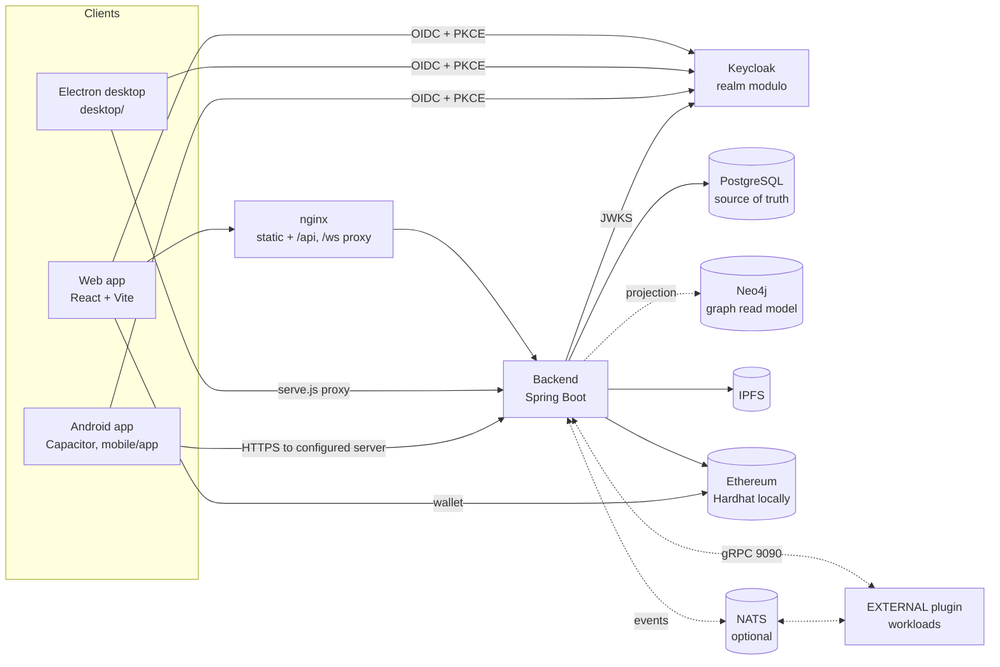

# Architecture overview

This section explains how Modulo is built: the runtime components, how a
request moves through them, and the rules that keep the system coherent. Start
here if you are new to the codebase or about to make a change that crosses
component boundaries. For what Modulo does and its vocabulary, see
[overview.md](../getting-started/overview.md); for running it, see
[local-development.md](../getting-started/local-development.md).

## Pages in this section

| Page | Covers |
| --- | --- |
| [backend.md](backend.md) | Spring Boot packages, HTTP/STOMP/gRPC surfaces, events, workers, persistence conventions |
| [frontend.md](frontend.md) | React app, `@modulo/core`, feature packs, workspace plugin runtime, boundary lint, platform layer |
| [data-and-state.md](data-and-state.md) | PostgreSQL and Flyway, Neo4j projection, plugin state API, offline queues and sync, ownership |
| [security-model.md](security-model.md) | Keycloak/OIDC and PKCE, backend auth chains, ownership and roles, OPA, secrets, sharing and encryption |
| [decisions.md](decisions.md) | Every architecture decision record, condensed, with stable anchors |

## Components

| Component | Role | Where |
| --- | --- | --- |
| Frontend | One React/TypeScript build served to browsers, loaded by Electron, and packaged into the Android APK | [`frontend/`](../../frontend/), [`desktop/`](../../desktop/), [`mobile/app/`](../../mobile/app/) |
| Backend | Spring Boot 2.7 on Java 17: REST under `/api`, STOMP at `/ws`, gRPC for plugins, Blueprint interpreter and workflow engine | [`backend/`](../../backend/) |
| Keycloak | OIDC identity provider; realm `modulo`, public client `modulo-frontend` | [`keycloak/`](../../keycloak/) |
| PostgreSQL | All authoritative data; schema owned by Flyway | [`backend/src/main/resources/db/postgresql/`](../../backend/src/main/resources/db/postgresql/) |
| Neo4j | Derived note-link graph for backlinks and related notes; the app runs without it | [`backend/.../graph/`](../../backend/src/main/java/com/modulo/graph/) |
| IPFS (Kubo) | Content-addressed storage for published or encrypted note payloads | `ipfs` service in [`docker-compose.yml`](../../docker-compose.yml) |
| Ethereum contracts | Note registry, anchoring, encrypted-sharing access grants; Hardhat node for local development | [`smart-contracts/`](../../smart-contracts/) |
| Script sandbox plugin | First EXTERNAL workload: runs `action.code.execute` out of process; the core falls back in-process when it is absent | [`services/script-sandbox-plugin/`](../../services/script-sandbox-plugin/) |
| NATS | Optional event bridge to EXTERNAL plugins (`modulo.plugins.broker.enabled`) | [ADR 0004](decisions.md#adr-0004) |
| Envoy + OPA | Optional edge authorization overlay; Rego policies tested in CI | [`policy/`](../../policy/), [`infra/opa/`](../../infra/opa/) |
| Observability stack | OpenTelemetry collector, Jaeger, Prometheus, Grafana, Loki, Elasticsearch, audit collector | [observability.md](../operations/observability.md) |

The minimal deployment is the backend, PostgreSQL and Keycloak with the web
frontend. Neo4j, IPFS, the blockchain, NATS and EXTERNAL plugins each degrade
cleanly when absent: the backend logs, skips, and keeps serving notes.
Deployment topologies are in [deployment.md](../operations/deployment.md).

## How a request flows

1. The client signs in with Keycloak (authorization code + PKCE) and keeps the
   access token in memory.
2. It calls `/api/...` with `Authorization: Bearer <token>`. In the browser nginx
   forwards `/api` and `/ws` to the backend; Electron's embedded server does the
   same; Android calls the configured server origin directly.
3. The backend validates the JWT against Keycloak's JWK set and resolves the
   token's issuer and subject to a provisioned `users` row. That row's ID is the
   owner for every query.
4. The controller's service or store reads and writes PostgreSQL with the owner
   in every predicate. Foreign records answer 404.
5. Side effects fan out asynchronously: note and link events go on the in-JVM
   plugin event bus (Neo4j projection, Blueprint triggers, plugins, and optionally
   NATS); plugin-state changes go through a transactional outbox to the owner's
   STOMP queue; knowledge indexing drains a PostgreSQL queue.
6. Clients receive live updates over STOMP (`/user/queue/...`) and reconcile
   through versioned reads, so a missed push only delays an update.

## Architectural rules

These rules show up across the codebase. Each links to where it is defined.

- **The server owns acknowledged state.** Clients keep partitioned offline
  queues, but an edit is "saved" only once committed locally and is authoritative
  only once the server accepts it with a version check.
  [data-and-state.md](data-and-state.md#client-state-offline-and-sync)
- **Owner comes from the principal, never from input.** Every query is
  owner-scoped, and "not found" and "not yours" look identical.
  [security-model.md](security-model.md#ownership-is-the-primary-rule)
- **Feature code talks to `@modulo/core`**, not workspace internals, and the core
  keeps concrete `note`/`link`/`tag`/`user` types. Enforced by ESLint in CI.
  [decisions.md](decisions.md#core-experience-boundary),
  [ADR 0002](decisions.md#adr-0002)
- **No browser Storage for data.** Plugin data lives in server-side plugin state;
  device data lives in IndexedDB or SQLite. Enforced by ESLint.
  [ADR 0009a](decisions.md#adr-0009a)
- **Third-party code never runs in the core JVM.** It runs as an EXTERNAL
  workload behind the gRPC contract, with pod-level isolation.
  [ADR 0004](decisions.md#adr-0004)
- **Untrusted code runs in bounded sandboxes**: QuickJS on WASM for scripts and
  import-free core WASM for compiled modules, both with a 2 s budget and a
  64 KiB output cap. [ADR 0003](decisions.md#adr-0003)
- **Derived stores are optional.** Neo4j, IPFS and the broker can be down without
  failing a note write.
- **Accountable actions are bound and auditable.** Workflow runs, approvals and
  plugin-state mutations are append-only or versioned, with bounded, redacted
  metadata. [ADR 0009b](decisions.md#adr-0009b)
