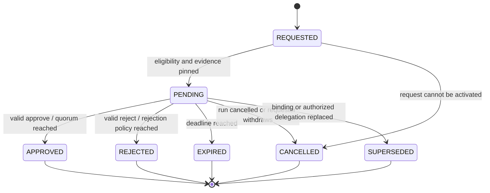

# ADR 0009: run-bound human approval

Status: accepted contract. Runtime, reviewer UI, signatures and portable evidence
are delivered by #431, #432, #433 and #434 respectively. This ADR resolves #430.

## Decision

An approval is an accountable decision about one immutable request in one run
attempt. It grants no general access to the owner's notes or workflow. A valid
receipt from another request, attempt, Blueprint revision or checkpoint can never
satisfy the current wait.

The interpreter creates requests from an approval node. The server derives the
requester and workflow owner from the stored run, not trigger values or request
JSON. V1 designates one explicit user and requires one decision. Versioned policy
fields reserve selectors for users, roles and groups, a distinct-voter quorum,
and a rejection rule. V1 rejects unsupported selectors or quorum values instead
of silently broadening authorization.

The designated reviewer must differ from the requester. Separation of duty is
checked when requesting and again when deciding. Workflow authors cannot disable
it through node configuration. Membership is a current server-side fact; JWT
role strings, stale UI eligibility and possession of a request UUID are not
approval authority.

## Request and decision records

A request records:

- UUID, contract/policy version, workflow owner and requester, designated reviewer;
- run UUID and attempt, Blueprint digest/version, node identity and checkpoint;
- a fresh 256-bit resume nonce (only its digest is exposed in evidence);
- a digest of the exact allowed evidence, redaction/omission markers and a safe summary;
- requested/expiry timestamps, state, revision and superseding request reference;
- policy for comments, expiry, reminders, delegation and future quorum.

A decision is an append-only record containing its UUID, request UUID/revision,
server-derived actor, `APPROVE` or `REJECT`, normalized comment digest, effective
timestamp, the complete request binding, and signature metadata when available.
No endpoint edits or deletes a committed decision. Corrections are new requests
and decisions with explicit lineage. A server signature attests what the server
accepted; it does not claim the user holds that signing key.

## State machine



Requested-to-pending activation is one transaction, with creation evidence kept
in the audit trail. All resolved states are terminal. A resolved request is never
reset to pending. Quorum extension will retain one immutable vote per actor and
resolve only when the versioned policy's threshold/rejection rule is met. V1 is
threshold one with any rejection resolving the request.

Approval and rejection resume the matching durable wait with a typed outcome and
decision reference. Expiry is a distinct outcome, never implied approval.
Cancellation stops the run. Supersession invalidates the wait and requires a fresh
request. A result node must branch explicitly on recognized outcomes; an unknown
or missing outcome is an error, not approval.

## Commit-time authorization and races

The decision transaction locks the request, verifies its expected revision and
pending state, and re-evaluates all of the following from current stored data:

1. The authenticated actor still exists and is the eligible reviewer under the
   current server-side grant/policy. The requester is not that reviewer.
2. The run still belongs to the recorded owner, is waiting on this request, and
   has the same attempt, checkpoint and resume nonce binding.
3. The Blueprint and allowed evidence still match the pinned digests. A changed
   Blueprint cannot receive approval for an older request without a new request.
4. The database's current wall-clock time is before expiry. Use a time check
   after acquiring the lock, not an application timestamp captured before waiting.
5. The outcome and comment satisfy the versioned policy.

Only then does the transaction append the decision, resolve the request and make
its matching wait resumable. Expiry, cancellation and competing decisions use the
same serialization boundary. No notification or network callback is proof that a
decision committed. The resume worker checks the binding again before continuing.

An exact transport replay with the same decision idempotency key returns its
original receipt without another vote or resume. A second distinct submission,
changed body under the same key, stale revision or already-resolved request is a
conflict. Unauthorized and unknown request IDs share the same unavailable response.

## API examples

The host creates the request from the stored run and node. Ordinary clients do
not create arbitrary run-bound approvals by submitting owner/run IDs.

An eligible reviewer or the requester can read the authorized projection:

```http
GET /api/approvals/9b6bc09b-85b6-4cdf-989c-06cfa8a4553c
```

```json
{
  "id": "9b6bc09b-85b6-4cdf-989c-06cfa8a4553c",
  "revision": 1,
  "state": "PENDING",
  "expiresAt": "2026-09-06T12:00:00.000Z",
  "summary": {"fields": 2, "types": {"text": 1, "reference": 1}},
  "redacted": true,
  "commentRequiredOnReject": true
}
```

```http
POST /api/approvals/9b6bc09b-85b6-4cdf-989c-06cfa8a4553c/decision
Content-Type: application/json
```

```json
{
  "expectedRevision": 1,
  "idempotencyKey": "90d7f9af-df62-4e46-bbfb-61dc2a42cb78",
  "outcome": "REJECT",
  "comment": "The referenced evidence needs correction."
}
```

The actor, owner, policy, binding and effective time come from the server. Client
fields claiming those authorities are never authoritative. The response contains
a stable decision reference and resolved state. A `409` response means the UI must
refresh; it must not automatically retry a changed decision. Pending/history
lists expose only requests the caller can currently inspect.

## Expiry, reminders, delegation and comments

V1 expiry is 1 minute through 7 days, default 24 hours. Expiry is immutable after
activation; extending it creates a superseding request and fresh nonce. Reminders
are in-app, rate limited, and contain only a safe summary and an authorized deep
link. Reminder delivery cannot extend expiry or change eligibility. Policies may
request at most three reminders, separated by at least one hour.

Delegation is disabled by default. A future enabled delegation requires the
current reviewer, an owner-preauthorized target, unchanged separation of duty,
and a recorded reason. It creates a new request linked to the superseded one,
with fresh revision/nonce and re-evaluated evidence. It never edits an existing
vote or transfers a reusable approval token. V1 can reject delegation without
changing this record model.

Rejection requires a nonblank comment; approval comments are optional. Normalize
comments to Unicode NFC before storing and hashing, with a 4096-byte UTF-8 limit.
Comments may contain sensitive context: only authorized participants can read
them, and evidence export can omit them while retaining an explicit digest and
redaction marker. Comments are not metric labels or log messages.

## Retry, update and restart semantics

A process restart preserves a pending request and its checkpoint. Resumption is
an atomic state transition for that request/run pair, so two workers cannot apply
one decision twice.

Every retry gets a new run UUID/attempt and new approval requests. A checkpoint
containing an approval receipt cannot be replayed into a different run. V1 may
require retry from the start when an approval was involved; it must not reuse an
approved boolean or old receipt from a later checkpoint. Old decisions remain
valid historical evidence about their original request only.

A Blueprint/evidence change supersedes pending approval. It does not rewrite a
previous approved decision. A superseded wait must not resume from a late click.
Cancelled, expired and superseded requests cannot be reopened through retries,
delegation, delayed notifications or a stale client cache.

## Evidence and signing boundary

Safe summaries follow the execution trace policy. Reviewers receive only the
explicit approval projection; being an approver does not bypass note ownership,
share-grant checks or run-detail authorization. Restricted artifacts are omitted
and marked as such. Their digests identify the material covered by the decision
without implying the reviewer could read it; the UI must show that omission.

The signed statement covers a versioned domain separator, decision/request/run
UUIDs, request revision, run attempt, node identity, Blueprint and evidence
digests, policy digest, resume-nonce digest, actor, outcome, normalized comment
digest, effective UTC timestamp, signing key ID and algorithm. Canonical
serialization is versioned and tested across runtimes in #433. Key rotation
retains historical public keys. Unsigned, server-signed, wallet-signed, anchored
and unverifiable are distinct states. No placeholder signature or anchor is
presented as verified evidence.

## Threat model and acceptance cases

| Threat | Required control |
| --- | --- |
| Guessed UUID or forged actor/owner | Current server-side participant authorization; unavailable response |
| Role removal after opening the inbox | Re-evaluate eligibility inside the decision transaction |
| Requester approves own work | Separation-of-duty checks at creation and commit |
| Two decisions or expiry racing | Request lock, expected revision and terminal-state compare-and-set |
| Old approval reused by retry | New run/request/nonce binding; reject stale checkpoint receipts |
| Blueprint/evidence changed after review | Digest comparison and supersession |
| Delegation to an unauthorized recipient | Preauthorized target, fresh request and immutable lineage |
| Redaction bypass through summaries/logs | Typed projections, artifact access checks and no raw comments in logs |
| Forged evidence or rotated signing key | Canonical signed statement, pinned key IDs and retained public keys |
| Notification replay or worker restart | Database decision authority and idempotent resume transition |

The runtime acceptance suite must cover authorized approve/reject, foreign users,
requester self-approval, grant revocation, duplicate and stale decisions, expiry
races, Blueprint changes, cancelled runs, restart/resume, and retry after an earlier
approval. Signature tamper/rotation vectors and portable-bundle verification are
separate gates in #433 and #434.
