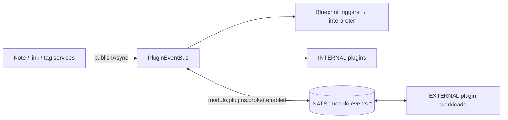

# Backend

A map of the Spring Boot application in [`backend/`](../../backend/): how its
packages are organized, which HTTP, WebSocket and gRPC surfaces it exposes,
how it persists data, and how events and background workers move work around.
Read it before adding a controller, a table or a worker. Feature behavior is in
the [features](../features/) pages; every configuration key is in
[configuration.md](../reference/configuration.md).

## Stack

| Concern | Choice |
| --- | --- |
| Runtime | Java 17, Spring Boot 3.5 (Jakarta EE 10 `jakarta.*` namespace; `spring-boot-starter-parent` 3.5.16 in `backend/pom.xml` and the root reactor POM) |
| Persistence | Spring Data JPA/Hibernate 6 and `JdbcTemplate` on PostgreSQL; Flyway migrations (`flyway-database-postgresql`) |
| Auth | Spring Security OAuth2 resource server (Keycloak JWT), one stateless chain in `config/SecurityConfig` |
| Realtime | STOMP over WebSocket (`/ws`, SockJS fallback) |
| Plugin RPC | gRPC server (`net.devh` starter 3.1, grpc-java 1.63, port 9090) |
| Plugin eventing | In-JVM `PluginEventBus`; optional NATS bridge (`jnats`) |
| Sandboxes | QuickJS on WASM (`quickjs4j`) for `action.code.execute`; Chicory interpreter for `action.wasm.execute` |
| Blockchain | web3j; IPFS over the Kubo HTTP API |

The Maven reactor ([`pom.xml`](../../pom.xml)) builds `plugin-contract`,
`backend`, `services/script-sandbox-plugin` and `smart-contracts`.

## Request path and URL prefix

Controllers declare full paths that start with `/api/...`. The
`application.properties` default also sets `server.servlet.context-path=/api`,
which would produce `/api/api/...`; every container deployment therefore sets
`SERVER_SERVLET_CONTEXT_PATH=/` (Compose, OCI, and the backend `Dockerfile`).
The value must be `/`, not empty: the application's property validator rejects a
blank context path. nginx (web) and Vite (dev) forward `/api` and `/ws` to the
backend unchanged.

## Package layout

All code lives under [`com.modulo`](../../backend/src/main/java/com/modulo/).
Newer features are organized by domain package; older code still follows the
layered `controller` / `service` / `repository` / `entity` split.

| Package | Responsibility |
| --- | --- |
| `controller`, `service`, `repository`, `entity`, `dto` | Original layered core: notes, tags, links, tasks, attachments, users, blockchain/IPFS, conflicts, health, performance |
| `security` | `AuthenticatedUserService` (principal → owner), `TenantQueryExtension`, `OwnedSocketInterceptor`, `RateLimitingFilter`, audit logger, security-testing endpoints |
| `config` | Security chains, WebSocket, gRPC, caches, OpenTelemetry, Azure Blob, plugin wiring, validation |
| `backend` | `/api/me` (token claims) |
| `blueprint` | Blueprint CRUD, node registry, capability grants, triggers and webhooks |
| `blueprint.interpreter` | `BlueprintInterpreterService`: executes Blueprint IR graphs |
| `blueprint.execution` | Workflow runs, steps, checkpoints, scheduler, retention, recovery, operations, trace policy |
| `blueprint.approval` | Human approval requests, decisions, signing, evidence bundles |
| `blueprint.sandbox`, `blueprint.wasm` | `ScriptSandbox` seam (local WASM engine or remote workload); WASM module validation and execution |
| `plugin.*` | Plugin API, manager/loader, registry, event bus and NATS bridge, submissions, marketplace trust |
| `grpc.service` | gRPC `PluginService` and `PluginHostService` implementations |
| `state` | Plugin state store, schemas, grants, workloads, outbox; Gmail newsletter connection |
| `pack` | Pack manifests (v1/v2), validation, workspace pack plan/apply, Pack Studio, audit pack |
| `knowledge` | Typed note properties, saved property queries, semantic search and embeddings, document text extraction |
| `graph` | DTOs for the unlinked-mentions endpoint |
| `collab` | Comments, notifications, presence and Yjs document relay over STOMP |
| `sharing` | Public share links |
| `editor` | Note templates, Markdown/HTML/ZIP export, note-local files |
| `files` | Owner-scoped workspace files |
| `remote` | Remote service calls with encrypted credentials, safe HTTP fetcher, PDF tools |
| `integrations.noesis`, `integrations.praxis` | Noesis intake bridge; Praxis client |
| `audit` | Audit events and note audit interceptor |
| `observability`, `aspect`, `filter`, `health` | Execution trace context, tracing/performance aspects, tracing filter, health indicators |
| `migration` | Operator tools for schema migration and ownership backfill |
| `chaos` | Chaos-engineering filter (off by default, `modulo.chaos.enabled`) |

## API surface

All endpoints below require an authenticated, provisioned user unless marked
public. The authoritative request/response shapes are in the controllers and
the generated OpenAPI document (springdoc: `/api-docs`, `/swagger-ui`).

### Notes and knowledge

| Base path | Controller | Purpose |
| --- | --- | --- |
| `/api/notes` | `NoteController` | CRUD, tags, search, `/{id}/upload-to-ipfs` |
| `/api/v2/notes` | `OptimizedNoteController` | Paged/optimized note reads |
| `/api/note-links` | `NoteLinkController` | Explicit links between notes |
| `/api/tags` | `TagController` | Owner-scoped tags |
| `/api/graph` | `GraphController` | Unlinked mentions, and turning a mention into a link |
| `/api/note-properties`, `/api/property-queries` | `NotePropertyController`, `SavedPropertyQueryController` | Typed properties and saved queries |
| `/api/knowledge`, `/api/knowledge/workspace-search`, `/api/knowledge/extract` | `SemanticKnowledgeController`, `WorkspaceSearchController`, `DocumentTextController` | Semantic search, suggested links, document text |
| `/api/templates` | `NoteTemplateController` | Note templates |
| `/api/notes/{id}/export/markdown`, `/html`, `/api/notes/export/zip` | `NoteExportController` | Exports |
| `/api/notes/{noteId}/comments` | `CommentController` | Comments |
| `/api/notifications` | `NotificationController` | In-app notifications |
| `/api/conflicts` | `ConflictResolutionController` | Optimistic-lock conflict check/resolve |
| `/api/tasks` | `TaskController` | Relational tasks |

### Files, sharing and integrations

| Base path | Purpose |
| --- | --- |
| `/api/attachments` | Note attachments in Azure Blob Storage |
| `/api/notes/{noteId}/files`, `/api/files/{noteId}/{filename}` | Note-local files |
| `/api/workspaces/{workspace}/files` | Workspace files (PostgreSQL) |
| `/api/notes/{noteId}/shares`, `/api/shares/{tokenId}` | Manage share links |
| `/api/s/{token}`, `/api/s/{token}/meta` | **Public** share view |
| `/api/ipfs`, `/api/blockchain`, `/api/access-control` | IPFS relay, anchoring, on-chain access control |
| `/api/integrations/noesis/intake` | Noesis intake |
| `/api/praxis` | Praxis submissions |
| `/api/newsletters/gmail`, `/api/public/gmail/callback` (public) | Gmail newsletter import |
| `/api/remote` | Remote services with stored credentials |

### Blueprints, workflows and packs

| Base path | Purpose |
| --- | --- |
| `/api/blueprints` | Blueprint CRUD, permissions, manual runs |
| `/api/public/blueprints/webhook` | **Public** webhook triggers (per-Blueprint secret) |
| `/api/workflow-runs` | Run history, cancel, retry, evidence bundles |
| `/api/workflow-ops` | Operations policies and alerts |
| `/api/approvals` | Approval inbox, decisions, signatures, evidence |
| `/api/packs` | Pack manifests, `POST /api/packs/validate` |
| `/api/workspace-packs` | Transactional pack plan/apply/rollback |
| `/api/pack-studio` | Pack authoring and publication |
| `/api/audit-pack` | Security Audit Pack engagements |

### Plugins and plugin state

| Base path | Purpose |
| --- | --- |
| `/api/plugins` | Plugin registry administration (`ADMIN`) |
| `/api/plugins/submissions` | Marketplace submissions |
| `/api/marketplace/trust` | Trust Center: publishers, releases, deployments |
| `/api/renderers` | Renderer plugins |
| `/api/workspaces/{workspace}/plugin-state[/{namespace}]` | Plugin state host API |
| `/api/workspaces/{workspace}/plugin-state-schemas/{namespace}` | Custom schema registration |
| `/api/plugin-state/grants`, `/api/plugin-state/workloads` | Owner grants and outbound workloads |
| `/api/plugin-state/callback/**` | **Public route**, dual-token checked (external workloads) |

The plugin-state contract is documented in
[data-and-state.md](data-and-state.md#plugin-state).

### Health, identity and operations

| Path | Purpose |
| --- | --- |
| `/api/health`, `/api/simple-health` | **Public** health checks (the OCI health check uses `/api/health`) |
| `/actuator/**` | Actuator (`management.server.port=8081` in the default properties) |
| `/api/me` | The caller's token claims (used by the Envoy/OPA overlay) |
| `/auth/migration/**` | Provider migration administration |
| `/api/audit` | Audit event queries |
| `/api/v2/performance`, `/api/security/testing`, `/chaos` | Diagnostics and test hooks |

## Realtime: STOMP over WebSocket

[`WebSocketConfig`](../../backend/src/main/java/com/modulo/config/WebSocketConfig.java)
registers the `/ws` endpoint with SockJS, a simple broker for `/topic` and
`/queue`, application prefix `/app` and user prefix `/user`.
`OwnedSocketInterceptor` authenticates `CONNECT` and authorizes every
`SUBSCRIBE`, `SEND` and outbound frame by owner
([security-model.md](security-model.md#websocket-authentication)).

| Destination | Direction | Carries |
| --- | --- | --- |
| `/user/queue/state` | server → client | Plugin-state change events (from the outbox) |
| `/user/queue/notes` | server → client | Note change notifications |
| `/user/queue/notifications` | server → client | In-app notifications |
| `/app/notes/{noteId}/presence`, `/app/notes/{noteId}/ydoc` | client → server | Presence and Yjs collaborative-editing relay, for notes the sender owns |

## gRPC

The gRPC server listens on `grpc.server.port` (9090). Protos live in
[`backend/src/main/proto/`](../../backend/src/main/proto/) and are the single
source for the published [`plugin-contract`](../../plugin-contract/) module.

| Service | Implemented by | Purpose |
| --- | --- | --- |
| `PluginService` | Plugins (the core also serves it) | Lifecycle, health, info, capabilities, configuration, execute |
| `PluginHostService` | Core (`PluginHostServiceImpl`, enabled by `modulo.features.enable-grpc=true`) | Permission-gated note operations and event publish/subscribe for EXTERNAL plugins; trusts only the plugin ID bound in the gRPC context |
| `NotePluginService`, `UserPluginService` | Plugins (optional) | Note- and user-oriented hooks |

The core also dials out to EXTERNAL plugin workloads (`ExternalPluginProxy`) and
polls their health every `modulo.plugins.external.health-interval-ms` (30 s). See
[ADR 0004](decisions.md#adr-0004) and [plugins.md](../features/plugins.md).

## Events



- [`PluginEventBus`](../../backend/src/main/java/com/modulo/plugin/event/PluginEventBus.java)
  is the in-JVM bus for note, link, user and system events. Delivery is
  at-most-once.
- [`PluginEventBridge`](../../backend/src/main/java/com/modulo/plugin/event/PluginEventBridge.java)
  exists only when `modulo.plugins.broker.enabled=true` (default `false`); it
  mirrors events to NATS subjects `modulo.events.<type>` at
  `modulo.plugins.broker.url` (default `nats://nats:4222`) and tags origin so
  events never loop. If NATS is unreachable, bridging suspends and in-JVM delivery
  continues.
- Plugin-state events do **not** use this bus: they go through a transactional
  outbox to the owner's private queue, because bus listeners have no
  owner-specific authority.
- Knowledge indexing does not use the bus either: note writes enqueue rows in
  `application.knowledge_index_queue` in the same transaction.

## Background workers

All workers use Spring `@Scheduled` (task scheduler pool size 4).

| Worker | Interval | Job |
| --- | --- | --- |
| `WorkflowScheduler` | `modulo.workflow.scheduler.poll-ms` (1000 ms) | Cron firings, retries and wait resumption; leader-elected with a PostgreSQL advisory lock |
| `WorkflowRetention` | `modulo.workflow.retention.interval-ms` (1 h) | Expire terminal runs past retention (`modulo.workflow.retention.enabled`) |
| `WorkflowOperationsWorker` | `modulo.workflow.operations.poll-ms` (30 s) | Refresh workflow metrics and evaluate alerts |
| `ApprovalWorker` | `modulo.approval.poll-ms` (5 s) | Sweep approvals: expiry, reminders, supersession |
| `PluginStateOutbox` | `modulo.state.delivery-delay-ms` (1000 ms) | Deliver plugin-state events (`modulo.state.delivery.enabled`) |
| `KnowledgeEmbeddingEventListener` | `modulo.knowledge.index-interval-ms` (2000 ms) | Drain up to 25 queued notes into the semantic index |
| `WorkspacePackRuntimeWorker` | 2 s | Apply pack runtime refreshes |
| `GmailMailboxService` | `modulo.gmail.poll-ms` (60 s) | Poll connected Gmail newsletter mailboxes |
| `ExternalPluginHealthMonitor` | 30 s | Health-check EXTERNAL plugins |

## Persistence conventions

- **Flyway owns DDL** in the `docker` and `dev` profiles; Hibernate runs in
  `validate` mode. Add a new `V<n>__<Description>.sql` under
  `src/main/resources/db/postgresql/`; never edit a deployed migration. The
  default (no profile) run uses in-memory H2 with `ddl-auto: update` for quick
  local work only.
- **Owner in every query.** JPA repositories use `:#{tenant.ownerId}`; JDBC stores
  add the owner predicate themselves. Return 404 for foreign rows.
- **Invariants in the database** where they matter: check constraints on plugin
  state, triggers that reject illegal workflow state transitions, unique keys for
  idempotency (`(run, sequence, attempt)`, request idempotency keys).
- **Bounded payloads.** Metadata columns have explicit byte caps; raw note
  content, credentials and exception messages are not written to traces.

Schema reference and migration list: [data-and-state.md](data-and-state.md).
Operating migrations: [database.md](../operations/database.md).

## Profiles

| Profile | Used by | Effect |
| --- | --- | --- |
| (none) | Quick local runs | H2 in memory, Flyway off, debug logging |
| `docker` | Compose, OCI, Pi, the backend image | PostgreSQL from `SPRING_DATASOURCE_*`, Flyway on, Hibernate validate |
| `dev` | `mvn spring-boot:run` against local backing services | PostgreSQL on `localhost:5432`, Keycloak on `localhost:8180`, context path `/` |
| `test` | Tests | H2, disables delivery workers and Azure initializer |

Security does not depend on the profile; see
[security-model.md](security-model.md#how-the-backend-authenticates-a-request).
Details: [configuration reference](../reference/configuration.md#profiles).

## Testing

```sh
cd backend
mvn test -Dtest=MyTest              # single class
mvn -q test -Dtest=Foo,Bar          # several classes
mvn -q -o test -Dtest=Foo           # offline, after a prior compile
```

Security-sensitive code has dedicated tests under
[`backend/src/test/java/com/modulo/security/`](../../backend/src/test/java/com/modulo/security/)
(ownership, socket authorization, principal resolution, and per-profile boot
tests of the security chain; see
[security-model.md](security-model.md#testing-the-security-configuration)).
Full test setup is in
[local-development.md](../getting-started/local-development.md).
