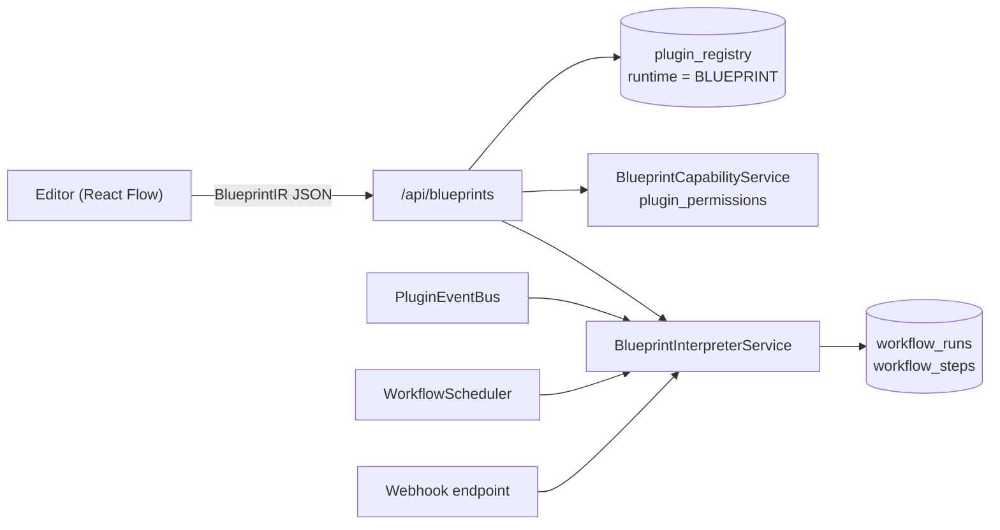

# Blueprints

Blueprints are Modulo's visual automations: node graphs that run when a trigger
fires, such as a saved note, a schedule, a webhook, or a manual request. This page
explains how to build one in the editor, what the saved graph (the Blueprint IR)
looks like, how the backend interpreter executes it, how capabilities and
sandboxing constrain it, and how plugins add nodes. It is written for Blueprint
authors and for developers who work on the Blueprint system.

Related pages:

- [Blueprint node reference](../reference/blueprint-nodes.md): every node, with its pins and config.
- [WASM node ABI and script sandbox](../reference/wasm-node-abi.md): what custom code may do.
- [Workflows and approvals](workflows-and-approvals.md): run records, retries, schedules, human approval, and evidence.
- [Packs](packs.md): shipping Blueprints as part of a pack.

## How the parts fit



| Layer | Code |
| --- | --- |
| Node model, types, connection rules | [`nodeModel.ts`](../../frontend/src/features/blueprint/nodeModel.ts) |
| Node catalog | [`nodeCatalog.ts`](../../frontend/src/features/blueprint/nodeCatalog.ts) |
| Graph IR and validation | [`blueprintIR.ts`](../../frontend/src/features/blueprint/blueprintIR.ts) |
| Editor | [`frontend/src/features/blueprint/editor/`](../../frontend/src/features/blueprint/editor/) |
| REST API | [`BlueprintController`](../../backend/src/main/java/com/modulo/blueprint/BlueprintController.java), [`ManualBlueprintController`](../../backend/src/main/java/com/modulo/blueprint/ManualBlueprintController.java), [`BlueprintWebhookController`](../../backend/src/main/java/com/modulo/blueprint/BlueprintWebhookController.java) |
| Persistence | [`BlueprintRepository`](../../backend/src/main/java/com/modulo/blueprint/BlueprintRepository.java) |
| Interpreter | [`BlueprintInterpreterService`](../../backend/src/main/java/com/modulo/blueprint/interpreter/BlueprintInterpreterService.java) |
| Node registry | [`BlueprintNodeRegistry`](../../backend/src/main/java/com/modulo/blueprint/BlueprintNodeRegistry.java) |
| Capabilities | [`BlueprintCapabilityService`](../../backend/src/main/java/com/modulo/blueprint/BlueprintCapabilityService.java) |

## Building a Blueprint in the editor

Open **Blueprints** in the workspace (`/app/blueprints`; the old `/blueprints`
route redirects there). This is a React Flow node editor, separate from the
knowledge-graph renderer.

- **Palette (left).** Lists every node available to you, grouped into Triggers,
  Actions, and Logic, with a search over title, type, and description. Click a
  node to add it, or drag it onto the canvas. The palette always contains the core
  nodes, plus the nodes of every installed plugin that contributes some.
- **Canvas (centre).** Pan, zoom, minimap, and grid. Select a node or edge and
  press `Delete` or `Backspace` to remove it. Node-specific settings, such as the
  code of a Custom Code node or the module of a WASM Module node, are edited on the
  node itself.
- **Toolbar (top).** Name, description, autonomy level, **New**, **Load**,
  **Save**, **Test Run**, **Debug**, **Clear Highlight**, and **Permissions**.

### Pins and connection rules

Each pin is a React Flow handle. Exec pins are white diamonds: the input on the
left, and named outputs such as `then`, `true`/`false`, or
`approved`/`rejected`/`expired` on the right. Data pins are circles coloured by
type. Every connection attempt goes through the same `validateConnection` used by
IR validation, so the canvas enforces the same rules as saved graphs:

1. Exec connects only to exec, and data only to data.
2. Connections run from an output to an input.
3. Data types must be assignable: equal, or one side `any`.
4. You cannot connect into a trigger, which has no exec input, or connect a node to itself.

The editor rejects an illegal drop and shows the reason in the status bar.

### Test Run and Debug

- **Test Run** is a static trace in the browser. It follows exec edges from every
  trigger and highlights the reachable path, including both arms of a branch,
  because conditions are not evaluated. It makes no backend call.
- **Debug** loads the Blueprint's run history
  (`GET /api/blueprints/{name}/executions`) and highlights the nodes the most
  recent real run executed. The Execution Center links into the editor with
  `?run=<id>&node=<id>`, which highlights a specific run. The editor opens the
  *current* graph and warns that nodes may have changed since that run.

## The Blueprint IR

A saved Blueprint is a versioned JSON document, the `BlueprintIR` defined in
`blueprintIR.ts`. The editor produces it with `flowToIR` and loads it back with
`irToFlow`. The interpreter deserializes the same JSON as `BlueprintIRGraph`.

| Field | Meaning |
| --- | --- |
| `irVersion` | Always `1` for now. Unknown versions fail validation. |
| `nodes[]` | `id`, `type`, `nodeVersion` (the pinned descriptor version), optional `position` (editor layout only), optional `config` (node settings that are not pins, such as `cron`, `code`, `module`, or `secret`) |
| `edges[]` | `id`, `kind` (`exec` or `data`), `fromNode`, `fromPin`, `toNode`, `toPin`. Exec edges use `toPin: "in"` by convention. |
| `metadata` | `name`, optional `description`, optional `autonomyLevel`, `createdAt`, `updatedAt` |

`validateIR` checks the IR version, unique node ids, that every node resolves in
the catalog at its pinned version, unique edge ids, that every edge endpoint
exists, and that every edge passes `validateConnection`.

### Worked example

On Note Saved, then Summarize (AI), then Add Tag with the summary, then Anchor
On-Chain. This is the pipeline that
[`blueprintIR.test.ts`](../../frontend/src/features/blueprint/__tests__/blueprintIR.test.ts)
validates:

```json
{
  "irVersion": 1,
  "nodes": [
    { "id": "n1", "type": "trigger.note.saved",  "nodeVersion": 1 },
    { "id": "n2", "type": "action.ai.summarize", "nodeVersion": 1 },
    { "id": "n3", "type": "action.tag.add",      "nodeVersion": 1 },
    { "id": "n4", "type": "action.note.anchor",  "nodeVersion": 1 }
  ],
  "edges": [
    { "id": "e1", "kind": "exec", "fromNode": "n1", "fromPin": "then",    "toNode": "n2", "toPin": "in" },
    { "id": "e2", "kind": "data", "fromNode": "n1", "fromPin": "note",    "toNode": "n2", "toPin": "note" },
    { "id": "e3", "kind": "exec", "fromNode": "n2", "fromPin": "then",    "toNode": "n3", "toPin": "in" },
    { "id": "e4", "kind": "data", "fromNode": "n2", "fromPin": "summary", "toNode": "n3", "toPin": "tag" },
    { "id": "e5", "kind": "data", "fromNode": "n1", "fromPin": "note",    "toNode": "n3", "toPin": "note" },
    { "id": "e6", "kind": "exec", "fromNode": "n3", "fromPin": "then",    "toNode": "n4", "toPin": "in" },
    { "id": "e7", "kind": "data", "fromNode": "n3", "fromPin": "note",    "toNode": "n4", "toPin": "note" }
  ],
  "metadata": {
    "name": "On Save → Summarize → Tag → Anchor",
    "createdAt": "2026-01-01T00:00:00Z",
    "updatedAt": "2026-01-01T00:00:00Z"
  }
}
```

Reading it: exec edges `e1`, `e3`, and `e6` give the order n1 → n2 → n3 → n4. Data
edges carry values. The saved note (`n1.note`) feeds both the summarizer and the
tagger. The summary becomes the tag (`summary: string` → `tag: string`). The
tagged note is what gets anchored. Every edge passes `validateConnection`. To run,
the Blueprint needs the `ai:invoke`, `notes:write`, and `blockchain:anchor`
capabilities.

A second example, with a schedule trigger and a human approval, is
[`approval-request.json`](../reference/examples/approval-request.json). Its
walkthrough is in
[Workflows and approvals](workflows-and-approvals.md#human-approvals).

### Versioning nodes

Nodes are referenced as `type@nodeVersion`. When a descriptor's pins change, bump
its `version`. The catalog keeps every registered version, so older Blueprints keep
resolving to the signature they were built against, and new ones get the latest.

## Saving, storage, and the API

Blueprints are stored in `plugin_registry` with `runtime = 'BLUEPRINT'` and the IR
in the JSONB `config` column. This lets them share the plugin catalog, config
history, and permission tables. Every Blueprint has a persisted owner and a public
name that is unique per owner. Two owners can use the same name, because the
internal registry name is a generated identifier. All endpoints require
authentication and resolve the caller as the owner.

| Method and path | Purpose |
| --- | --- |
| `GET /api/blueprints` | List your Blueprints |
| `GET /api/blueprints/{name}` | Load one |
| `POST /api/blueprints` | Create from `{name, description, version, ir}` |
| `PUT /api/blueprints/{name}` | Replace the IR from `{ir, changeReason}`. The previous config is recorded in `plugin_config_history`. |
| `DELETE /api/blueprints/{name}` | Delete. Run history is kept (see [retention](workflows-and-approvals.md#retention-and-alerts)). |
| `GET /api/blueprints/{name}/permissions` | List required capabilities and whether each is granted |
| `POST /api/blueprints/{name}/permissions` | Grant or revoke: `{"capability": "notes:write", "granted": true}` |
| `GET /api/blueprints/{name}/executions?limit=20` | Recent runs (1–100) with the executed node ids |
| `POST /api/blueprints/{name}/run` | Fire a `trigger.manual` node (see below) |

When the server saves a Blueprint, it rejects the request with
`400 INVALID_BLUEPRINT_IR` if any of these limits is exceeded:

- the serialized IR must be at most 1 MiB;
- at most 1,000 nodes and 5,000 edges;
- node ids must match `[A-Za-z0-9_-][A-Za-z0-9_.-]{0,127}` and be unique;
- node types must be at most 128 characters;
- every edge must reference existing nodes;
- `metadata.autonomyLevel` must be a known level.

Create, update, and delete also re-register the Blueprint with the interpreter, so
the running set always matches what is stored.

Blueprints installed by a marketplace pack are kept as workspace state on the
server, not in the browser, and the editor lists them next to your own. See
[`localBlueprints.ts`](../../frontend/src/features/blueprint/localBlueprints.ts)
and [Packs](packs.md).

## Autonomy levels

Every Blueprint records one owner-selected execution posture in
`metadata.autonomyLevel`
([`BlueprintAutonomyLevel`](../../backend/src/main/java/com/modulo/blueprint/BlueprintAutonomyLevel.java)):

| Level | Effect |
| --- | --- |
| `MANUAL` ("Manual only") | Event, webhook, and schedule triggers are not registered. The confirmed manual-run endpoint is the only way to start the Blueprint. |
| `SUPERVISED` (default) | Automatic triggers are active. Capability grants and approval nodes apply as usual. Legacy Blueprints without the field load as `SUPERVISED`. |
| `AUTONOMOUS` | Declares that automatic execution is intended. |

No level grants a capability, removes an approval node, or lets an automation
widen its own authority.

## Capabilities and consent

A Blueprint's required capabilities are the union of its nodes' capabilities.
The capability list is in the
[node reference](../reference/blueprint-nodes.md#capabilities).

1. On save, `BlueprintCapabilityService.syncPermissions` writes each required
   capability to `plugin_permissions` with `granted = false`. It removes
   capabilities that are no longer needed and leaves existing grants untouched.
2. The editor opens the consent screen (`CapabilityConsentScreen`) with a label and
   explanation for each capability. The owner grants or revokes each one. The
   **Permissions** button reopens the screen later.
3. Before each node runs, the interpreter checks the grant. A node whose capability
   has not been granted is skipped, recorded as `SKIPPED` with
   `CAPABILITY_DENIED`, and the flow continues through `then`.

Retries and resumed runs use the grants that are current when they run, not the
grants at the time of the original run.

## How the interpreter runs a Blueprint

### Registration

`BlueprintInterpreterService` is an `ApplicationRunner`. On startup it loads every
runnable Blueprint and registers its triggers. A runnable Blueprint is `ACTIVE` and
has an owner. Unowned legacy Blueprints are preserved but never activated; adopting
them is an operator task described in [Runbooks](../operations/runbooks.md).

| Trigger | Registration |
| --- | --- |
| `trigger.note.saved` | Subscribes to `note.created` and `note.updated` on the `PluginEventBus` |
| `trigger.link.created` | Subscribes to `link.created` |
| `trigger.schedule` | Syncs a persisted schedule definition into the durable `WorkflowScheduler` |
| `trigger.webhook` | Registers an endpoint keyed by Blueprint id and node id. The node must configure a `secret`. |
| `trigger.manual` | Nothing to register. It is invoked through the run endpoint. |
| Plugin trigger | Subscribes to the event types the plugin's registration declares |

Event-driven triggers only fire for notes owned by the Blueprint owner. For
`link.created`, both notes must belong to the owner. Registration listens for
`system.plugin_started` and `system.plugin_stopped` and re-registers all
Blueprints, so plugin-provided triggers follow the plugin lifecycle.

### Execution

When a trigger fires:

1. The interpreter computes the SHA-256 of the canonical IR and creates a workflow
   run keyed by trigger identity. Repeated delivery of the same event, schedule
   job, or webhook `Idempotency-Key` returns the existing run instead of starting a
   new one.
2. The trigger's output values seed a fresh `BlueprintExecutionContext`, and the
   trigger is recorded as step 1.
3. The interpreter follows the exec edge leaving the trigger's `then` pin. Before
   each node, it saves a checkpoint, checks for cancellation, and resolves the
   node's data inputs from values that upstream nodes wrote, addressed as
   `nodeId:pinId`.
4. The node runs. A handler registered by a plugin takes priority; otherwise the
   built-in implementation runs. Its outputs are written back to the context.
5. The node returns the exec output to follow next: `then` for actions,
   `true`/`false` for a branch, or the approval outcome for Approval Result. The
   flow ends when that output has no edge.

`logic.wait` and `logic.approval.wait` end the current call after saving a
checkpoint. The scheduler resumes the same run later; see
[Workflows and approvals](workflows-and-approvals.md#durable-schedules-and-waits).

### Safety guards

| Guard | Behaviour |
| --- | --- |
| Loop guard | More than 100 steps in one run throws `BlueprintLoopGuardException`. The run fails with `LOOP_GUARD`, so a cyclic exec graph cannot hang. |
| Async action timeout | Blockchain anchoring is awaited for at most 30 s. |
| Failure | Any node exception fails the step and the run. The run fails with `NODE_FAILURE`, or with the approval failure reason for approval nodes. Execution stops at the failed node. |
| Isolation | Each firing gets its own execution context, so concurrent runs never share pin values. |
| Ownership | Runs execute as the Blueprint owner, so note and tag APIs see only that owner's data. |

### Webhooks

`trigger.webhook` exposes a public endpoint:

```sh
curl -X POST https://<modulo>/api/public/blueprints/webhook/<blueprintId>/<nodeId> \
  -H 'X-Webhook-Secret: <secret from the node config>' \
  -H 'Idempotency-Key: <1–128 printable characters>' \
  --data 'raw payload'
```

- A valid secret returns `202 {"status":"accepted"}` and the body becomes the
  trigger's `payload` output.
- The secret is compared in constant time. An unknown endpoint and a wrong secret
  both return `404 {"status":"rejected"}`, so callers cannot tell them apart.
- With an `Idempotency-Key`, repeated deliveries map to the same run. Without one,
  every request is a separate delivery.

Webhooks are not registered for Blueprints set to `MANUAL`.

### Manual runs

`POST /api/blueprints/{name}/run` with
`{"requestId": "<uuid>", "noteId": 42, "triggerId": "<trigger.manual node id>", "confirmed": true}`
starts a run and returns `{"runId": …}`. The note must belong to the caller, and
`confirmed` must be `true`. Reusing the same `requestId` returns the same run.

## Custom code

Two core nodes run owner-supplied code in a sandbox:

- **Custom Code** (`action.code.execute`) runs a JavaScript function in QuickJS
  compiled to WebAssembly. It is the only engine; Rhino has been removed.
- **WASM Module** (`action.wasm.execute`) runs a compiled, import-free WebAssembly
  module.

Both are pure compute over the note's title and content. They have no network,
filesystem, or host access, a 2 s wall-clock budget, a 32 MiB memory cap, and
64 KiB of output. Each needs its own capability (`code:execute`, `wasm:execute`).
The full contract, engine provenance, and the differences from the removed Rhino
engine are in [WASM node ABI and script sandbox](../reference/wasm-node-abi.md).

When an EXTERNAL `script-sandbox` plugin is attached and healthy, Custom Code runs
in that pod instead of in-process. See
[Plugins](plugins.md#deploying-external-plugins).

## Contributing nodes from a plugin

A node has two halves that share one `type` and `version` key.

**Editor descriptor (frontend).** A workspace plugin adds the descriptor in
`activate`. It shows up in the palette while the plugin is installed:

```ts
const calendarPlugin: PluginModule = {
  activate(ctx) {
    ctx.addBlueprintNode({
      type: 'calendar.create-event',
      version: 1,
      category: 'action',
      title: 'Create calendar event',
      description: 'Create an event in the connected calendar.',
      execIn: true,
      execOut: ['then'],
      inputs: [{ id: 'title', name: 'Title', type: 'string' }],
      outputs: [{ id: 'eventId', name: 'Event', type: 'string' }],
      capability: 'calendar:write',
    });
  },
};
```

**Executable registration (backend).** An in-process backend plugin implements
[`BlueprintNodeProvider`](../../backend/src/main/java/com/modulo/plugin/api/BlueprintNodeProvider.java):

```java
public final class CalendarPlugin implements Plugin, BlueprintNodeProvider {
  @Override
  public Collection<BlueprintNodeRegistration> getBlueprintNodes() {
    return List.of(BlueprintNodeRegistration.action(
        "calendar.create-event", 1, "calendar:write",
        context -> new BlueprintNodeResult(
            Map.of("eventId", createEvent(String.valueOf(context.input("title")))),
            "then")));
  }
}
```

Rules enforced by
[`BlueprintNodeRegistration`](../../backend/src/main/java/com/modulo/blueprint/BlueprintNodeRegistration.java)
and `BlueprintNodeRegistry`:

- The type must match `[a-z][a-z0-9]*(\.[a-z0-9_-]+)+`, and the version must be 1 or higher.
- The capability, if present, must be 1–128 characters.
- A trigger uses `BlueprintNodeRegistration.trigger(...)`. Its type must start with
  `trigger.`, and it declares the event types it consumes. The handler receives an
  immutable `BlueprintTriggerContext` with the event, node config, and owner id,
  and returns the trigger outputs, or `null` to ignore the event.
- The plugin manager registers contributions after the plugin starts and removes
  them before it stops. A plugin cannot replace a core node or another plugin's
  node at the same `type@version`. A batch containing a collision or a duplicate is
  rejected as a whole, so the registry never holds half a plugin's nodes.
- `BlueprintNodeExecutionContext` exposes the resolved inputs, immutable node
  config, Blueprint id, owner id, and workflow lease, and nothing else from the
  interpreter.
- Pack validation resolves node types and capabilities through the live registry.

EXTERNAL (gRPC) plugins cannot provide executable node handlers yet; that would
need a host protocol extension. The steps for adding a built-in node are in the
[node reference](../reference/blueprint-nodes.md#adding-a-node).
