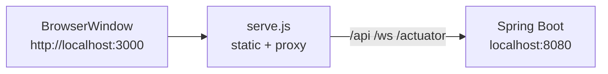

# Mobile and desktop

This page covers the two native shells around the web app: the Android app
(Capacitor) and the Electron desktop app. It explains how each is built, signs
in, stores data offline and synchronizes, what device features it adds, and
how signed Android builds are released and upgraded. It is for users
installing the apps, operators running a server they connect to, and
developers working on the shells.

Both shells run the same React frontend and plugin catalog as the browser. The
architecture decision is recorded in [Decisions](../architecture/decisions.md)
(shared frontend for Android); the state protocol they share is described in
[Data and state](../architecture/data-and-state.md).

## Android app

The Android app lives in [`mobile/app`](../../mobile/app/). It is a Capacitor
project (`appId` `com.modulo`) that packages the production build of
`frontend/` (`webDir: ../../frontend/dist`); nothing is downloaded from the
server at launch. Native code is in
[`mobile/app/android/app/src/main/java/com/modulo/`](../../mobile/app/android/app/src/main/java/com/modulo/):

| Class | Role |
| --- | --- |
| `MainActivity`, `ShellWindowPlugin` | Edge-to-edge window; insets the WebView for the soft keyboard and reports the inset to the page; system bar icon colour follows the theme |
| `ModuloStateCachePlugin` | Transactional SQLite cache and outbox for plugin state; commits before resolving a write and keeps the queue replica ID across process death |
| `ModuloSecureStorePlugin` | Android Keystore-backed credential store (refresh token) |
| `ModuloSharePlugin` | Receives shares from other apps |
| `ModuloRemindersPlugin`, `ReminderStore`, `ReminderAlarmReceiver`, `ReminderRescheduleReceiver` | Local reminder alarms |

The older `mobile/android` Kotlin app shares the `com.modulo` application ID
but was never buildable or distributed, so there is no installation to
upgrade from. It will be removed once a signed release has passed the upgrade
test from a previous signed release.

### Supported devices and servers

| | Requirement |
| --- | --- |
| Android | 8.0 (API 26) or newer; built for API 36 |
| Android System WebView / Chrome | 120 or newer. Older WebViews get an update prompt at start instead of a partly working app; offline data is kept |
| Screen | Phones and tablets, portrait and landscape; system font scaling up to 200% |
| Modulo server | HTTPS origin with the plugin-state API, `/api/remote` for server-side services, and the Keycloak client registered with redirect URIs `com.modulo:/oauth2redirect` and `com.modulo:/logout` (`deploy/oci/render-realm.sh` does this) |

### Server onboarding and sign-in

On first start the app asks for the server address. It must be an explicit
`https://` origin with no path, user name or password
([`androidServer.ts`](../../frontend/src/services/androidServer.ts)). The app
checks `GET /api/simple-health` (must report application `modulo`, status
`UP`, without redirects) and the issuer's
`/.well-known/openid-configuration`, then stores the origin in its private
database.

Sign-in follows RFC 8252: the identity provider opens in the system browser
(Custom Tab), and Android returns to the app through
`com.modulo:/oauth2redirect`
([`authService.ts`](../../frontend/src/features/auth/authService.ts),
[`AndroidAuthLink.tsx`](../../frontend/src/features/auth/AndroidAuthLink.tsx)).
The refresh token and the identity it belongs to are kept in the Keystore
store, one record per server
([`nativeSession.ts`](../../frontend/src/features/auth/nativeSession.ts)).
A record for another server or issuer is never used, and refreshes are
validated against the stored subject. A refresh that fails for lack of
connectivity keeps the session for offline use; a refresh the identity
provider rejects ends it. Browsers and Electron never persist refresh tokens.

### Offline storage

All normal plugin records go through the shared plugin-state client. On
Android its queue is the native SQLite adapter; on web and Electron it is
IndexedDB. Browser `localStorage` is read only by the isolated legacy
migration code (`frontend/src/services/legacy/`) and authentication; CI fails
on any other Storage reference. Android system backup is disabled
(`allowBackup="false"`) for the private offline database.

### Phone interface

The phone layer is in
[`frontend/src/features/workspace/mobile/`](../../frontend/src/features/workspace/mobile/):
a top app bar naming the screen, labelled bottom navigation (content first,
utility views only fill empty slots), an edge-swipe drawer, a capture button,
a phone home screen, a hub view picker, pull-to-refresh, and banners placed
under the app bar. An open note claims the whole screen. Touch sizing keys
off Tailwind's `coarse:` variant (`@media (pointer: coarse)`), so it does not
appear when you narrow a desktop window; use a device, an emulator or Chrome
device emulation. A labelled button reaches 44 px on a coarse pointer, and
dialogs become bottom sheets below the `md` breakpoint.

### Share to Modulo

Modulo appears in the Android share sheet for text, links, images and
documents.

1. `ModuloSharePlugin` copies the share into app-private storage
   (`files/shared-inbox/<id>`) as soon as it arrives, because the sender's URI
   grant ends with the activity. A share directory is renamed into place only
   after every file is copied; a half-copied share is removed on next start.
2. Only `content://` URIs are read. Files over 25 MB, more than 10 files,
   revoked permissions and unavailable files are listed as "not kept" instead
   of failing the whole share.
3. The workspace shows each pending share with **Save as note** or
   **Discard**. Saving creates one note and uploads each file as an ordinary
   server attachment (files over the server's 10 MB limit are named in the note
   instead).
4. Progress is committed after the note is created and after each upload. A
   failed upload keeps the share pending with **Retry**, which reuses the note
   and skips uploaded files. A hidden marker in the note prevents a second
   note if the import was interrupted.

### Saving and opening files

The Android WebView ignores `<a download>`, so export, backup and recovery
downloads are routed to the system **Save to** dialog (Storage Access
Framework); cancelling writes nothing
([`androidDownloads.ts`](../../frontend/src/services/androidDownloads.ts)).
`shareDocument` offers a file to other apps; only files Modulo wrote to
`cache/share/` are exposed through the `FileProvider`. File picking and camera
capture use the standard file input, which opens the system picker or camera
app without storage or camera permissions.

### Reminders

Reminders & Notifications records stay on the server. Whenever they change
(including from another device) the app publishes the complete set of
upcoming occurrences to `ModuloRemindersPlugin.replaceAll`
([`androidReminders.ts`](../../frontend/src/features/workspace/androidReminders.ts)):

- Up to 7 occurrences per reminder within 45 days, at most 500 alarms. Opening
  Modulo extends the window.
- Each occurrence has a stable ID (`<record>:<date>`), so republishing
  replaces instead of duplicating; reminders missing from the new set are
  cancelled. Signing out cancels every alarm and notification.
- Times are wall-clock: 09:00 stays 09:00 after a time-zone change.
- Alarms are re-armed after reboot, app update, clock change and time-zone
  change by `ReminderRescheduleReceiver`, without starting the WebView.
- Tapping a notification opens `com.modulo:/open?route=/app/...` (workspace
  routes only) and the record named by `?record=`.

| Situation | Behaviour |
| --- | --- |
| Notifications and "Alarms & reminders" allowed | Delivered on the minute, including in Doze |
| Exact alarms not allowed | Delivered, possibly minutes late; the view offers **Allow exact timing** |
| Notifications denied | Nothing is shown; the view offers **Allow notifications** (system settings after a permanent denial). Due reminders stay visible in the view and calendar |
| Phone off at the due time | Shown once after boot if less than 24 hours late |
| App force-stopped | Android cancels its alarms until Modulo is opened again |
| Reminder edited offline | Local alarm updates immediately; the server copy follows the offline queue |

Modulo keeps no background WebView or service. Work that must run whether or
not a phone is on (scheduled Blueprints, server jobs) runs on the server.

### Server-side service adapters

The desktop app runs feed sync, web capture, web watches, CalDAV, ntfy,
metadata lookups and PDF tools locally. Android and browsers cannot, so the
server offers the same operations under `/api/remote` (authenticated,
owner-scoped;
[`remote/`](../../backend/src/main/java/com/modulo/remote/)). The client
[`platform/network.ts`](../../frontend/src/platform/network.ts) returns the
desktop services in Electron and the server client elsewhere, with results of
the same shape.

| Endpoint | Replaces | Notes |
| --- | --- | --- |
| `POST /api/remote/feeds` | `feeds.sync` | RSS/Atom, or Miniflux with the saved `minifluxToken` |
| `POST /api/remote/archive/capture` | `archive.capture` | Page saved as a workspace file; HTML is never served inline |
| `POST /api/remote/archive/import` | `archive.import` | Karakeep (with `karakeepToken`) or ArchiveBox JSON |
| `POST /api/remote/web-watch/check` | `webWatch.check` | Stateless; up to 25 per call |
| `POST /api/remote/caldav` | `caldav.sync` | CalDAV `REPORT` or a plain `.ics` URL |
| `POST /api/remote/ntfy` | `ntfy.publish` | Optional `ntfyToken` |
| `GET /api/remote/metadata` | `providers.search` | Open Library, MusicBrainz, TMDB, YouTube, IGDB |
| `POST /api/remote/pdf` | `pdf.run` | Merge, split, rotate, extract text; 20 files, 25 MB each, 2,000 pages; encrypted PDFs refused; nothing stored |
| `GET /api/remote/credentials`, `PUT /api/remote/credentials/{key}` | `credentials.status/set` | Write-only; a blank value deletes |
| `GET /api/remote/status` | | Availability |

**Outbound request policy.** Every URL comes from a user, so
[`SafeHttpFetcher`](../../backend/src/main/java/com/modulo/remote/SafeHttpFetcher.java)
treats each request as potential SSRF: only `http`/`https` (`webcal` read as
`https`) on ports 80, 443, 8080 and 8443, no credentials in URLs; every
connection and redirect hop resolves through a resolver that refuses
loopback, private, link-local (including 169.254.169.254), CGNAT,
unique-local, multicast and unspecified addresses and IPv4 embedded in IPv6,
checked at connect time to close DNS rebinding; no proxy, at most 5
redirects, 10 s timeouts, 5 MB responses, no cookies.

Self-hosted services on the server's own network are therefore refused by
default. `MODULO_REMOTE_ALLOW_PRIVATE_NETWORKS=true` allows them, but lets
**any signed-in user** make the server call internal addresses; enable it only
on single-user or trusted deployments.

**Credentials.** Provider tokens are stored per user in
`remote_service_credentials`, AES-GCM encrypted with
`MODULO_REMOTE_CREDENTIAL_KEY` (32 bytes, base64; generated by
`deploy/oci/init-env.sh`), with owner ID and key name as authenticated data.
Values are never returned. Without the key, saving answers
`REMOTE_CREDENTIALS_UNCONFIGURED`. Failures return a stable `{ "code": ... }`
(for example `URL_ADDRESS_NOT_ALLOWED`, `REMOTE_AUTH_REJECTED`,
`PDF_ENCRYPTED`); upstream bodies and stack traces are never relayed.

Gaps off the desktop: indexing a local folder (use the file picker; files
become attachments), image OCR (Document Inbox extracts embedded text; image
OCR runs in the desktop app or through server extraction), ZIP backups (use
the JSON backup), and scheduled web watches (checked when you open Web Watch
or tap **Check**).

### Building and testing

With JDK 21 and the Android SDK (Platform 36, Build Tools 36) installed and
`ANDROID_HOME` set:

```sh
npm --prefix mobile/app run build:debug     # frontend strict build, cap sync, assembleDebug
adb install -r mobile/app/android/app/build/outputs/apk/debug/app-debug.apk
npm --prefix mobile/app run smoke:android   # onboarding/login, SQLite round trip, insecure-origin rejection, force-stop recovery
```

CI jobs: `android-debug` builds and uploads the APK; `android-emulator` runs
the packaged-app journeys. The `frontend` job runs the phone gates:

| Command (in `frontend/`) | Checks |
| --- | --- |
| `npm run inventory:android:check` | Every catalog plugin activates, no Storage use outside legacy/auth code, every storage key has an owner, the generated inventory and parity matrix are current |
| `npm run phone:audit`, `phone:parity`, `phone:parity:no-storage`, `phone:a11y` | Phone layout, per-view parity (also with browser storage throwing), accessibility |
| `npm run phone:perf` | Performance budgets (report-only until calibrated on the runner) |

`npm run inventory:android` regenerates the inventory and parity matrix in
[`reference/generated/android/`](../reference/generated/android/).
`frontend/scripts/phoneShots.mjs` screenshots views at Pixel size and reports
horizontal overflow and touch targets under 44 px.

`phone:perf` renders 2,000 notes and 4,000 links at 412×883 with 4× CPU
throttling against the development build. Budgets: notes list first rows
5 s, deep-linked note 2.5 s, graph first frame 5 s, canvas 4 s, longest task
1.5 s, heap 250 MB. These catch algorithmic regressions; device cold start,
scrolling and memory are checked on real devices at release.

### Releasing signed builds

**The signing key is Modulo's identity on every device.** Android installs an
update only if it is signed with the same key. Losing it forces users to
uninstall, losing unsynchronized edits, to move to a new key.

One-time setup:

1. Generate the key once on a trusted machine, never on a CI runner:
   `keytool -genkeypair -v -keystore modulo-release.jks -alias modulo -keyalg RSA -keysize 4096 -validity 10000`.
2. Keep two offline, encrypted copies of the keystore and its passwords.
3. In GitHub, create the environment `android-release` with required
   reviewers and the secrets `MODULO_ANDROID_KEYSTORE_BASE64`
   (`base64 -w0 modulo-release.jks`), `MODULO_ANDROID_KEYSTORE_PASSWORD`,
   `MODULO_ANDROID_KEY_ALIAS`, `MODULO_ANDROID_KEY_PASSWORD`.

The workflow decodes the keystore into the runner's temp directory for the
build step only and deletes it afterwards, also on failure. Without the
keystore the release build stays unsigned; it never falls back to a debug key.
With Google Play App Signing, this key becomes the upload key; register it in
Play Console before the first upload.

Cutting a release
([`android-release.yml`](../../.github/workflows/android-release.yml)):

1. Make sure `main` is green, including the phone gates and `android-emulator`.
2. Run **Android release** from the Actions tab with a semantic
   `version_name`, a `version_code` higher than every published build, and the
   previous release tag (blank for the first release).
3. The workflow runs the frontend checks, builds the signed APK and AAB,
   verifies the APK signature (v2/v3), writes `SHA256SUMS`, `provenance.json`
   and a build provenance attestation. On an emulator it installs the previous
   release, leaves a pending offline edit, the replica identity and a Keystore
   credential, upgrades, checks all three survived, and runs the packaged-app
   journeys.
4. It creates a **draft** GitHub release with the artifacts and test evidence
   (screenshots, step report, logcat). Complete the real-device checklist,
   then publish the draft by hand. Uploading the AAB to a store is a separate
   step.

Real-device checklist (record device model, Android version, WebView version
and build in the release notes):

- [ ] Fresh install: server onboarding, sign-in through the browser, sign-out.
- [ ] Upgrade over the previous release with a pending offline edit; the edit
      synchronizes afterwards.
- [ ] TalkBack: drawer, a hub picker, a note and a record form; every control
      is announced with a name.
- [ ] Largest font and display size: no clipped controls on the dashboard,
      notes, a collection view and settings.
- [ ] Share a link, an image and a PDF into Modulo; the files open on desktop.
- [ ] A reminder fires with the app closed and opens its record; after a
      reboot it still fires.
- [ ] Cold start under 3 s on a mid-range phone; scroll a 2,000-note list and
      the graph without visible stalls.

### Installing and upgrading signed builds

1. Download `modulo-<version>.apk` and `SHA256SUMS` from the GitHub release.
   Verify them with `sha256sum -c SHA256SUMS` and
   `gh attestation verify modulo-<version>.apk --repo Ikey168/Modulo`.
2. Open the APK and allow installation from the browser or file manager when
   Android asks.
3. On first start, enter the Modulo server address (`https://...`) and sign in.

Upgrades install over the existing app and keep everything: the offline
queue, drafts, the server choice and the saved sign-in. A lower `versionCode`
can never be installed over a higher one.

Recovery:

- Everything the server acknowledged comes back by signing in on a new device.
- Edits still queued on a lost phone are lost with it; let the phone come
  online now and then.
- **Recovery → Full workspace backup** exports all plugin records to a file
  that restores on any device.
- **Uninstalling deletes the offline queue.** Synchronize first.

Compatibility policy:

- A server change that removes or changes an endpoint the app uses must keep
  the old behaviour for at least one app release, because users update at
  different times.
- The state API's storage generation protects queued edits across server
  restores (see below).
- Capacitor, the Android Gradle Plugin, Gradle and the SDK levels are
  upgraded together, in a change that runs the emulator journeys and the
  upgrade test.

## Cross-device sync and recovery

Desktop, browser and Android use the same plugin-state protocol: optimistic
versions, tombstones, listings without tombstones, and a server **storage
generation**. The acceptance suite
[`crossDeviceSync.test.ts`](../../frontend/src/__tests__/acceptance/crossDeviceSync.test.ts)
runs a desktop client on IndexedDB and an Android client on the SQLite queue
against an in-memory server:

| Scenario | Result |
| --- | --- |
| Desktop creates, phone reads and edits, desktop refreshes | Data flows both ways without export |
| Offline edits, app killed, relaunch, two sync passes | One server write per record |
| Different records edited on each device | Merged |
| Same field edited on both | Conflict with both versions kept, resolved explicitly |
| Desktop deletes a record the phone has cached | Tombstone wins; the record stays deleted |
| New device with an empty queue | All acknowledged records listed from the server |
| Server unreachable | Edits queued and delivered when it returns |
| Server restored from backup | Queued edits made against the old generation are not replayed; they are surfaced for review with the local value kept |
| Full backup of every registered schema, restored on the other platform | Identical records; a second restore writes nothing |

**Conflicts.** For `modulo.workspace.*` documents a version conflict is first
resolved by a record-level three-way merge
([`stateMerge.ts`](../../frontend/src/services/stateMerge.ts)): changes to
different records, or different fields of one record, are combined. When both
sides changed the same value nothing is overwritten; the entry is marked as a
conflict and you choose. Other schemas always go to review. An expired session
keeps edits queued; switching accounts closes every client of the previous
account.

**Full workspace backup.** **Recovery → Full workspace backup** downloads every
plugin record of the account (all namespaces and schemas, listed by
`GET /api/workspaces/personal/plugin-state`) as one JSON file. Restore adds
and updates through the normal queue and verifies that every record reached
the server. Deleting records absent from the backup is a separate option,
limited to the namespaces in the file. Notes and attachments are server data
covered by the server backup (`deploy/oci/backup.sh`; see
[Database operations](../operations/database.md)).

## Legacy mobile browser sign-in

The web app still has the routes `/mobile/login`,
`/mobile/auth/google/callback` and `/mobile/auth/microsoft/callback`
([`MobileLoginPage`](../../frontend/src/components/mobile/MobileLoginPage.tsx),
[`mobileOAuthService.ts`](../../frontend/src/features/auth/mobileOAuthService.ts)).
They sign in directly with Google or Microsoft (PKCE) or MetaMask, configured
by `VITE_GOOGLE_CLIENT_ID`, `VITE_MICROSOFT_CLIENT_ID` and
`VITE_MICROSOFT_TENANT_ID` (default `common`), with redirect URIs
`<origin>/mobile/auth/google/callback` and
`<origin>/mobile/auth/microsoft/callback`. They are separate from the
Keycloak OIDC login the web, desktop and Android apps use (see
[Security model](../architecture/security-model.md)).

## Desktop app (Electron)

The desktop app in [`desktop/`](../../desktop/) runs the unmodified web build.
Its main process ([`main.js`](../../desktop/main.js)) starts a small embedded
server ([`serve.js`](../../desktop/serve.js), Node built-ins only) that serves
`frontend/dist` and reverse-proxies `/api`, `/ws` and `/actuator` to the
backend. The renderer therefore sees the same single origin it gets from the
Vite proxy in development and nginx in Docker: no CORS setup and no absolute
API URLs, and WebSocket/STOMP works unchanged.



### Run it

| Command | What it does |
| --- | --- |
| `npm run deploy:desktop` (repo root) | Builds the frontend, starts the backend stack with Docker Compose (backend, db, neo4j, keycloak), waits for health, launches the app. Flags: `--stop`, `--no-build`, `--stack-only`, `--app-only` ([`deploy-desktop.js`](../../scripts/deploy-desktop.js)) |
| `npm run dev` in `desktop/` (with `npm run dev` in `frontend/`) | Loads the Vite dev server with hot reload |
| `npm start` in `desktop/` | Uses a production `frontend/dist` build |
| `npm run serve` in `desktop/` | Only the embedded server, no Electron |
| `npm run pack` / `npm run dist` in `desktop/`, or `npm run build:desktop` at the root | Unpacked app, or installers (AppImage/deb, dmg/zip, NSIS) in `desktop/release/` |
| `npm test` in `desktop/` | Native-service and browser-extension tests |

The stack started by `deploy:desktop` keeps running after the window closes.
Node 18 or newer is required.

### Configuration

| Variable | Default | Purpose |
| --- | --- | --- |
| `MODULO_APP_URL` | unset | Load a deployed app origin directly instead of the local server |
| `MODULO_BACKEND_URL` | `http://localhost:8080` | Backend the embedded server proxies to |
| `MODULO_KEYCLOAK_URL` | `http://localhost:8180` | Keycloak origin allowed for in-window OIDC navigation |
| `MODULO_DESKTOP_PORT` | `3000` | Port of the embedded server, which is the app's origin |
| `MODULO_DIST_DIR` | `frontend/dist` | Frontend build served by `npm run serve` (standalone mode only; the app itself uses the packaged `app-dist` or the repo build) |
| `ELECTRON_START_URL` | unset | Dev-server URL to load (implies dev mode) |
| `MODULO_SMOKE_TEST` | unset | Write a screenshot to this path, then exit |

The origin `http://localhost:3000` is deliberately the same as the Vite dev
server's, which the `modulo-frontend` Keycloak client and the backend CORS
allowlist already trust, so login works without changes. If you change
`MODULO_DESKTOP_PORT`, add `http://localhost:<port>/*` to the client's valid
redirect URIs and allow the origin in the backend CORS configuration. The
embedded server refuses to start if the port is taken (for example by a
running Vite server).

### Security model

- The renderer runs with `contextIsolation: true`, `nodeIntegration: false`,
  `sandbox: true`.
- [`preload.cjs`](../../desktop/preload.cjs) exposes a minimal,
  capability-scoped `window.moduloDesktop` object. Extend it through
  `contextBridge` and `ipcRenderer.invoke`, never by enabling Node
  integration.
- Navigation is restricted to the app origin and Keycloak; other links open in
  the system browser.
- The embedded server binds to `127.0.0.1` only.
- The proxy strips the `Origin` header from forwarded requests. The backend's
  CORS allowlist does not know the shell's origin, and Chromium sends `Origin`
  on every mutating request, so without stripping every POST, PUT and DELETE
  would be rejected.

### Native desktop services

[`native-services.js`](../../desktop/native-services.js) provides the local
implementations the Android/web build gets from `/api/remote`: OS-encrypted
provider credentials, background reminders and tray behaviour, RSS/Miniflux
feeds, local web archives, document OCR, PDF operations, managed-folder
indexing, CalDAV, ntfy, attachments, ZIP backup and restore, and
passphrase-encrypted workspace sync. Native state lives under Electron's
`userData/native` directory; secrets are never written to the frontend store.
Remote imports accept HTTP(S) only, reject credentials in URLs, cap responses
at 10 MiB and re-validate each redirect (at most five hops). Unlike the
server adapters, the desktop reaches home-network services directly.

The package also ships
[`browser-extension/`](../../desktop/browser-extension/), a Manifest V3
extension for Firefox and Chromium browsers that captures pages to Noesis on
user action. Load it unpacked during development; its README documents the
endpoint, permissions, queue and privacy contract.
