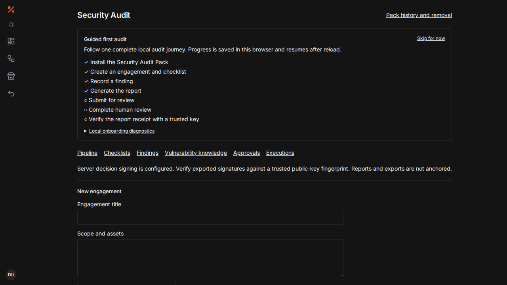

# Packs

A pack bundles plugins, Blueprints, and workspace configuration so that one
install sets up a whole workflow. This page explains the three pack mechanisms in
Modulo, the v2 manifest format, transactional install/upgrade/rollback, authoring
in Pack Studio, and the Security Audit Pack's guided journey. It is written for
pack authors and for users installing packs. The list of shipped packs is in the
[pack catalog](../reference/pack-catalog.md).

## Which pack mechanism?

| Mechanism | Where | What it installs | Backend |
| --- | --- | --- | --- |
| **Catalog pack** | **Marketplace → Packs** | A curated list of workspace plugins plus starter Blueprint templates | None. Plugins install through the workspace plugin runtime; Blueprint templates go into server-side workspace state. |
| **Workspace pack (manifest v2)** | **Packs** view, authored in **Pack Studio** | Typed resources: plugins, Blueprints, property schemas, templates, saved queries, views, dashboards, workspace modes, permission presets, demo data | `/api/workspace-packs`: transactional plan/apply with release history |
| **Legacy Blueprint pack (manifest v1)** | Legacy pack manager | Node descriptors and Blueprint IRs under `contributes` | `/api/packs`: install, IPFS publish, on-chain anchoring, paid-pack gating |

New pack work should use manifest v2. v1 manifests keep installing through the
legacy path. A v2 manifest sent to the legacy installer is rejected with
`V2_REQUIRES_WORKSPACE_INSTALL_PLAN`, instead of installing only part of it.

## Catalog packs

Catalog packs are defined in `PACKS` in
[`packs.ts`](../../frontend/src/features/workspace/plugins/packs.ts). Each has an
id, a name, a description, a category, `pluginIds`, and `blueprints`.

Installing one from **Marketplace → Packs**:

- installs each plugin, and each plugin's dependencies, through the plugin runtime;
- adds each Blueprint template to the pack Blueprint store in server workspace
  state
  ([`localBlueprints.ts`](../../frontend/src/features/blueprint/localBlueprints.ts)).

The Blueprint editor lists and opens these templates. They are not in
`plugin_registry`, so the interpreter does not run them automatically.

A pack is shown as installed when all of its plugins and Blueprints are present.
Every plugin in a pack can still be installed, disabled, or uninstalled on its own.
Plugin data belongs to the plugin, not the pack, so uninstalling a plugin leaves
its data in place for a later reinstall.

## Manifest v2

Manifest v2 describes a complete workspace pack. The executable JSON Schema is
[`pack-manifest-v2.schema.json`](../../backend/src/main/resources/pack-manifest-v2.schema.json).
It drives both the backend validator,
[`PackManifestValidator`](../../backend/src/main/java/com/modulo/pack/PackManifestValidator.java),
and the frontend validator,
[`packManifestV2.ts`](../../frontend/src/features/blueprint/pack/packManifestV2.ts).
Semantic validation then checks references, capability declarations,
compatibility, and dependency order.

Reference examples:

- [`shared/packs/knowledge-base.v2.json`](../../shared/packs/knowledge-base.v2.json):
  a property schema, template, saved query, table and board views, dashboard,
  workspace mode, and optional demo records.
- [`shared/packs/security-audit.v2.json`](../../shared/packs/security-audit.v2.json):
  the same contributions, plus the report-approval Blueprint and a review
  permission preset.

### Identity and compatibility

| Field | Rule |
| --- | --- |
| `manifestVersion` | `2`. If omitted, the manifest is v1. |
| `id` | Lowercase and namespaced, such as `org.modulo.security-audit`, at most 128 characters |
| `version` | Three-component semantic version |
| `name`, `description`, `author` | Display metadata |
| `minIrVersion`, `minCatalogVersion` | Must be supported before planning (IR version `1`) |
| `dependencies` | Up to 32 entries of `{id, minVersion}`. Self-dependencies and duplicates are invalid. |
| `capabilities` | The root list of every capability requested, up to 128 |
| `policies` | Required, exactly as shown below |
| `resources` | Up to 256 resources |

```json
{ "upgrade": "preserve-user-content", "removal": "preserve-user-content", "demoData": "opt-in" }
```

The whole manifest must be at most 2 MiB when serialized, with nesting depth at
most 32. Unknown fields, including prototype-named properties, are rejected.

### Resources

A resource has:

- a stable local `id`, lowercase and unique within the pack;
- a `kind`;
- a `title`;
- `requires`: the local resource ids that must be installed first;
- `capabilities`;
- a `spec`.

Its logical identity is `(installation owner, pack id, resource id)`. Titles may
change between releases, but ids should not. Ids must never embed database ids,
other owners' ids, or credentials.

| Kind | Required capability | `spec` |
| --- | --- | --- |
| `plugin` | `plugins:install` | Immutable image pinned by digest, runtime, optional configuration |
| `blueprint` | `blueprints:write` | Versioned Blueprint IR in `spec.ir`. Its action capabilities must also be declared. |
| `propertySchema` | `properties:schema` | Unique typed fields, with explicit options for select fields |
| `template` | `templates:write` | Title, Markdown, optional property-schema reference |
| `savedQuery` | `queries:write` | Property-schema reference and filters on existing fields |
| `view` | `workspace:configure` | Query reference and a table, list, card, or board layout |
| `dashboard` | `dashboard:configure` | References to contributed views |
| `workspaceMode` | `workspace:configure` | View references and an optional dashboard reference |
| `permissionPreset` | `permissions:request` | Requested capabilities. These are requests, never automatic grants. |
| `demoData` | `notes:write` | Template reference and a bounded set of explicitly identified demo records |

Validation rules:

- A reference must resolve to a resource of the expected kind, appear in
  `requires`, and belong to an acyclic graph. The validator returns a
  deterministic dependency-first order.
- Every resource capability must also appear in the root list. Permission presets
  must declare every permission they request, both locally and at the root.
- Blueprint action capabilities are checked against the live node registry.
- Resources from other packs are reached only through an installed dependency's
  public interface, never through raw cross-owner or cross-pack references.

Declaring a capability requests consent; it does not grant it. A plugin image
pinned by SHA-256 still has to pass the install checks in the
[Trust Center](plugins.md#trust-center).

`POST /api/packs/validate` returns `ok`, a classified failure reason, and the
resource order. It changes nothing.

### Migrating from v1

1. Set `manifestVersion: 2`.
2. Give each contribution a stable resource id.
3. Move each Blueprint IR into a `blueprint` resource's `spec.ir`.
4. Declare `requires` and capabilities, and add the three policies.
5. Represent plugins as explicit `plugin` resources.

v2 uses only `resources`; the legacy `contributes.nodes` and
`contributes.blueprints` arrays must stay empty. Executable node descriptors cannot
be delivered through a v2 pack.

## Installing, upgrading, and removing a v2 pack

Open **Packs** in the workspace, paste a v2 manifest, choose whether to create
optional demo notes, and review the install plan. The plan lists resource changes
and requested capabilities. Applying it requires explicit confirmation. Release
history offers rollback plans, uninstall has its own reviewable plan, and the
operation history records successes and classified failures. The implementation is
[`WorkspacePackService`](../../backend/src/main/java/com/modulo/pack/WorkspacePackService.java).

### Plan and apply

1. `POST /api/workspace-packs/plans` with `{manifest, includeDemo}` checks:
   - the v2 contract;
   - the resource order;
   - installed dependencies;
   - that each resource kind is compatible with what is already installed.

   It records an immutable plan and returns the operation UUID, the manifest
   digest, the changes, and the required capabilities.
2. `POST /api/workspace-packs/plans/{id}/apply` with `{manifestDigest,
   acceptedCapabilities}` must repeat the exact capability list from the reviewed
   plan. It locks the owner's pack operations and rechecks the active release and
   the dependency snapshot. It then applies all configuration, demo notes, grants,
   and activation in one transaction.

Guarantees:

- A dependency change invalidates the plan; consent is never silently changed.
- A failed stage rolls back the whole installation transaction and leaves a
  separate failed-operation record.
- A crash before commit leaves the plan reusable. A retry after a successful commit
  returns the original result.
- The previous release stays active until an upgrade commits.
- A release version can never be rewritten with different manifest content.
- Operations for one owner are serialized; other owners are unaffected.
- Each owner can retain at most 10,000 pack operations.

### Rollback and uninstall

- **Rollback** plans target an existing immutable release. Dependency minimum
  versions are rechecked, so a rollback cannot break another installed pack.
- **Uninstall** is blocked while another active pack depends on the target.

### Ownership rules

- Configuration owned by the pack can be replaced by a new release or restored by a
  rollback.
- User content is never overwritten or deleted. This includes Blueprints the user
  edited (detected by comparing against the installed baseline) and resources
  marked user-modified. Uninstall detaches them as user configuration.
- A resource id cannot change kind during an upgrade. Author a new id and an
  explicit migration instead.
- Permission presets never widen grants silently on upgrade.
- Demo notes are created only when the user opts in at install time; a manifest
  cannot opt in on the user's behalf. Their identities are tracked, including
  tombstones for deleted notes. Upgrade, rollback, uninstall, and reinstall never
  overwrite or recreate them.
- Importing demo notes does not fire note-created workflows while an installation
  is only partly applied.
- `plugin` resources bind to an existing deployment that the owner owns, that is
  active, and that is pinned by digest. Provision the image first. Preflight rejects
  missing or foreign deployments and configuration mismatches before anything
  changes. Removing the pack removes only the binding.

### Runtime refresh

Blueprint definitions and their consented capabilities are saved atomically. A
durable refresh journal then updates event and webhook listeners on every backend
instance, and each instance reads the journal independently.

A listener refresh is idempotent and retried. After 10 failed attempts it stays
visible for an explicit **retry** from the Packs view
(`POST /api/workspace-packs/{pack}/retry-runtime`). The pending count reflects
acknowledgements from servers, not a cluster quorum. Schedules already read the
persisted Blueprint definitions, so they need no refresh.

### API

| Endpoint | Purpose |
| --- | --- |
| `GET /api/workspace-packs` | Your installations and runtime-pending counts |
| `POST /api/workspace-packs/plans` | Create an install or upgrade plan |
| `GET /api/workspace-packs/plans/{id}` | The original plan and its final status |
| `POST /api/workspace-packs/plans/{id}/apply` | Apply with consent |
| `POST /api/workspace-packs/{pack}/rollback-plan` | `{release}`: plan a rollback to that release UUID |
| `POST /api/workspace-packs/{pack}/uninstall-plan` | Plan removal |
| `POST /api/workspace-packs/{pack}/retry-runtime` | Retry listener reconciliation |
| `GET /api/workspace-packs/history?page=0` | Operation history, bounded |
| `GET /api/workspace-packs/resources` | Available contributions and detached user configuration |
| `GET /api/workspace-packs/{pack}/releases` | Immutable release history |

All endpoints are owner-scoped. Errors return `{"code": "<CLASSIFIED_REASON>"}`.

## Authoring in Pack Studio

Open **Pack Studio** in the workspace
([`PackStudio.tsx`](../../frontend/src/features/packs/PackStudio.tsx),
[`PackAuthoringService`](../../backend/src/main/java/com/modulo/pack/PackAuthoringService.java)).

1. Start with **New Audit draft** or **New Knowledge Base draft**, which load the
   reference resources. Set the pack id and version.
2. Pick contributions and edit their fields. The picker covers plugins, Blueprints,
   property schemas, templates, saved queries, views, dashboards, workspace modes,
   permission presets, and optional demo data.
3. For a Blueprint resource, such as the Audit draft's report approval, set the
   **Reviewer account ID** for each Request Approval node. You can also import one
   of your saved Blueprints: **Open Blueprint editor in new tab**, save the graph
   there, choose **Refresh Blueprints**, and import it. An imported graph is a copy
   inside the draft.
4. A plugin contribution names an image that is already provisioned. Authoring
   never provisions a runtime.

Validation names the affected contribution and field. It reports missing or
mistyped references, query properties, prerequisites, and cycles.

**Preview** shows dependencies, requested capabilities, navigation, and sample view
and dashboard layouts. It has no side effects: it installs nothing, queries no
notes, and enables no workflow. Installing is a separate step in the **Packs** view.

**Save private draft** stores the source under your account with optimistic
revision checks. A stale save is rejected; reload the draft before editing again.
A draft may be incomplete, but preview and publication require a valid manifest.
Import and export use JSON files of at most 2 MiB.

**Publish** uploads the manifest to IPFS. The server preview returns deterministic
source bytes and their SHA-256. **Export manifest source** downloads exactly those
bytes. Any edit invalidates both the preview and the publication consent.

Before publishing, you must confirm that the entire manifest, including Blueprint
and plugin configuration, may become public. Never put credentials in pack
configuration.

Publication uploads, pins, retrieves, and compares the digest before it records
`PUBLISHED`. A failed transport, pin, or content check records `FAILED` and never
invents a CID or receipt. Retrying the same version with the same source is
idempotent. A version already reserved for different source needs a new version.
Publishing to IPFS neither verifies the publisher nor anchors the pack on-chain,
and the UI and receipt both say so.

| Endpoint (under `/api/pack-studio`) | Purpose |
| --- | --- |
| `POST /preview` | Deterministic source and digest, with no side effects |
| `POST /drafts`, `GET /drafts`, `GET /drafts/{id}`, `DELETE /drafts/{id}` | Private drafts |
| `POST /publish` | Publish to IPFS |
| `GET /publications`, `GET /publications/{id}/source` | Publication records and their exact source |

**Keeping copies in sync.** The frontend keeps copies of the example packs in
`frontend/src/features/packs/examples/`. After editing the backend schema or
`shared/packs/*`, run `python3 scripts/sync-pack-assets.py`. CI runs the same
script with `--check` and fails on stale copies.

## Security Audit Pack journey

Open **Security Audit** in the workspace
([`AuditPack.tsx`](../../frontend/src/features/packs/AuditPack.tsx),
[`AuditPackService`](../../backend/src/main/java/com/modulo/pack/AuditPackService.java)).
If the pack is not installed yet, enter a **Reviewer account ID** for a
different account and choose **Review Audit Pack installation**. This produces a
normal v2 install plan to consent to. After that, a guided checklist walks through
these steps:

1. install consent;
2. creating an engagement;
3. recording a finding;
4. generating the report;
5. submitting it to a reviewer;
6. human review;
7. verifying the receipt.

Submitting alone does not complete the guide. Progress is kept in the browser, so
you can skip and resume without changing any audit record.



- **Safe first run.** **Create privacy-safe demo engagement** uses only local
  fixture content. It creates an engagement intake, a checklist, a sample
  access-control finding, a vulnerability knowledge note, and a report. It contacts
  no target, blockchain, or external AI provider. Demo engagements are labelled
  **Demo** and have a **Remove demo** action. That endpoint is owner-scoped and
  refuses to delete real engagements.
- **Review.** **Review request** records the review through the standard
  [approval flow](workflows-and-approvals.md#human-approvals).
- **Verify the receipt locally.** In the shared report snapshot, enter the SHA-256
  signing-key fingerprint you obtained independently from your administrator, and
  choose **Verify report receipt locally**. The browser checks the report bytes,
  the evidence digest, and the Ed25519 decision signature itself. A valid signature
  from an unknown key is reported separately from a trusted identity, and unsigned
  receipts stay unverifiable. After a reload, verify again: a cached progress flag
  is not cryptographic evidence.
- **Verify offline.** Export the report and decision receipt, then run
  `node scripts/verify-audit-report.mjs report-receipt.json [trusted-key-sha256]`.
  Verification never claims blockchain anchoring.
- **Diagnostics.** The onboarding diagnostics store only step event names and
  timestamps in the browser. They exclude note, finding, report, account, and
  target content, and can be cleared at any time.

API (under `/api/audit-pack`):

| Endpoint | Purpose |
| --- | --- |
| `POST /manifest` | The pack manifest |
| `GET /engagements`, `POST /engagements`, `GET /engagements/{id}` | Engagements |
| `DELETE /engagements/{id}/demo` | Remove a demo engagement |
| `POST /engagements/{id}/findings`, `/report`, `/submit` | Findings, report, and submission for review |
| `GET /approvals/{id}/report` | The report snapshot for a review |

To regenerate the screenshot, run
`UPDATE_DOC_SCREENSHOTS=1 npx playwright test tests/audit-pack-onboarding.spec.ts --project=chromium --grep="fresh workspace"`
from `frontend/`.

## Legacy Blueprint packs (v1)

A v1 manifest bundles `contributes.nodes` (node descriptors) and
`contributes.blueprints` (IRs), along with `id`, `version`, `minIrVersion`,
`minCatalogVersion`, and dependencies.

- **Storage.** Packs are stored in `plugin_registry` with `runtime = 'PACK'`.
- **Frontend.**
  [`PackRegistry`](../../frontend/src/features/blueprint/pack/packRegistry.ts)
  validates descriptors, IRs, compatibility, and dependencies, and registers the
  contributed nodes in the catalog.
- **Backend.** [`PackService`](../../backend/src/main/java/com/modulo/pack/PackService.java)
  handles installation.

| Endpoint (under `/api/packs`) | Purpose |
| --- | --- |
| `POST /validate` | Validate a v1 or v2 manifest without side effects |
| `POST /install`, `DELETE /{packId}`, `GET /`, `GET /{packId}` | Install or upgrade, uninstall, list, get |
| `POST /install-from-cid` | Fetch a manifest from IPFS by CID, verify the SHA-256 when one is supplied, and install it |
| `POST /{packId}/publish`, `GET /published` | Publish to IPFS. The CID and SHA-256 are stored with the pack. |
| `POST /{packId}/anchor`, `GET /{packId}/provenance` | Anchor the pack's content hash on-chain |
| `POST /{packId}/pricing`, `GET /{packId}/entitlement?address=0x…` | Paid packs: price and royalty, and whether an address may install |

On-chain provenance and paid-pack gating reuse the `NoteMonetization` and
`ModuloToken` contracts
([`PackProvenanceService`](../../backend/src/main/java/com/modulo/pack/PackProvenanceService.java)).
When the chain is unavailable, the service returns a deterministic placeholder so
that the rest of the lifecycle keeps working in development and offline setups.
Treat such a result as unverified provenance.
