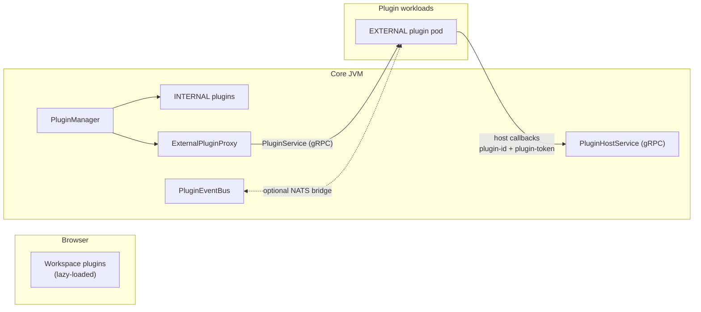

# Plugins

How Modulo is extended: user-installable workspace plugins in the browser,
first-party in-process backend plugins, and third-party EXTERNAL plugins that run
as their own workloads and speak a versioned gRPC contract. This page covers
writing each kind, deploying external plugins, the image-based submission
pipeline, and the Marketplace with its Trust Center. It is written for plugin
authors, reviewers, and the operators who deploy plugin workloads. For curated
bundles of plugins, see [Packs](packs.md). For how plugins store their data, see
[Data and state](../architecture/data-and-state.md).

## Plugin tiers

"Plugin" names three different things in Modulo. They share a marketplace and a
permission vocabulary, but they run in different places:

| Tier | Runs in | Who writes it | Typical use |
| --- | --- | --- | --- |
| **Workspace plugin** | The browser, inside the workspace shell | First party, in this repository | Views, note panels, fenced-block renderers, editor actions, Blueprint palette nodes |
| **INTERNAL backend plugin** | The core JVM | First party only | Note processors, event handlers, executable Blueprint nodes |
| **EXTERNAL backend plugin** | Its own container and pod, reached over gRPC | Anyone, including marketplace publishers | Untrusted or heavy work, such as the script sandbox |

Third-party code never runs in the core JVM. This is enforced in code, not just by
review:

- `PluginManager` refuses an in-process remote install from any origin outside
  `modulo.plugins.first-party-origins` (default
  `https://github.com/Ikey168/Modulo`).
- The submission pipeline accepts only container images pinned by digest.

The reasoning, including the choice of the pod boundary over JVM sandboxing, REST,
or Kafka, is ADR 0004 in [decisions](../architecture/decisions.md).



## Workspace plugins

Workspace plugins are the user-facing layer: what a user installs from
**Marketplace → Plugins**. The runtime is in
[`frontend/src/features/workspace/plugins/`](../../frontend/src/features/workspace/plugins/):

| File | Role |
| --- | --- |
| [`types.ts`](../../frontend/src/features/workspace/plugins/types.ts) | Contribution vocabulary, `PluginModule`, `PluginManifest` |
| [`catalog.ts`](../../frontend/src/features/workspace/plugins/catalog.ts) | Every runnable plugin: id, dependencies, `builtin`, lazy `load()`; retired ids and their replacements |
| [`runtime.ts`](../../frontend/src/features/workspace/plugins/runtime.ts) | Install, uninstall, enable, and disable; activation; contribution tracking |
| [`installationState.ts`](../../frontend/src/features/workspace/plugins/installationState.ts) | Installed records, persisted as authenticated workspace state (`modulo.workspace.installations`) |
| [`builtins/`](../../frontend/src/features/workspace/plugins/builtins/) | The plugin modules |

### Lifecycle

- **Install** resolves the plugin's dependencies, persists the install record, and
  activates the plugin. Activation lazy-loads its chunk, runs `activate(ctx)`, and
  collects its contributions.
- **Uninstall** is refused while another installed plugin depends on this one.
  Otherwise it deactivates the plugin, disposes exactly the contributions it
  registered, and drops the record.
- **Enable and disable** activate or deactivate without touching the install record.

A plugin that is not installed never has its `load()` called, so its code is never
fetched or evaluated. Activation and rendering are fault-isolated
(`PluginErrorBoundary`), so a broken plugin cannot take down the shell or other
plugins. Plugins marked `builtin` are pre-installed in a fresh workspace, such as
`notes-editor` (Markdown Notes) and `graph-view`. When a plugin id is retired,
existing installations are rewritten to its successor through
`RETIRED_PLUGIN_REPLACEMENTS`.

Uninstalling or disabling a plugin removes its surfaces but not its data. The data
stays in the plugin's state namespace and comes back when the plugin is
reinstalled.

### What a plugin can contribute

`activate(ctx)` receives a `PluginContext`:

| Method | Adds |
| --- | --- |
| `ctx.addView(view)` | A workspace view at `/app/<id>`, optionally grouped into a mode (such as `research` or `audit`) and a section |
| `ctx.addNotePanel(panel)` | A section in the note details panel |
| `ctx.addNoteFence(fence)` | A renderer for a fenced ```` ```lang ```` block in notes |
| `ctx.addEditorAction(action)` | An editor toolbar action that can insert text at the cursor |
| `ctx.addBlueprintNode(descriptor)` | A node in the Blueprint editor palette (see [Blueprints](blueprints.md#contributing-nodes-from-a-plugin)) |
| `ctx.state()` | A `PluginStateClient` bound to this plugin's namespace and the signed-in account |

### Writing a workspace plugin

1. Create the module in `builtins/`:

   ```tsx
   import { Newspaper } from 'lucide-react';
   import type { PluginModule } from '../types';
   import { MyView } from './MyView';

   const myPlugin: PluginModule = {
     activate(ctx) {
       ctx.addView({ id: 'my-view', label: 'My View', icon: Newspaper,
         order: 20, mode: 'research', component: MyView });
     },
   };
   export default myPlugin;
   ```

2. Add the marketplace metadata (id, name, description, category, icon) to
   `PLUGINS` in
   [`features/workspace/plugins.ts`](../../frontend/src/features/workspace/plugins.ts).
3. Add the runnable entry, with `load: () => import('./builtins/myPlugin')` and any
   `dependencies`, to `catalog.ts`. A manifest without `load` shows in the
   marketplace as metadata only and cannot be installed.
4. Store data through `ctx.state()` or the workspace-store hooks, never in raw
   `localStorage`. The storage CI gate rejects any browser storage key that is not
   registered in
   [`legacyKeyRegistry.ts`](../../frontend/src/services/legacy/legacyKeyRegistry.ts).
5. Import core data through `@modulo/core`. The boundary lint rule
   (`npm run lint:boundary:ci`) fails on imports from workspace internals.

## Backend plugins

The backend plugin API is in
[`com.modulo.plugin.api`](../../backend/src/main/java/com/modulo/plugin/api/).
A plugin implements
[`Plugin`](../../backend/src/main/java/com/modulo/plugin/api/Plugin.java):
`getInfo()`, lifecycle methods, `healthCheck()`, `getCapabilities()`,
`getRequiredPermissions()`, `getSubscribedEvents()`, and `getPublishedEvents()`.
Optional interfaces add more:

- `NoteProcessorPlugin` and `UserProcessorPlugin` for note and user hooks.
- `NoteRenderer` for renderer plugins.
- `BlueprintNodeProvider` for executable Blueprint nodes.

[`PluginManager`](../../backend/src/main/java/com/modulo/plugin/manager/PluginManager.java)
loads, starts, stops, and uninstalls plugins. It records them in
`plugin_registry`, with `type` `INTERNAL` or `EXTERNAL` and a runtime value.
Declared permissions are persisted in `plugin_permissions`. Events flow over the
in-JVM `PluginEventBus`, for example `note.created`, `note.updated`,
`link.created`, `system.plugin_started`, and `system.plugin_stopped`.

The admin REST surface is `/api/plugins`, and every endpoint requires the `ADMIN`
role:

| Endpoint | Purpose |
| --- | --- |
| `POST /api/plugins/install-external` | Attach an EXTERNAL workload by endpoint (see below) |
| `POST /api/plugins/install` | Upload a first-party JAR |
| `POST /api/plugins/install-remote`, `POST /api/plugins/validate-remote` | Remote JAR install. Refused for origins outside `modulo.plugins.first-party-origins`. |
| `GET /api/plugins/status`, `GET /api/plugins/{id}/status`, `GET /api/plugins/{id}/info` | Status and metadata |
| `POST /api/plugins/{id}/start`, `POST /api/plugins/{id}/stop`, `DELETE /api/plugins/{id}` | Lifecycle |
| `PUT /api/plugins/{id}/config` | Update configuration |
| `/api/plugins/repository/*`, `/api/plugins/cache` | Remote repository sources and the download cache used by the first-party path |

### The v1 gRPC contract

EXTERNAL plugins speak the contract published by
[`plugin-contract/`](../../plugin-contract/README.md), a standalone Maven module
(`com.modulo:plugin-contract`). Plugin authors can depend on it without depending
on the core. It generates code from
[`backend/src/main/proto/`](../../backend/src/main/proto/), the single source of
truth, so the core and the contract cannot drift. The package is
`com.modulo.plugin.grpc`.

| Service | Implemented by | Purpose |
| --- | --- | --- |
| `PluginService` | The plugin | Lifecycle (Initialize, Start, Stop, Shutdown), status, health, info, capabilities, configuration, and `Execute` |
| `PluginHostService` | The core | Permission-gated note operations and event publish/subscribe for plugin callbacks |
| `NotePluginService`, `UserPluginService` | The plugin (optional) | Note and user hooks |

Every `PluginHostService` call must carry the `plugin-id` and `plugin-token`
metadata headers. The token is issued by the core when the plugin is attached.
A missing header fails with `UNAUTHENTICATED`. A missing permission fails with
`PERMISSION_DENIED`:

| RPC | Permission |
| --- | --- |
| `GetNote`, `SearchNotes` | `notes.read` |
| `SaveNote`, `AddNoteMetadata` | `notes.write` |
| `DeleteNote` | `notes.delete` |
| `PublishEvent` | `system.events.publish` |
| `SubscribeEvents` | `system.events.subscribe` |

`Execute` also carries `correlation_id` and `step_id` when it is called from a
workflow run.

**Evolution rules (binding).**

- Changes are additive only: new fields, RPCs, and services.
- Field numbers are never renumbered, repurposed, or changed in type.
- A field whose meaning changes is a new field.
- An incompatible surface ships under a new name, such as `PluginHostServiceV2`,
  next to v1.
- Event payloads follow the same rules through `schema_version`.

**Event envelope.** An envelope has `id`, `type`, `schema_version`, `timestamp`,
`origin`, and `json_payload`. It is the same on the gRPC stream and on the NATS
bridge. The core sets `origin` (`core` or `plugin:<id>`), and it drives loop
protection, so never trust or forge it. Payloads are shallow; fetch full entities
through the gated host API.

## Deploying external plugins

An external plugin goes from container image to an attached, health-monitored
workload in four steps. The running example is the first real one, the script
sandbox, which serves `action.code.execute` (see
[WASM node ABI and script sandbox](../reference/wasm-node-abi.md#selection-and-configuration)).
Deployment infrastructure (Helm, Argo CD, clusters) is covered in
[Deployment](../operations/deployment.md).

### 1. Build the image

An external plugin is any container that serves `PluginService` on a gRPC port.
Ideally it also exposes `grpc.health.v1`, so Kubernetes' native gRPC probes work.
For the pilot:

```sh
# Build from the repository root: the service compiles shared sources from backend/
docker build -f services/script-sandbox-plugin/Dockerfile -t modulo-script-sandbox:latest .
```

### 2. Deploy with the plugin chart and Argo CD

Every plugin workload is an instance of the reusable chart
[`helm/plugin`](../../helm/plugin/). The chart enforces this posture by default:

- a dedicated ServiceAccount with no token automount;
- a non-root user and a read-only root filesystem;
- resource limits;
- gRPC health probes;
- a deny-by-default NetworkPolicy: ingress only from the core, and egress only to
  core gRPC, NATS, and DNS.

Add one Application file under `argocd/apps/plugins/`. The app-of-apps picks the
directory up automatically:

```yaml
# argocd/apps/plugins/my-plugin.yaml
spec:
  source:
    path: helm/plugin
    helm:
      values: |
        pluginName: my-plugin
        image:
          repository: acme/my-plugin
          tag: "1.0.0"
```

[`argocd/apps/plugins/script-sandbox.yaml`](../../argocd/apps/plugins/script-sandbox.yaml)
is the complete reference file. To check the rendering locally, run
`helm template x helm/plugin --set pluginName=my-plugin --set image.repository=acme/my-plugin`.

For marketplace releases, deploy by digest with
`scripts/deploy-marketplace-release.mjs`; see [Trust Center](#trust-center).

### 3. Attach the endpoint to the core

The chart names the in-cluster Service `modulo-plugin-<pluginName>`, so the
pilot's endpoint is `modulo-plugin-script-sandbox:9090`. An admin attaches it:

```sh
curl -X POST https://<modulo>/api/plugins/install-external \
  -H 'Content-Type: application/json' \
  -d '{"endpoint": "modulo-plugin-script-sandbox:9090", "config": {}}'
```

The core then:

1. Fetches the plugin's identity and declared permissions over the contract.
2. For a marketplace plugin, re-verifies the release against its exact reviewed
   digest (pass it as `config.imageDigest`). It also checks that the declared
   permissions do not exceed the approved set. A failure refuses the attachment
   with `Marketplace trust check failed: …`.
3. Records the endpoint in `plugin_registry`, completing the entry that an approved
   submission pre-registered, if one exists.
4. Grants the declared permissions and issues the host token. The token is
   delivered in the `Initialize` config as `modulo.plugin.token`.
5. Calls `Initialize` and `Start`, and registers any Blueprint nodes the plugin
   provides.

After attachment:

- `ExternalPluginHealthMonitor` polls the workload every
  `modulo.plugins.external.health-interval-ms` (default 30 s). Three consecutive
  failures mark the plugin `ERROR` in `/api/plugins/{id}/status`, and recovery
  returns it to `ACTIVE`.
- The registry survives core restarts. The endpoint is re-attached on startup, and
  a pod that is down yields `ERROR`, never a failed boot.
- Components with an in-process fallback route back automatically while the plugin
  is unhealthy. The script sandbox is one of them.

Registering automatically when Argo CD syncs is not implemented; the `install-external` call is a
deliberate operator step.

### 4. Remove a plugin

`DELETE /api/plugins/{pluginId}` stops and unregisters the workload. Delete the
Application file to tear down the deployment, and Argo CD prunes it.

### Event bridge

A plugin can consume and emit events over NATS instead of the gRPC stream. Enable
the broker on the core with `modulo.plugins.broker.enabled=true`; the `modulo-nats`
Argo CD app deploys the broker. `PluginEventBridge` republishes in-JVM events to
`modulo.events.<type>` subjects, and injects broker messages back onto the in-JVM
bus with origin tagging, so bridged events never loop.

Delivery is at most once, the same as the in-JVM bus. The bridge is off by
default, which is also the state on the Pi and in minimal compose. With the flag on
and NATS unreachable, the core logs and degrades but never blocks local
publishing.

### Degradation guarantees

- With no plugin workloads deployed, nothing polls and nothing fails.
- An EXTERNAL plugin that is down is marked unhealthy. The core never crashes or
  blocks on a plugin pod.
- The broker is optional, as described above.

## Submitting a plugin

Third-party plugins are submitted as container images, not JARs, through
`POST /api/plugins/submissions/image`, or the submission form at
`/plugins/submit`
([`PluginSubmission.tsx`](../../frontend/src/features/PluginSubmission.tsx)).
Developers can follow their submissions at `/plugins/my-submissions`.
[`PluginValidationService`](../../backend/src/main/java/com/modulo/plugin/submission/PluginValidationService.java)
requires:

- `imageReference`: a valid OCI reference, such as `ghcr.io/acme/my-plugin`.
- `imageDigest`: exactly `sha256:<64 hex>`. Tags are mutable and not accepted. Get
  the digest with `docker inspect --format='{{index .RepoDigests 0}}' <image>`.
- Declared permissions from the platform allowlist.
- If a minimum platform version is given, it must be `1.x` (the v1 contract).

A legacy row that carries a JAR path gets a `[POLICY]` error: JAR submissions are
no longer accepted.

Submissions move through `SubmissionStatus`:

- `PENDING_REVIEW`, then `IN_REVIEW` or `UNDER_REVIEW`;
- then `VALIDATION_FAILED`, `CHANGES_REQUESTED`, `APPROVED`, or `REJECTED`;
- `APPROVED` can move to `PUBLISHED`, and a developer can move a submission to
  `WITHDRAWN`.

Approving an image submission creates the EXTERNAL registry entry with its endpoint
pending. An operator then deploys the chart and attaches it as described above.
Approval never deploys anything automatically.

| Endpoint | Purpose |
| --- | --- |
| `POST /api/plugins/submissions/image` | Submit |
| `GET /api/plugins/submissions/{id}` | Details |
| `GET /api/plugins/submissions/developer/{email}` | A developer's submissions |
| `PUT /api/plugins/submissions/{id}/status` | Reviewer status change |
| `PUT /api/plugins/submissions/{id}/resubmit` | Resubmit after changes |
| `DELETE /api/plugins/submissions/{id}` | Delete |
| `GET /api/plugins/submissions/statistics`, `/status-options`, `/health` | Reporting |

## Marketplace

**Marketplace** in the workspace has three tabs:

- **Plugins** lists every workspace plugin in the catalog, with install, enable,
  and disable controls. Installing a plugin installs its dependencies first.
- **Packs** lists curated bundles (see [Packs](packs.md)).
- **Trust Center** shows release evidence for EXTERNAL marketplace plugins and
  bundled software.

### Trust Center

The Trust Center separates mutable marketplace listings from immutable releases
pinned by digest. The data model is in
[`MarketplaceTrustService`](../../backend/src/main/java/com/modulo/plugin/trust/MarketplaceTrustService.java),
and the API is `/api/marketplace/trust`. It records:

- release identity;
- publisher identity;
- permission sets;
- verification evidence;
- publisher review history;
- install, upgrade, and rollback history;
- user reports.

**Evidence.** Signature, SLSA provenance, SBOM, and vulnerability evidence are
evaluated independently. Each has a source, summary, evaluation time, expiry, and
normalized payload. The states are `VERIFIED`, `FAILED`, `UNAVAILABLE`, `STALE`
(expired), and `UNKNOWN` (missing). Missing tools or missing evidence are never
shown as verified.

The default verifier,
[`CliArtifactTrustVerifier`](../../backend/src/main/java/com/modulo/plugin/trust/CliArtifactTrustVerifier.java),
runs:

- `cosign` against the exact `image@sha256:…`, including signed SPDX SBOM
  attestations. It is configured by `modulo.marketplace.trust.identity-regexp` and
  `modulo.marketplace.trust.oidc-issuer` (default
  `https://token.actions.githubusercontent.com`).
- `grype` for vulnerabilities. A critical vulnerability fails policy.

A mutable tag can never pass the install check. A re-check appends new evidence and
never rewrites old evaluations, so rotating trust roots or policy stays
inspectable.

**Publishers.** A publisher applies through
`POST /api/marketplace/trust/publishers/applications` with a name, a proposed
signing identity, and ownership evidence. Only an independent admin can set a
verification level: `UNVERIFIED`, `DOMAIN`, `IDENTITY`, or `ORGANIZATION`.
Publishers cannot self-assign a level. Any verified level requires a signing
identity, which cannot be bound to two publishers. Verified display names must be
unique. Verification expires after 365 days. Approval, expiry, revocation, and the
reviewing actor are kept in the publisher history. Revocation changes future trust
decisions without rewriting historical release facts. Release ownership is bound to
the authenticated account, not to a submitted email, and a submission cannot
rename an existing publisher or take over an existing plugin.

**Install, upgrade, rollback.**

- An install check re-verifies evidence and fails closed unless the release is
  `VERIFIED`.
- Attaching a runtime requires the workload digest to equal the reviewed release
  digest.
- Any increase in permissions requires fresh consent. Declining leaves the existing
  release untouched.
- Automatic upgrades are disabled, and every change of code digest needs consent.
- Upgrades and rollbacks record the actor, release ids, the permission difference,
  consent, outcome, and time. They never delete plugin-owned data.
- Approving a release pins it; deploying it is a separate, recorded step.

| Endpoint | Purpose |
| --- | --- |
| `GET /plugins/{plugin}/releases`, `GET /releases/{id}`, `GET /releases/{id}/evidence-history` | Releases and evidence |
| `POST /releases/{id}/recheck`, `POST /releases/{id}/install-check` | Re-evaluate |
| `GET /diff?from=&to=` | Permission difference between releases |
| `POST /plugins/{plugin}/install`, `/upgrade`, `/rollback/{release}` | Consented changes |
| `POST /plugins/{plugin}/deployment` (admin) | Record a deployment outcome |
| `GET /plugins/{plugin}/history`, `GET /plugins/{plugin}/health` | Operation history and health |
| `POST /plugins/{plugin}/report` | User report |
| `POST /publishers/applications`; admin: `GET /publishers/applications`, `POST /publishers/{id}/verification`, `POST /publishers/{id}/revoke` | Publisher review |

All paths are relative to `/api/marketplace/trust`.

**Deploying and rolling back a marketplace release.** The operator command
previews by default and changes nothing:

```sh
MODULO_API_TOKEN=<operator token> node scripts/deploy-marketplace-release.mjs \
  --api https://modulo.example \
  --release RELEASE_UUID --helm-release example-plugin --namespace modulo
```

After inspecting the preview, add `--apply --consent`. The command:

1. rechecks the evidence;
2. records the approval;
3. runs `helm upgrade --install --atomic --reuse-values` with the exact `image.digest`;
4. records the deployment success or failure separately from the approval.

A failed upgrade restores the previous approval pin, when there is one.

To roll back, pass a previously approved release UUID with
`--rollback --apply --consent`. The command finds that release's Helm revision,
checks its plugin and digest, and runs `helm rollback`. Plugin records and volumes
are never deleted. A failed rollback is reported as failed and needs operator
inspection. The command needs a configured cluster and Helm context. Local fixtures
(`node scripts/test-marketplace-deployment.mjs`) test how commands are built and
how recovery is decided; they do not verify a live registry or cluster.

In the UI, the Trust Center on an installed plugin shows its digest, publisher,
evidence, runtime status, and install and rollback history. **Verify rollback to
&lt;version&gt;** re-checks the previous release and records it as the rollback
target. It does not claim that anything was deployed: the previous digest still has
to be redeployed and pass the same check when it is attached. Missing health data
is shown as unavailable and never inferred.
