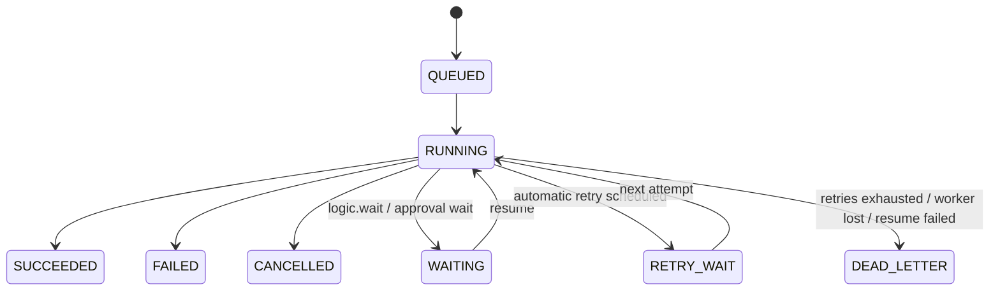
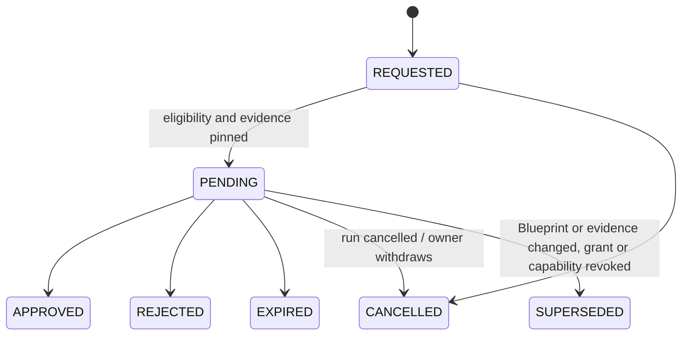

# Workflows and approvals

A Blueprint run is recorded as a durable workflow run with ordered steps,
checkpoints, retries, schedules, and optional human approval. This page covers the
run model, the Execution Center, cancel and retry, durable schedules and waits,
retention and alerts, human approvals with signed decisions, and portable evidence
bundles. It is written for Blueprint owners, reviewers, and developers. Operator
procedures, such as adopting unowned Blueprints, alert response, and load testing,
are in [Runbooks](../operations/runbooks.md). Metrics wiring is in
[Observability](../operations/observability.md).

To learn how a Blueprint is built and executed, read [Blueprints](blueprints.md)
first.

| Area | Code |
| --- | --- |
| Run records and transitions | [`WorkflowRunService`](../../backend/src/main/java/com/modulo/blueprint/execution/WorkflowRunService.java) |
| Checkpoints | [`WorkflowCheckpointService`](../../backend/src/main/java/com/modulo/blueprint/execution/WorkflowCheckpointService.java) |
| Schedules, waits, automatic retries | [`WorkflowScheduler`](../../backend/src/main/java/com/modulo/blueprint/execution/WorkflowScheduler.java) |
| Trace redaction | [`TracePolicy`](../../backend/src/main/java/com/modulo/blueprint/execution/TracePolicy.java) |
| Query, recovery, operations APIs | [`WorkflowQueryController`](../../backend/src/main/java/com/modulo/blueprint/execution/WorkflowQueryController.java), [`WorkflowRecoveryController`](../../backend/src/main/java/com/modulo/blueprint/execution/WorkflowRecoveryController.java), [`WorkflowOperationsController`](../../backend/src/main/java/com/modulo/blueprint/execution/WorkflowOperationsController.java) |
| Approvals | [`ApprovalService`](../../backend/src/main/java/com/modulo/blueprint/approval/ApprovalService.java), [`ApprovalController`](../../backend/src/main/java/com/modulo/blueprint/approval/ApprovalController.java) |
| Decision signing | [`ApprovalSigningService`](../../backend/src/main/java/com/modulo/blueprint/approval/ApprovalSigningService.java), [`DecisionStatement`](../../backend/src/main/java/com/modulo/blueprint/approval/DecisionStatement.java) |
| Evidence bundles | [`EvidenceBundleService`](../../backend/src/main/java/com/modulo/blueprint/approval/EvidenceBundleService.java) |
| UI | [`features/executions/`](../../frontend/src/features/executions/), [`features/approvals/`](../../frontend/src/features/approvals/) |

## Runs and steps

Every trigger firing creates a row in `workflow_runs`, unless it is a duplicate
delivery, and one row per executed node in `workflow_steps`.

A run records:

- a UUID;
- the owner and the Blueprint;
- the Blueprint version and the SHA-256 of its canonical IR;
- the trigger node and trigger type;
- a trigger key;
- the state, attempt, and timestamps.

The trigger key is what removes duplicates:

| Trigger | Key | Effect |
| --- | --- | --- |
| Note or link event | Bus event id | Repeated delivery of one event runs once |
| Schedule | Scheduler job UUID | One run per scheduled delivery |
| Webhook | `webhook:<Idempotency-Key>`, or a random UUID when there is no header | Same key, same run |
| Manual | `manual:<requestId>` | Same request, same run |
| Retry | Its own request UUID and lineage | See [Cancel and retry](#cancel-and-retry) |

A step records its sequence, node id and type, attempt, a step UUID, its duration
in milliseconds, and a terminal state. The trigger is step 1. Each later node is
persisted before it runs and finishes as `SUCCEEDED`, `FAILED`, or `SKIPPED`.
`SKIPPED` with `CAPABILITY_DENIED` means the capability was not granted. A branch
arm that was not taken has no step.

### States



`SUCCEEDED`, `FAILED`, `CANCELLED`, and `DEAD_LETTER` are terminal. PostgreSQL
triggers reject a terminal state going backwards and invalid attempt changes, even
if a caller bypasses the service. `(run, sequence, attempt)` is unique for steps.

A failed run carries an error class: `NODE_FAILURE`, `LOOP_GUARD`, an approval
failure reason, `RESUME_FAILED`, `WORKER_LOST`, `RETRY_EXHAUSTED`, or
`NON_RETRYABLE`.

### Trace redaction

Step inputs and outputs are never stored raw. `TracePolicy` stores field counts and
bounded type counts. It inspects at most 256 values and keeps at most 16 references
to notes owned by the run owner. Raw strings, property names, note contents,
credentials, and exception messages are excluded, and each input or output summary
is capped at 4 KiB. Identifiers that look like credentials or email addresses are
replaced by stable labels derived from SHA-256.

Operators can add literal, case-insensitive markers with
`modulo.workflow.trace.redact-patterns`: at most 16 markers, separated by
semicolons, each at most 128 characters and 2,048 characters in total. These are
not regular expressions.

Run and step UUIDs are carried in logging MDC through `ExecutionTraceContext`, and
passed to EXTERNAL plugins in the gRPC `Execute` fields `correlation_id` and
`step_id`.

## Execution Center

Open **Executions** in the workspace (`/app/executions`, or
`/app/executions?run=<id>` for one run). It lists the signed-in owner's retained
runs, and every query is filtered by owner. A missing run, a deleted run, and
another user's run all return the same unavailable response.

| Endpoint | Purpose |
| --- | --- |
| `GET /api/workflow-runs` | List runs. Filters: `q`, `state`, `blueprint`, `trigger`, `after` (inclusive), `before` (exclusive), `minDuration`, `page`, `size` (1–100, default 25). |
| `GET /api/workflow-runs/summary` | Run counts by state, used by the dashboard |
| `GET /api/workflow-runs/{id}?stepPage=0` | Run detail with its step timeline, 100 steps per page |
| `POST /api/workflow-runs/{id}/cancel` | Request cancellation |
| `POST /api/workflow-runs/{id}/retry` | Replay from a checkpoint |
| `GET /api/workflow-runs/{id}/evidence-bundle` | Export an evidence bundle (see [Evidence bundles](#evidence-bundles)) |

From a run, **Open executed path in editor** (or **Select node in editor** on a
step) loads the Blueprint and highlights the recorded path. The editor shows the current graph and warns that it may have changed since
the run. A deleted Blueprint keeps its run evidence but cannot be opened. The UI
labels values as redacted and renders only recognized summary counts.

## Cancel and retry

**Cancel.** A queued or waiting run is cancelled immediately. For a running run,
the request is recorded with the owner and time. The action in flight may finish,
and execution stops at the next step boundary. A final success transition honours
a cancellation that was already persisted. Cancellation never undoes an external
effect and never interrupts a write halfway.

**Retry.** `POST /api/workflow-runs/{id}/retry` takes
`{"requestId": "<uuid>", "checkpoint": <n>, "confirmSideEffects": true|false}`.

- The retry is a new run with an incremented attempt, linked to the original, with
  the requester and confirmation recorded. The original trace does not change.
- The same `requestId` returns the same retry.
- Checkpoint `0` replays from the start of the action path. Later checkpoints
  resume at a recorded boundary with the pinned graph and the pin values captured
  there.
- The capability grants that are current at retry time apply.
- Referenced notes must still exist, belong to the owner, and be at the captured
  version. If an input has changed, the replay is rejected.
- Every action that is not a logic or trigger node is treated as potentially
  non-idempotent. That includes note writes, remote calls, and blockchain anchoring.
  Replaying a completed or uncertain operation requires
  `confirmSideEffects: true`. This is not exactly-once delivery for external
  systems: a remote timeout can happen after the effect already took place.
- After a run has requested approval, a retry must start at checkpoint 0 and issue
  a fresh approval request.

**Checkpoints** live in `workflow_checkpoints` and are never returned by the trace
APIs. They contain the pinned graph, scalar values, and versioned references to the
owner's notes. Each checkpoint is limited to 1 MiB and each run to 4 MiB. A
snapshot that is unsupported, too large, or unavailable disables that replay
boundary. Checkpoints hold private workflow payloads, so backups that contain them
need the same protection as notes.

## Durable schedules and waits

Schedules and waits live in PostgreSQL, so they survive restarts and work across
several application instances.

- **Definitions.** Saving a Blueprint syncs each `trigger.schedule` node into
  `workflow_schedules` with its cron, IANA zone, next fire time, and retry policy.
  The cron is a six-field Spring cron expression. Re-saving an unchanged definition
  keeps its next fire time.
- **Single dispatcher.** A PostgreSQL advisory lock elects one dispatcher across
  instances. The dispatcher polls every `modulo.workflow.scheduler.poll-ms`
  (default 1000 ms), and each poll handles up to 100 due definitions and 10
  deliveries or resumes. Each due job is committed, and its definition advanced,
  before execution. The job UUID is the run's trigger key.
- **Missed intervals** coalesce into one delivery plus the next future fire, so
  there is no unbounded catch-up burst.
- **Dispatcher death.** Leadership is released with the database connection. The
  next dispatcher marks work that was running with an uncertain outcome as
  `DEAD_LETTER` with `WORKER_LOST`, instead of repeating its side effects.
- **Throughput.** Long actions delay other schedules. The delay shows up as
  schedule lag in the metrics.
- **Job cap.** Each owner can retain at most 10,000 jobs. Reaching the cap disables
  that schedule until capacity is reclaimed and the Blueprint is saved again.
- **Automatic retries.** Set `retryMaxAttempts` (1–5, default 1) and
  `retryBackoffSeconds` (5–3600, default 30) on the schedule node. Backoff is
  exponential and capped at one hour. Retries apply only to failed paths that did
  not invoke a potentially effectful action. Loop-guard failures and uncertain
  effects are not retried. When attempts run out, the run moves to `DEAD_LETTER`.
  A job that was rejected before a run could be created keeps a classified
  dead-letter record; fix the schedule definition before its next delivery.
- **`logic.wait`** saves a checkpoint and a `resume_at` time, then ends the call. A
  dispatcher resumes the same run from that boundary, even after a restart. A
  database state transition prevents duplicate resumes. If referenced notes
  changed or the checkpoint is invalid, the run is dead-lettered with
  `RESUME_FAILED`. No thread sleeps while a run waits.

`GET /api/workflow-ops/schedules` lists all of the caller's schedules, including
disabled ones. Each entry shows the Blueprint, node, cron, zone, next fire time,
retry policy, and the state and error class of the latest delivery.

## Retention and alerts

**Default retention.** An owner can keep up to 10,000 runs. Terminal runs expire
after 90 days, and an hourly cleanup deletes them together with their steps and
checkpoints. Active and waiting runs are never purged. Deleting a Blueprint keeps
its runs but clears the foreign key. Deleting the owner deletes their run data.

| Setting | Default | Effect |
| --- | --- | --- |
| `modulo.workflow.retention.enabled` | `true` | Set to `false` to disable cleanup |
| `modulo.workflow.retention.interval-ms` | `3600000` | Cleanup interval |
| `modulo.workflow.operations.poll-ms` | `30000` | How often metrics refresh and alert rules are evaluated |

**Per-Blueprint policy.** In the Execution Center's **Alerts and retention**
section, or through `GET` and `PUT /api/workflow-ops/policies/{blueprintId}`:

| Field | Range |
| --- | --- |
| `retentionDays` | 7–365 days after completion |
| `payloadHours` | 1 hour up to the retention limit. Controls how long checkpoints and note references in step summaries are kept. |
| `failureThreshold` | 1–1000 failed or dead-letter runs |
| `windowMinutes` | 1–1440 |
| `route` | `NONE`, `EXECUTION_CENTER`, or `INBOX` |

Alerts are deduplicated per workflow and time bucket. An `INBOX` alert and its
notification are committed together, and reading or deleting the notification
clears the unread count. Alert payloads contain counts and workflow ids only.
`GET /api/workflow-ops/alerts` lists Execution Center alerts, and
`POST /api/workflow-ops/alerts/{id}/read` marks one as read.

Once a parent run's history expires, a retry still points to it by its immutable
parent UUID. Following that link shows a retention-gap message. A run whose
checkpoints are gone can no longer be replayed.

**Metrics.** The backend exports a fixed set of 23 gauges per instance, with no
owner, Blueprint, run, or error labels:

| Metric | Meaning |
| --- | --- |
| `modulo_workflow_runs{state}` | Retained runs in each of the eight states |
| `modulo_workflow_run_rate{state}` | Runs per second over the last five minutes |
| `modulo_workflow_run_latency_seconds{quantile}` | p50, p95, and p99 of completed-run latency over five minutes, including waits |
| `modulo_workflow_retries` | Retained attempts that have a parent |
| `modulo_workflow_queue_depth` | Schedule deliveries that are pending or running |
| `modulo_workflow_schedule_lag_seconds` | Maximum lateness of an enabled schedule |
| `modulo_workflow_alerts_unread` | Unread workflow alerts |

The rates are rolling gauges, so do not wrap them in `rate()`. All replicas see the
same database-wide values: aggregate them with `max`, not `sum`. The Grafana
dashboard is `monitoring/grafana/dashboards-available/workflow-executions.json`.
The alert rules are in `monitoring/prometheus/rules/workflow-alerts.yml`. The rule
tests and the `scripts/workflow-load-test.sh` load gate are described in
[Runbooks](../operations/runbooks.md).

## Human approvals

A Blueprint can pause until a different, designated person approves or rejects.
The contract is ADR 0009 in [decisions](../architecture/decisions.md). Its core
rule: an approval is an accountable decision about one immutable request, in one
attempt of one run. It never grants general access to the owner's notes or
workflow. A receipt from another request, attempt, Blueprint revision, or
checkpoint can never satisfy the current wait.

### Building an approval step

Use three core nodes in sequence:

1. **Request Approval** (`action.approval.request`, needs `approval:request`).
   Configure `approverUserId`, which must be a different user than the owner, and
   optionally `expirySeconds` (60–604800, default 86400), `reminders` (0–3), and
   `message`.
2. **Wait for Approval** (`logic.approval.wait`). Connect its `request` input to the
   request node's output. The run pauses durably.
3. **Approval Result** (`logic.approval.result`). Connect business actions to its
   `approved`, `rejected`, or `expired` exec output. Expiry is its own outcome and
   never counts as approval. An unknown outcome is an error.

The sample
[`approval-request.json`](../reference/examples/approval-request.json) wires a
weekly schedule into this pattern. To try it, import it, replace reviewer id `2`
with an existing different user, and grant `approval:request`.

Version 1 supports exactly one designated user and one decision. The node rejects
selectors for roles or groups, a quorum other than 1, and delegation with
`UNSUPPORTED_APPROVAL_POLICY`. Choosing yourself as the reviewer fails with
`SEPARATION_OF_DUTY`.

### What a request binds

A request records:

- the run and attempt;
- the Blueprint digest and version;
- the node and checkpoint;
- the SHA-256 digest of a fresh 256-bit resume nonce (the nonce itself is private);
- a digest of the allowed evidence, plus a safe summary;
- the policy digest, the designated reviewer, and the expiry.

The request, wait, and result nodes store only references in the trace.



All resolved states are terminal, and a resolved request is never reopened.
Supersession invalidates the wait, and continuing requires a fresh request.

### Deciding

Reviewers open **Approvals** in the workspace, or follow the in-app notification.
Pending requests show when they expire. The status filter includes resolved
history. A request shows the safe summary, the evidence digest, the request events,
and the decision history. It never shows raw inputs, note contents, checkpoint
data, or general access to the run.

To decide, pick **Approve** or **Reject**, enter a reason (required for a
rejection), and confirm. Changing the choice or the reason clears the
confirmation. After a network failure, the client retries an unchanged submission
with the same idempotency key. A conflict refreshes the request and requires a
fresh review.

| Endpoint | Purpose |
| --- | --- |
| `GET /api/approvals?state=&page=&size=` | Requests the caller may currently inspect |
| `GET /api/approvals/{id}` | The authorized projection: state, revision, expiry, summary, redaction flag |
| `POST /api/approvals/{id}/decision` | `{expectedRevision, idempotencyKey (UUID), outcome: APPROVE or REJECT, comment}` |
| `POST /api/approvals/{id}/cancel` | Owner cancels a pending request |
| `PUT /api/approvals/grants/{blueprintId}/{reviewerId}` | `{"enabled": false}` revokes a reviewer grant |
| `GET /api/approvals/{id}/decisions/{decisionId}/signature` | Export a signed decision envelope |
| `GET /api/approvals/{id}/evidence` | Evidence for an authorized participant |

Only the owner and the currently eligible reviewer can read a request. An
unauthorized id and an unknown id return the same response. The actor, owner,
policy, binding, and time are always derived on the server. Client fields that
claim them are ignored.

### Praxis approvals in the inbox

The **Approvals** inbox also lists the pending approvals of Praxis tasks you
submitted (see [Praxis](integrations.md#praxis)). Each row is labeled with its
source: **Workflow approval** or **Praxis task approval**. The two kinds are
merged newest first. Praxis approvals appear only with the **Pending** filter on
the first page, because Praxis keeps their decision history, not Modulo's
request list.

A Praxis approval is decided in the row: enter a reason (required, sent to
Praxis) and choose **Approve** or **Reject**. The decision is bound to the
effect id, its version and the attempt it was proposed in. If the task has
moved to a new attempt, Praxis answers `409 stale_process_attempt`; the inbox
says so in an alert, reloads, and the refreshed row starts with an empty reason
so nothing is re-sent by accident.

Modulo relays the decision to Praxis with your delegated identity and, only
after Praxis accepts it, records it in the audit trail (`audit_events`, event
type `PRAXIS_APPROVAL_DECISION`, outcome `APPROVED` or `REJECTED`, actor = your
account id). The entry's `detail` is JSON with `source: "praxis"`, `ownerId`,
`processId`, `effectId`, `version`, `attemptId`, `decision`, `reason` and
`decidedAt`. A decision Praxis refuses (a stale attempt, `approval_rejected`,
`403`, `404`) is not audited. Read your entries with
`GET /api/audit?eventType=PRAXIS_APPROVAL_DECISION`. Workflow approvals keep
their own history in `approval_events` and `approval_decisions`, which are
tied to a Modulo approval request; a Praxis approval has no such request, so it
uses the general audit trail instead of a new table. If writing the audit entry
fails after Praxis accepted, the decision still stands (Praxis applied it) and
the server logs an error with the decision's binding.

When Praxis is not configured, the inbox shows only workflow approvals. When
Praxis cannot be reached, workflow approvals still load and a notice says the
Praxis approvals could not be loaded. The **Approvals** panel in Praxis Tasks
shows how many approvals a task is waiting on and links here; it no longer
keeps its own list.

### Rules enforced when a decision commits

The decision transaction locks the request and re-checks all of the following
against current data:

- the reviewer is still eligible and still differs from the requester;
- the run still waits on this request with the same attempt, checkpoint, and nonce;
- the Blueprint and the evidence still match their pinned digests, with note rows
  locked while they are checked;
- the database clock is before the expiry;
- the outcome and comment satisfy the policy.

Only then does it append the immutable decision and make the wait resumable. A
decision never executes actions directly: the scheduler resumes the run, and the
resume worker checks the binding again. An exact replay with the same idempotency
key returns the original receipt. A different submission, a changed body, a stale
revision, or an already resolved request returns `409`, and the UI must refresh
instead of retrying.

Other rules:

- Comments are normalized to Unicode NFC and limited to 4,096 UTF-8 bytes. They are
  never used as metric labels or written to logs.
- Expiry is fixed once the request is active. Up to three reminders are spaced at
  least one hour apart and never extend the expiry.
- A persisted reviewer selection seeds a grant only when no grant exists yet.
  Execution never restores a grant that was revoked.
- The approval worker reconciles cancellation, reviewer revocation, capability
  revocation, and Blueprint changes.

### Signed decisions

A server configured with a key pair signs every committed decision with Ed25519.
The signature is written in the same transaction as the decision, so a signing
failure leaves the request pending. Without a key pair, receipts say `UNSIGNED`
explicitly. An evidence digest alone is not a signature.

| Property | Meaning |
| --- | --- |
| `modulo.approvals.signing.private-key-file` | Unencrypted PKCS#8 DER private key, mounted read-only |
| `modulo.approvals.signing.public-key-file` | Matching X.509 SubjectPublicKeyInfo DER public key |
| `modulo.approvals.signing.required` | `true` refuses to start without a valid key pair (default `false`) |

A partial or mismatched key configuration always refuses startup. Keep the private
key out of the database and the repository. The key id is the SHA-256 fingerprint
of the public key's DER bytes; publish it through a trusted channel.

To rotate, mount a new matching pair and restart. New decisions use the new
fingerprint. Old signatures and the public-key records are immutable and keep the
old identity. During a rollout, instances may use different valid identities.

A signature is a server attestation of an authenticated review. It does not prove
that a reviewer controlled a personal key. Wallet signatures are not produced, and
nothing is anchored on a chain.

**Canonical statement v1.** The signed bytes are UTF-8 JSON for a fixed-order
array of strings, with no whitespace, numbers, or optional elements:

```text
format, keyId, decisionId, requestId, requestRevision, runId, runAttempt,
nodeId, blueprintDigest, evidenceDigest, policyDigest, nonceDigest,
checkpoint, actor, outcome, comment, commentDigest, decidedAt, idempotencyKey
```

- `format` is `modulo.approval.decision.v1`.
- Strings must be NFC, and lone surrogates are rejected.
- Timestamps are UTC with exactly three fractional digits.
- The envelope carries the signature and the SPKI public key in standard base64.

Shared vectors are in
[`shared/approval/vectors.json`](../../shared/approval/vectors.json) and are
checked by `node --test shared/approval/verification.test.mjs`.

**Verify offline.** In the decision history, choose **Export decision signature**,
then run:

```sh
node scripts/verify-approval.mjs approval.json [TRUSTED_PUBLIC_KEY_SHA256]
```

The script uses only Node's standard crypto library and makes no network request.
A valid signature from a key you did not pin reports `VALID` and `UNTRUSTED_KEY`.
A matching pinned fingerprint reports `TRUSTED_KEY`. Other results are `TAMPERED`,
`UNVERIFIABLE`, and `UNSUPPORTED`. Anchoring always reports `NOT_VERIFIED`.

## Evidence bundles

Owners export a terminal run as a deterministic ZIP, from the Execution Center's
**Export evidence bundle** or from
`GET /api/workflow-runs/{id}/evidence-bundle`. Reviewing a request does not grant
export access. The export reads one repeatable database snapshot. An active run
returns a conflict instead of a partial package.

| Entry | Content |
| --- | --- |
| `manifest.json` | Format version, run and Blueprint binding, omission markers, sorted inventory with SHA-256 hashes, byte lengths, and an ordered hash chain |
| `run.json`, `blueprint.json` | Retained run metadata, and the Blueprint version and digest |
| `steps/` | Step status, timings, and safe trace summaries |
| `references.json` | Referenced artifact identities, with content omitted |
| `approvals/`, `decisions/`, `signatures/` | Approval evidence and signed decision envelopes, when signing is configured |

Raw inputs, note contents, private checkpoints, and the full Blueprint
configuration are always excluded, and those exclusions are recorded in the hashed
manifest. The query parameters `omitSummaries`, `omitComments`, and
`omitSignatures` remove more. Omitting comments also omits signature envelopes,
because the signed statement contains the comment. An omitted entry keeps its hash
and an `OMITTED` status.

Unchanged evidence exported with the same options produces the same ZIP bytes. The
format is:

```text
manifest = ["modulo.workflow.bundle.v1", runId, blueprintDigest, redactions, entries, finalChain]
entry    = [path, sha256, byteLengthString, PRESENT_or_OMITTED, previousChain, chain]
chain    = SHA256(compact_JSON(entry_without_chain))      # first previousChain = 64 zeroes
root     = SHA256(compact_JSON(manifest))
```

Artifact data is capped at 56 MiB. Evidence that retention has already removed
cannot be reconstructed, so export what you need before it expires.

**Verify independently:**

```sh
python3 scripts/verify-evidence-bundle.py workflow.zip [EXPECTED_ROOT] [TRUSTED_SIGNING_KEY]
```

The Python part checks archive paths, duplicates, size limits, every hash, the
chain, and cross-artifact run bindings. It uses Node to verify signed approvals.

| Result | Meaning |
| --- | --- |
| `VALID` | Every byte verifies, and nothing was omitted |
| `INCOMPLETE_REDACTED` with `integrity: VALID` | The included bytes verify. This is the normal result, because Modulo always omits private material. It does not mean the omitted material was reviewed. |
| `TAMPERED`, `UNSUPPORTED`, `UNVERIFIABLE` | Failure |

Without an expected root, the output says `UNAUTHENTICATED_ROOT`: self-contained
hashes cannot prove who produced the package. Signing-key trust is reported
separately for each decision. Anchoring is not performed and always reports
`NOT_VERIFIED`. `python3 scripts/test-evidence-bundle.py` covers valid, redacted,
tampered, unsupported, and mismatched-root packages.

## Tests

| Command | Covers |
| --- | --- |
| `cd backend && mvn -q test -Dtest=WorkflowRunServiceTest,ApprovalRuntimeTest,DecisionStatementTest` | Runs, retries, schedules, waits, approvals, signing, and bundle export against real PostgreSQL through Testcontainers |
| `node --test shared/approval/verification.test.mjs` | Canonical statement and signature vectors |
| `python3 scripts/test-evidence-bundle.py` | Bundle verifier |
| `cd frontend && npx vitest run src/features/approvals` | The inbox, including merged Praxis approvals, both Praxis decision paths and the `409` handling |
| `cd backend && mvn -q test -Dtest=PraxisApprovalsTest,PraxisControllerTest` | Praxis approval listing and decision auditing against a loopback Praxis stand-in, without Docker |
| `cd frontend && npx playwright test --config playwright.approvals.config.ts` | Keyboard and mobile checks for the approval inbox. It uses a mocked service. |
