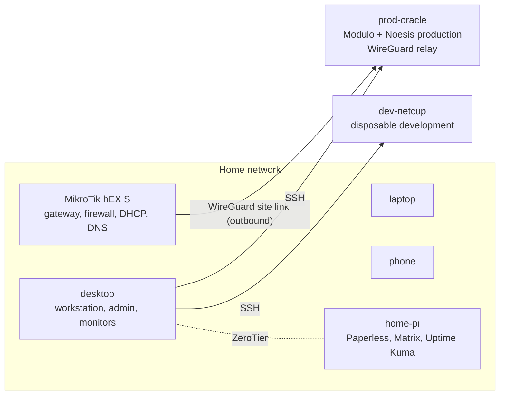

# Personal infrastructure

The owner's personal infrastructure that Modulo runs on and around: six devices,
the home network, the Raspberry Pi homeserver services, Oracle production,
Netcup development, and the operating rules for data, recovery and research.
These pages are real-world records for the owner and anyone helping with
operations or recovery; they are not derivable from the application code.

Nothing in this section contains secret values. Credentials, private keys,
recovery codes and configuration exports live in the password manager, the
encrypted Cryptomator vault on the desktop, or sealed offline custody. Pages
record only custody references, safe identifiers, checksums and results.

## Pages

| Page | Covers |
| --- | --- |
| [devices.md](devices.md) | six-device role contract, observed state, open gaps, inventory validation, per-device rebuild |
| [devices-inventory.json](devices-inventory.json) | machine-checkable device inventory |
| [home-network.md](home-network.md) | topology, VLANs, firewall, DNS, Wi-Fi, IPv6, administration, WireGuard, monitoring, network backup/restore |
| [data-lifecycle.md](data-lifecycle.md) | retention classes T0-T6, deletion gate, Noesis data classes and backup/restore contract |
| [recovery.md](recovery.md) | recovery runbook for every failure scenario, from one file to total loss |
| [records.md](records.md) | dated acceptance, verification and drill evidence, newest first |
| [Incident response](../security/incident-response.md) | security incident playbooks |
| [Identity recovery](../security/identity-recovery.md) | Tier-0 accounts, recovery factors, recovery cycles and remediation |

Modulo deployment itself (Compose, OCI, releases) is documented under
[operations](../operations/deployment.md).

## At a glance



| Host | Boundary | Holds |
| --- | --- | --- |
| desktop | personal | engineering work, network administration keys, monitoring timers, encrypted recovery vault |
| laptop, phone | personal | no unique services; phone is the authentication and capture device |
| home-pi | home infrastructure | Paperless records, Matrix/Synapse and bridges, Uptime Kuma, private services |
| prod-oracle | production | Modulo, Keycloak, Noesis, Praxis, Caddy; WireGuard rendezvous |
| dev-netcup | development | disposable build/test/agent compute; never production credentials |

## Operating rules that apply everywhere

- One authority per dataset; synchronization is not a backup and a backup is not
  an authority ([data-lifecycle.md](data-lifecycle.md)).
- Restore into new locations only, verify before cutover, keep the rollback copy
  ([recovery.md](recovery.md#rules-for-every-incident)).
- Failed checks never trigger automatic reconfiguration, credential rotation,
  deletion or restore.
- Disruptive tests (reboots, outages, provider rebuilds, live restores) happen
  only in an announced maintenance window with a fallback available.
- Record results in Modulo as references, counts, hashes and dates, then add the
  evidence to [records.md](records.md).

## Communication systems (Matrix on the Pi)

The Pi (`pi5`) runs Synapse, PostgreSQL, Element Web and the Mautrix Discord,
WhatsApp, Signal and Telegram bridges in Docker.

- Synapse is reachable on the LAN over TLS at `matrix.lan`. PostgreSQL and
  Synapse's direct HTTP listener are not exposed beyond the host.
- All four bridges use PostgreSQL, have encryption enabled and a persistent
  restart policy.
- [`scripts/pi-service-health.sh`](../../scripts/pi-service-health.sh) treats all
  Matrix services and bridges as critical and additionally checks the Telegram
  readiness endpoint. Its state is `~/.local/state/pi-service-health/last.json`
  on the Pi (12 critical services).
- Bridge configuration and appservice registrations are readable only by the
  service owner; the Synapse signing key is mode `600`.

This local-only design replaced an earlier split design with a public Matrix VPS.
It removes that VPS from the trust boundary, but bridge plaintext is not
isolated from Synapse because both run on the Pi.

### Matrix backup and restore

Two desktop user timers:

| Timer | Script | Does |
| --- | --- | --- |
| `matrix-backup-capture.timer` | [`matrix-backup-capture.sh`](../../scripts/matrix-backup-capture.sh) | daily backup into the mounted Cryptomator vault: full PostgreSQL cluster, Synapse config, signing key, appservice registrations, media store, Element config, each bridge's config and registration. Refuses to write an unencrypted fallback when the vault is unavailable. |
| `matrix-backup-monitor.timer` | [`matrix-backup-monitor.sh`](../../scripts/matrix-backup-monitor.sh) | every six hours: freshness, checksums, empty components |

[`scripts/matrix-restore-drill.sh`](../../scripts/matrix-restore-drill.sh) loads
the dump into a temporary network-less, tmpfs-only PostgreSQL 16 container and
checks non-empty schemas in `synapse` and all four Mautrix databases.

### Safe maintenance

1. Confirm the Cryptomator vault is mounted and the backup monitor reports
   `status: ok`.
2. Capture a fresh backup before a planned infrastructure change.
3. Check `~/.local/state/pi-service-health/last.json` on the Pi for 12 of 12
   healthy services.
4. Run disruptive reboot or outage tests only in an announced maintenance window
   with native messaging clients available as fallback.
5. Afterwards, verify bridge account and portal counts without reading message
   content, and record the result in Modulo.

### Open communication work

| Project | State | Remaining |
| --- | --- | --- |
| Harden Communication Identity & Recovery | active | COMM-01 to COMM-07 done; lost-phone/provider recovery and final owner acceptance |
| Establish Communication Identity & Addressing | planning | permanent public Matrix identity, canonical addressing, aliases, authoritative contact data |
| Standardize Native Messaging | planning | owner phone settings, linked-device checks, live native-client validation |
| Deploy Personal Matrix Infrastructure | active | public domain delegation, federation, MAS, MatrixRTC/TURN, cross-device call tests |
| Build Unified Messaging with Mautrix | active | native-client coexistence, all media/reaction variants, Signal portal creation, controlled Internet-outage test |
| Move Messaging Bridges to Raspberry Pi | active | maintenance-window reboot/outage test |
| Design Communication Attention & Organization | planning | spaces, room inventory, notification exceptions, owner preferences |
| Integrate Communication with Modulo | planning | message-to-record actions, schema, backlinks, project-context routing |
| Integrate Communication with Noesis & Automation | planning | allowlisted ingestion, provenance, output routing, deduplication, rate limits |
| Make Communication Infrastructure Recoverable | active | full host rebuild plus phone, YubiKey, Matrix-host, Oracle and home-Internet exercises |

## Browser environment

Linux workstations use a reproducible Firefox baseline defined in
[`config/browser-environment`](../../config/browser-environment/) and applied by
[`scripts/browser-environment/bootstrap.sh`](../../scripts/browser-environment/bootstrap.sh)
(checked by `scripts/browser-environment/verify.sh`). A Chromium-family browser
stays installed for compatibility testing only and is not the default.

| Profile | Use | Settings |
| --- | --- | --- |
| Main | ordinary browsing | HTTPS-Only on; containers Personal, Work, Finance, Shopping, Google, Social; uBlock Origin, Multi-Account Containers, Bitwarden |
| Development | developer tools and local/LAN HTTP services | HTTPS-Only off by design; uBlock Origin, Bitwarden |
| Disposable | untrusted or one-off browsing | uBlock Origin only; no stored credentials; transient state cleared on exit; never sign in to Bitwarden here |

All profiles block notification prompts, restrict autoplay, ask before camera,
microphone or location, ask where to save downloads, use strict tracking
protection, disable sponsored content, and never save passwords in Firefox.
Firefox Accounts/Sync and telemetry are disabled by policy, so history, cookies,
sessions, passwords, extensions and settings never cloud-sync. Bitwarden owns
passwords. Bookmarks are deliberately outside the baseline; never commit a
bookmark export, because URLs can reveal private activity.

Address-bar shortcuts: `g` DuckDuckGo (default), `gh` GitHub, `mdn` MDN Web
Docs, `w` Wikipedia, `sch` Google Scholar, `rfc` IETF RFC/Internet-Draft search.

To install or reconcile (idempotent; a differing `user.js` or Main
`containers.json` is backed up beside the original with a timestamp; cookies,
history, logins, sessions and private-window data are never read or copied):

```sh
scripts/browser-environment/bootstrap.sh
```

Then sign in to Bitwarden in Main and Development if appropriate and check
`about:policies`, `about:profiles` and the shortcuts. Acceptance on a new device:

1. Ordinary browsing opens in Main and HTTP is upgraded where supported.
2. A local HTTP dev service opens in Development without a forced upgrade.
3. Finance and social sessions stay isolated in their Main containers.
4. Disposable clears cookies and history after a clean exit and restart.
5. Notifications are blocked; camera, microphone and location stay ask-only.
6. Downloads prompt for a destination and are reviewed before opening.
7. Each search shortcut reaches its provider.
8. The Chromium fallback opens one known compatibility case without becoming
   default.

Review every six months, and when a browser reaches end of support, an approved
extension changes ownership, or a significant privacy control is renamed or
removed.

## Routing serious research through Noesis

The browser is for navigation, quick lookups, casual reading, authenticated
interaction and discovery. Escalate to Noesis when the result must compare
sources, verify a claim, retain provenance, expose uncertainty, find
contradictions, produce a reusable evidence package, or monitor change. The
Modulo side of the integration is described in
[integrations](../features/integrations.md).

Send Noesis only the minimum useful context: the question or claim and the
required output; the explicitly selected public URL, document, excerpt or
bounded tab set; the action (verify, trace the original, compare, find contrary
or newer evidence, synthesize, monitor); urgency/freshness and the destination
Modulo object. Never send cookies, authorization headers, session tokens,
unrelated tabs, history, private-window state or secrets. Authenticated material
needs an explicit access and retention decision before ingestion.

Noesis returns a conclusion package, not its corpus: question, answer/status,
findings, evidence locators, source references, contradiction state,
uncertainty/limitations, open questions, timestamps and a stable run, document,
watch or bundle reference. Modulo stores that package and the work it creates,
not a duplicate corpus.

The desktop Noesis checkout (`/home/ik/ChatGPT/Noesis`) has two domains: `local`
(private documents on the machine) and `research` (public evidence). Use
`research` for browser handoffs; private evidence stays in `local` and is
excluded from exports unless the owner explicitly authorizes it.

Known limits:

- Not all optional extraction/model/browser dependencies are installed. Ingest
  and cited answers work, but claim extraction reports degraded coverage and
  answers fall back to source passages.
- Token-overlap retrieval can return a lexically related but irrelevant passage
  for broad questions. Scope the domain and question, set a result limit and
  relevance threshold, inspect citations, and treat a refusal
  (`insufficient_evidence`) as a successful safety outcome.
- Long HTML pages can yield overlong passages; prefer focused, canonical or
  section-level sources.
- A citation shows where text appeared, not that it is true or independent.
  Consequential work still needs primary sources, corroboration, contradiction
  search and explicit uncertainty.
- Creating a watch does not schedule acquisition; collection cadence and
  notifications belong to the monitoring project.

Review the route every March and September and whenever the Noesis answer,
ingestion, export or watch contracts change. After a material runtime upgrade,
re-run the URL, comparison, refusal, bundle-verification and watch-lifecycle
pilots (see [records.md](records.md#noesis-research-routing-pilots-2026-09-20)).
Serious research is accepted only when its useful claims keep source locators
and its limits are visible; otherwise it stays open or refused.
