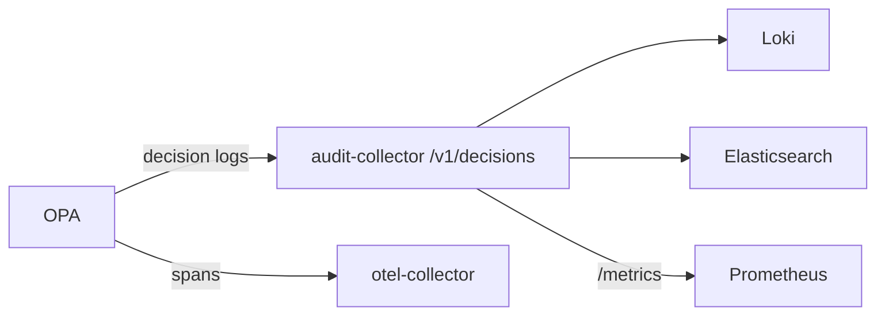

# Observability

This page is for operators and developers who need to know whether Modulo is
healthy and fast: health endpoints and probes, metrics, tracing, logs, audit
trails, the service-level objectives with their alerts, and load testing. The
settings behind each piece are in the
[configuration reference](../reference/configuration.md#observability).

## Where things run

| Signal | Local compose | OCI host |
|--------|---------------|----------|
| Health | `/api/health*`, actuator on 8081 | `/health`, `/api/health`, `status.sh`, `verify-deployment.py` |
| Metrics | Prometheus `:9090`, Grafana `:3000` | not deployed |
| Traces | OTel collector `:4317` → Jaeger `:16686` | disabled |
| Logs | Loki `:3100`, stdout | `docker compose logs`, `journalctl` for backups |
| Authorization audit | OPA → audit-collector → Loki + Elasticsearch | |
| Application audit | `audit_events` table, `GET /api/audit` | same |

The Kubernetes observability stack (Prometheus, Grafana, Loki, Tempo, SLO rules
and dashboards under `k8s/observability`) was retired with the cluster
deployment and is preserved at the Git tag
[`archive/cloud-deployments`](deployment.md#archived-cloud-deployments).

## Health endpoints

Paths below are as served when the context path is `/` (every Compose
deployment). Under the default `/api` context path (the `kubernetes` and `azure`
profiles), the custom endpoints move to `/api/api/health...` and actuator is at
`/api/actuator/...` on the server port or `/actuator/...` on the management port.

### Custom endpoints (`HealthController`)

[`HealthController`](../../backend/src/main/java/com/modulo/controller/HealthController.java)
and `SimpleHealthController` are permitted without authentication in `SecurityConfig`, as are `/actuator/**` and `/api/actuator/**`. Restrict actuator at the network level (separate management port, no public route).

| Endpoint | Checks | Status codes |
|----------|--------|--------------|
| `GET /api/health` | Application is up | 200, 503 |
| `GET /api/health/detailed` | Database connection, network detection service, offline sync service, JVM memory (warning at 90 % of max heap) | 200 when all are `UP`, else 503 |
| `GET /api/health/ready` | Database connection valid within 2 s | 200, 503 |
| `GET /api/health/live` | Process responds | 200 |
| `GET /api/health/uptime` | Uptime and start time | 200 |
| `GET /api/simple-health` | Minimal static response | 200 |

`/api/health` is what the OCI Compose health check, `status.sh` and
`verify-deployment.py` call. The frontend container answers `GET /health` from
nginx.

### Actuator

Actuator runs on `management.server.port` (8081 by default; 8080 under the
`azure` profile) at base path `/actuator`.

| Endpoint | Purpose |
|----------|---------|
| `/actuator/health` | Aggregate health, details shown (`when-authorized` under `azure` and `security`) |
| `/actuator/health/liveness` | Kubernetes liveness group |
| `/actuator/health/readiness` | Kubernetes readiness group |
| `/actuator/prometheus` | Micrometer metrics for Prometheus |
| `/actuator/metrics`, `/actuator/info` | Standard |

Probes for a container orchestrator should call the liveness and readiness
groups on the management port (8081 unless `MANAGEMENT_SERVER_PORT` changes it).

### Diagnosing a failing health check

```sh
curl -s localhost:8080/api/health/detailed | jq .checks
curl -s localhost:8081/actuator/health | jq .
docker compose logs backend --tail=200
```

- `database: DOWN` in `/detailed` or `/ready`: check `SPRING_DATASOURCE_*`, that
  PostgreSQL is reachable, and Hikari pool exhaustion in the logs.
- `memory: WARNING`: heap above 90 %. Check `JAVA_OPTS` (`MaxRAMPercentage`) and
  the container memory limit.
- Liveness passes but readiness fails: the app is up without a database. Do not
  raise the probe timeouts to hide this.

## Metrics

The backend publishes Micrometer metrics (`micrometer-registry-prometheus`) with
`application=modulo-backend` on every series and percentile histograms for
`http.server.requests` (p50, p90, p95, p99).

Workflow metrics, refreshed every `modulo.workflow.operations.poll-ms` (30 s) by
[`WorkflowOperationsService`](../../backend/src/main/java/com/modulo/blueprint/execution/WorkflowOperationsService.java):

| Prometheus name | Meaning |
|-----------------|---------|
| `modulo_workflow_runs{state}` | Runs by state |
| `modulo_workflow_run_rate{state}` | Recent rate by state |
| `modulo_workflow_run_latency_seconds` | Run latency |
| `modulo_workflow_schedule_lag_seconds` | How late schedules fire |
| `modulo_workflow_queue_depth` | Delivery backlog |

Prometheus in compose ([`monitoring/prometheus/prometheus.yml`](../../monitoring/prometheus/prometheus.yml))
scrapes itself, `audit-collector:8080/metrics`, `opa:8181/metrics`,
`otel-collector:8889`, `backend:8081/actuator/prometheus`, and PostgreSQL.

### Alert rules

| File | Loaded by | Alerts |
|------|-----------|--------|
| [`monitoring/prometheus/rules/workflow-alerts.yml`](../../monitoring/prometheus/rules/workflow-alerts.yml) Your own Prometheus; unit-tested by [`workflow-observability.yml`](../../.github/workflows/workflow-observability.yml) with `promtool test rules` | `WorkflowFailureBurst`, `WorkflowDeadLetters`, `WorkflowScheduleLag` (> 60 s for 2 min), `WorkflowQueueBacklog` (> 100 for 5 min) |
| [`monitoring/alerts/authorization-audit-alerts.yaml`](../../monitoring/alerts/authorization-audit-alerts.yaml) | Compose Prometheus (mounted as `/etc/prometheus/rules`) | Denial rate, audit service down, slow decisions, suspicious patterns, forwarding failures, token validation failures, no audit logs received, policy errors, authorization SLO |

The compose stack mounts `monitoring/alerts`, not `monitoring/prometheus/rules`,
so the workflow alerts are not loaded locally. Compose also points at an
`alertmanager:9093` that it does not run.

What to do when a workflow alert fires is in [Runbooks](runbooks.md#workflow-operations).

### Dashboards

- Compose Grafana (`admin`/`admin123`) provisions the Prometheus, Loki, Jaeger and
  Elasticsearch data sources. The auto-provisioned dashboard folder
  (`monitoring/grafana/dashboards`) is empty.
- [`monitoring/grafana/dashboards-available`](../../monitoring/grafana/dashboards-available)
  holds `authorization-audit.json` and `workflow-executions.json` for manual import
  (Dashboards → New → Import). They are kept out of the provisioned path because
  Grafana 10.2.3's file provisioner fails on the authorization dashboard every
  10 s ("could not resolve dashboards:uid"); the same JSON imports cleanly
  through the UI. Move it back once Grafana fixes the provisioner.
- The application performance, JVM, database, SLO overview, sync/blockchain and
  cost dashboards of the retired Kubernetes stack are in the
  [`archive/cloud-deployments`](deployment.md#archived-cloud-deployments) tag
  (`k8s/observability/dashboards`).

## Tracing

The backend builds its OpenTelemetry SDK by hand in
[`OpenTelemetryConfig`](../../backend/src/main/java/com/modulo/config/OpenTelemetryConfig.java)
(no Java agent). Spans go through a batch processor to OTLP gRPC at
`otel.exporter.otlp.endpoint`, or to Jaeger when `otel.traces.exporter=jaeger`.
Every span is exported (no sampler is configured).

Instrumentation that exists:

| Piece | What it does |
|-------|--------------|
| [`TracingFilter`](../../backend/src/main/java/com/modulo/filter/TracingFilter.java) | A span per HTTP request; puts `traceId`, `spanId`, `requestId` in the logging MDC and returns `X-Trace-ID` |
| [`TracingAspect`](../../backend/src/main/java/com/modulo/aspect/TracingAspect.java) | Spans around `@Traced` methods and around `@Service` and `@Repository` beans; `@NoTrace` opts out |
| [`WebSocketTracingConfig`](../../backend/src/main/java/com/modulo/config/WebSocketTracingConfig.java) | STOMP message spans |
| [`ExecutionTraceContext`](../../backend/src/main/java/com/modulo/observability/ExecutionTraceContext.java) | Puts server-generated `workflowRunId` and `workflowStepId` into the MDC for the duration of a workflow step, restoring the previous values afterwards so pooled threads do not leak correlation |
| `/api/v1/observability/demo/*` | Demo endpoints that generate traces, errors, metrics and load |

In compose the collector ([`infra/otel/otel-config.yaml`](../../infra/otel/otel-config.yaml))
forwards to Jaeger (UI on <http://localhost:16686>) and exposes Prometheus
metrics on 8889. OPA also exports its decision spans to the collector as service
`opa-authz`, so a request's authorization decision appears in the same trace.

The OCI deployment sets `OTEL_SDK_DISABLED=true`, but the hand-built SDK does not
read it. Without a collector the backend logs export failures; point
`OTEL_EXPORTER_OTLP_ENDPOINT` at a collector if you want traces there.

Troubleshooting:

| Symptom | Check |
|---------|-------|
| No traces in Jaeger | `docker compose logs otel-collector`; `curl localhost:13133` (collector health); the backend's `OTEL_EXPORTER_OTLP_ENDPOINT` must be reachable from the container (`http://otel-collector:4317`). |
| `Failed to export spans` floods the log | No collector at the endpoint. |
| Logs lack `traceId` | The request did not pass `TracingFilter` (for example a scheduled job). |

## Logs

The backend logs to stdout through
[`logback-spring.xml`](../../backend/src/main/resources/logback-spring.xml) with
the trace MDC fields. The dedicated `SECURITY_AUDIT` logger
([`SecurityAuditLogger`](../../backend/src/main/java/com/modulo/security/SecurityAuditLogger.java))
records authentication success and failure, authorization failures, rate-limit
hits, suspicious activity, security-config changes, session events and data
access. Under the `security` profile, the log pattern adds `eventType`, `eventId`
and `riskLevel`. User-supplied values pass through `LogSanitizer` before
logging.

## Audit trails

Modulo has two audit trails with different purposes.

### Application audit events

[`NoteAuditInterceptor`](../../backend/src/main/java/com/modulo/audit/NoteAuditInterceptor.java)
records every request to `/api/notes/{id}` into the `audit_events` table:
`NOTE_READ`, `NOTE_CREATE`, `NOTE_UPDATE`, `NOTE_DELETE` or `NOTE_ACCESS`, with
outcome `ALLOW` (2xx), `DENY` (401, 403, 404) or `ERROR`, client IP and status.
List endpoints are not recorded.

```http
GET /api/audit?noteId=&userId=&eventType=&from=<ISO>&to=<ISO>&page=0&size=50
```

`size` is capped at 200. Results are limited to the authenticated actor. Records
created before the tenant-ownership migration are marked unverified and excluded
([Database operations](database.md#tenant-ownership-migration)).

### Authorization decision logs (OPA)

When OPA fronts the API (compose `opa` service, or the Envoy overlay), each
decision is logged:



- OPA config: [`infra/opa/config-audit.yaml`](../../infra/opa/config-audit.yaml)
  (decision logs to `http://audit-collector:8080/v1/decisions` with a bearer
  `AUDIT_SERVICE_TOKEN`, 1–30 s reporting delay, Prometheus status, tracing).
- Policy with audit context: [`policy/audit_enhanced_authorization.rego`](../../policy/audit_enhanced_authorization.rego).
- Collector: [`services/audit-collector`](../../services/audit-collector) (Go).
  `POST /v1/decisions`, `GET /v1/health`, `GET /metrics`. Environment:
  `LOKI_ENDPOINT`, `ELASTIC_ENDPOINT`, `AUDIT_RETENTION_DAYS` (90), `BATCH_SIZE`
  (100), `DENIAL_RATE_THRESHOLD` (0.1), `SUSPICIOUS_ACTIONS_THRESHOLD` (10),
  `PORT` (8080).

A decision record carries timestamp, decision ID, trace and span IDs, request
ID, user (ID, tenant, roles; email pre-hashed), request (method, path, resource
type and ID, action), decision (allow, policy, rule, reason, evaluation time)
and client metadata. Request bodies and `Authorization` headers are never
logged. Keep it that way when changing the policy: hash identifiers you need for
correlation and cap free-text lengths.

Querying:

```logql
{service="opa-audit", decision="false"}
```

Loki streams are labelled `service="opa-audit"`, `decision`, `resource_type`, `action` and `tenant`. Search by `trace_id` in Loki or Elasticsearch and open the same ID in Jaeger to
see the whole request. [`scripts/test-audit-logging.sh`](../../scripts/test-audit-logging.sh)
exercises the pipeline end to end.

## Service-level objectives

| SLO | Objective | SLI | Error budget (30 days) |
|-----|-----------|-----|------------------------|
| Read latency | p95 of GET requests < 200 ms | `http_server_requests_seconds_bucket{application="modulo-backend",method="GET",status!~"[45].."}` | 5 % |
| Write latency | p95 of POST/PUT/DELETE < 500 ms | same, `method=~"POST\|PUT\|DELETE"` | 5 % |
| Sync latency | p95 of sync operations < 1000 ms | `modulo_sync_operations_duration_seconds_bucket{status="success"}` | 5 % |
| Availability | > 99.9 % of requests not 4xx/5xx | ratio of `http_server_requests_seconds_count` | 0.1 % (43.2 min) |

No backend code emits `modulo_sync_operations_duration_seconds` yet, so the sync
SLO has no data until that metric exists.

Recording rules `modulo:sli:*`, `modulo:slo:*_compliance` and
`modulo:slo:*_burn_rate_{5m,30m,1h,6h,24h}` and the burn-rate alerts were
defined only for the retired Kubernetes Prometheus
(`k8s/observability/prometheus-slo-rules.yaml`, preserved at the
[`archive/cloud-deployments`](deployment.md#archived-cloud-deployments) tag). No
running Prometheus loads them. Before porting them to
`monitoring/prometheus/rules/`, fix the alert annotations: they call a `div`
template function that Prometheus does not have, so `promtool check rules`
rejects the alerting file (the recording rules pass). The intended alerting is
multi-window burn rate:

| Severity | Burn rate | Windows | Budget gone in | Response |
|----------|-----------|---------|----------------|----------|
| Page | 14.4× | 5 min and 1 h | 2 hours | Immediate |
| Warning | 6× | 30 min and 6 h | 5 hours | Investigate within 30 min |
| Ticket | 1× | 2 h and 24 h | 30 days | Next working day |

Policy when budgets run out:

- An SLO violation is investigated and mitigated immediately.
- An exhausted error budget freezes feature work on the affected service until
  the budget recovers.
- Repeated violations get a root-cause analysis and an architecture review.
- Every incident includes an SLO impact assessment in its post-incident review
  (see [Incident response](../security/incident-response.md)).
- Changing an SLO target requires stakeholder review and historical data;
  retiring one needs 30 days' notice.
- Review SLO performance weekly, error budgets monthly, targets quarterly.

## Performance and load testing

### k6 suites

All k6 scripts live in [`k6-tests/`](../../k6-tests). Thresholds match the SLOs
(`slo_read_latency p(95)<200`, `slo_write_latency p(95)<500`,
`slo_sync_latency p(95)<1000`, `slo_error_rate rate<0.001`).

| Script | Purpose | Run |
|--------|---------|-----|
| `tests/crud-operations.js` | Note CRUD | `npm run test:crud` (in `k6-tests/`) |
| `tests/sync-operations.js` | Sync and blockchain paths | `npm run test:sync` |
| `tests/websocket-operations.js` | WebSocket connect and message latency | `npm run test:websocket` |
| `tests/advanced-load-test.js` | Mixed load | `npm run test:load` (root) |
| `tests/database-stress-test.js` | Database stress | `npm run test:load:database` (root) |
| `tests/blockchain-stress-test.js` | Blockchain stress | `npm run test:load:blockchain` (root) |
| `tests/memory-resource-exhaustion-test.js` | Resource exhaustion | `npm run test:load:resources` (root) |
| `tests/performance-regression-test.js` | Regression | `npm run test:load:regression` (root) |
| `authz-performance.js` | AuthN/Z overhead and resilience | `npm run test:authz`, `test:authz-smoke`, `test:authz-chaos`, or `./authz-performance-test.sh` |
| `authz-benchmark/benchmark.js` | OPA decision benchmark | `make authz-benchmark` |
| `synthetic/uptime-probe.js`, `synthetic/user-journey.js` | Synthetic monitoring | see below |

Environment: `BASE_URL` (default `http://localhost:8080`), `WS_URL`
(`ws://localhost:8080/ws`), `API_KEY`.

Load profiles:

| Profile | VUs | Duration | Use | Command |
|---------|-----|----------|-----|---------|
| smoke | 1 | 30 s | PR sanity | `npm run test:smoke` |
| normal | 10 | 5 min | Nightly baseline | `npm run test:load` |
| stress | 50 | 2 min | Capacity | `npm run test:stress` |

The authz suite asserts: authorization overhead p95 < 20 ms, login p95 < 1 s,
CRUD p95 < 500 ms, error rate < 10 %, and more than 90 % of requests served
during degradation. Its Markdown report is written by `handleSummary` to
`docs/reference/generated/authz-benchmark.md` relative to the working directory,
so run it from the repository root to update the committed
[report](../reference/generated/authz-benchmark.md).

### Baselines and regressions

```sh
cd k6-tests
npm run baseline:save       # store results in baselines/performance-baselines.json
npm run baseline:compare    # compare the latest results with the baseline
```

[`compare-baseline.js`](../../k6-tests/scripts/compare-baseline.js) flags a
regression when p95 latency rises more than 15 %, error rate rises more than 2
percentage points, or throughput falls more than 10 %; half those values produce
a warning. SLO threshold breaches are reported separately.

### CI

| Workflow | When | What |
|----------|------|------|
| [`nightly-performance.yml`](../../.github/workflows/nightly-performance.yml) | Daily 02:00 UTC; PRs to `main` touching `backend/`, `frontend/`, `k6-tests/`; manual with environment (`staging`/`development`) and profile | Starts the stack, runs k6, compares against the baseline, uploads results |
| [`synthetic-monitoring.yml`](../../.github/workflows/synthetic-monitoring.yml) | Every 5 min on weekdays 09–18 UTC, every 15 min otherwise; manual | Uptime probe and user journey (login, create note, sync, search) |

The synthetic workflow's default targets (`api.modulo.app`,
`staging-api.modulo.app`) are placeholders; set a real `TARGET_URL` before
relying on it.

### Backend response-time tooling

- `/api/v2/notes/*` ([`OptimizedNoteController`](../../backend/src/main/java/com/modulo/controller/OptimizedNoteController.java))
  serves cached, paginated note queries: by ID, by user, recent, search, advanced
  search, by tag, stats, counts, titles, and a per-user cache warm-up.
- [`PerformanceMonitoringAspect`](../../backend/src/main/java/com/modulo/aspect/PerformanceMonitoringAspect.java)
  times the optimized controller, service and repository and every `@Cacheable`
  method, and logs calls slower than 1 s (warning) and 5 s (error); API endpoints
  also warn above 500 ms.
- [`CacheConfig`](../../backend/src/main/java/com/modulo/config/CacheConfig.java)
  uses an in-memory `ConcurrentMapCacheManager`; caches are per instance and not
  shared between replicas.
- The `performance` profile tunes Hikari, Hibernate batching and response
  compression ([configuration reference](../reference/configuration.md#profiles)).
