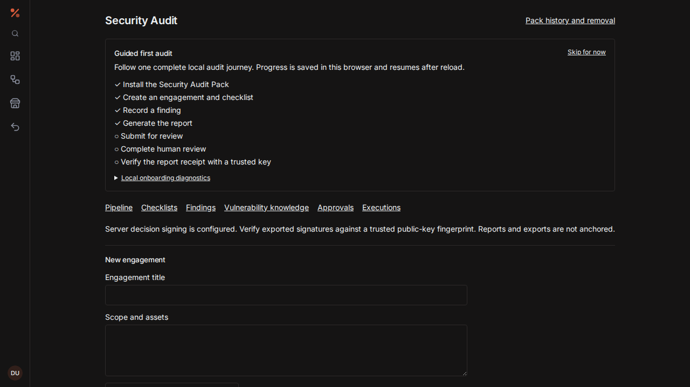

# Pack Studio

Open **Pack Studio** in the workspace to assemble a v2 pack. **New Audit draft** supplies the reference Audit resources; **New Knowledge Base draft** supplies the knowledge workspace. Set the pack ID and version, select each contribution, and edit its fields. The picker supports plugins, Blueprints, property schemas, templates, saved queries, views, dashboards, workspace modes, permission presets, and optional demo data.

For an Audit package, select **Human review** and replace the reviewer account ID. You can also import an owned saved Blueprint. The Blueprint editor opens in a separate tab; save there, refresh the Studio list, and import the graph. Imported graphs are copies in the draft. Plugin contributions identify an already provisioned image; authoring does not provision a runtime.

Validation reports the affected contribution and field, including missing or incorrectly typed references, query properties, prerequisites, and cycles. Preview shows dependency relationships, requested capabilities, navigation, and sample view/dashboard layouts. It does not install resources, query user notes, or enable workflows. The installation review remains a separate step under **Installed packs**.

**Save private draft** stores source under the current owner with optimistic revision checks. A stale save is rejected; reload the draft before editing again. Drafts may contain incomplete contributions, but preview and publication require a valid manifest. Import/export uses JSON files of at most 2 MiB.

The server preview returns deterministic source and its SHA-256 digest. **Export manifest source** downloads those exact bytes. Any edit invalidates the preview and publication consent. Publication requires explicit confirmation that the entire manifest, including Blueprint and plugin configuration, can become public on IPFS. Do not include credentials in public pack configuration.

Publication uploads, pins, retrieves, and compares the source digest before recording `PUBLISHED`. A failed transport, pin, or content check records `FAILED`; it never invents a CID or successful receipt. Retrying the same version and source is idempotent. A version already reserved for different source requires a new version. The publication history exports the exact recorded source. IPFS publication alone neither verifies the publisher nor anchors the package on a chain; the UI and receipt state this explicitly.

The frontend image builds from the repository root and copies the shared approval canonicalization module. Run `python3 scripts/sync-pack-assets.py` after editing the authoritative backend manifest schema or shared example packs. CI runs the same command with `--check` to detect stale frontend copies.

API: authenticated `/api/pack-studio/preview`, `/drafts`, `/drafts/{id}`, `/publish`, `/publications`, and `/publications/{id}/source`. Drafts and publication records are owner scoped. Preview has no storage side effects. Flyway V15 adds private drafts and immutable version/source publication records.

## Security Audit guided journey

After installing the **Security Audit Pack**, open **Security Audit** in the
workspace. The guided checklist walks through install consent, engagement
creation, a finding, report generation, reviewer submission, human review and
receipt verification. Submission alone does not complete the guide. Progress is
stored locally in the browser so the guide can be skipped and resumed without
changing audit records.

Open **Review request** to record the review. In the shared report snapshot,
provide the SHA-256 signing-key fingerprint obtained independently from your
administrator and choose **Verify report receipt locally**. The browser checks
the report bytes, evidence digest and Ed25519 decision signature itself. A valid
signature from an unknown key is explicitly distinguished from trusted identity;
unsigned receipts remain unverifiable. Export the report and decision receipt
for independent verification with `scripts/verify-audit-report.mjs`. Verification
does not claim blockchain anchoring. After reloading, verify the current receipt
again; a cached progress flag is not cryptographic evidence.

For a safe first run, choose **Create privacy-safe demo engagement**. The demo
uses only local fixture content and creates an engagement intake, checklist,
sample access-control finding, vulnerability knowledge note, and report. It does
not contact a target, blockchain network, or external AI provider. Demo
engagements are explicitly marked **Demo** and expose **Remove demo**; that
endpoint is owner-scoped and refuses to delete real engagements.

The onboarding diagnostics disclosure is intentionally narrow: only step event
names and timestamps are retained in browser storage. Note, finding, report,
account, and target content are excluded, and the diagnostics can be cleared at
any time.

The screenshot above is reproducible from the bounded Playwright fixture:
`UPDATE_DOC_SCREENSHOTS=1 npx playwright test tests/audit-pack-onboarding.spec.ts --project=chromium --grep="fresh workspace"`.
