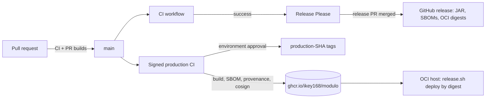

# Releases and supply chain

This page is for maintainers and operators. It explains how a commit on `main`
becomes signed, attested container images and a versioned GitHub release, how to
verify those artifacts, and how to enforce signatures in Kubernetes. Deploying
the images is covered in [Deployment](deployment.md).

## Overview



| Stage | Workflow | Trigger | Output |
|-------|----------|---------|--------|
| Validate | [`ci.yml`](../../.github/workflows/ci.yml) | push to `main`, `feature/*`, `*-*`; PRs to `main` | `Required checks` status |
| PR image build | [`docker-build.yml`](../../.github/workflows/docker-build.yml), `multiarch-verification` job of `signed-production.yml` | PRs | amd64 + arm64 build, nothing pushed |
| Build and sign | [`signed-production.yml`](../../.github/workflows/signed-production.yml) `build-signed` | push to `main` touching `backend/**` or `frontend/**`; manual | Multi-arch images `build-<sha>`, SBOM + provenance, cosign signatures, `signed-artifact-manifest-<sha>` artifact |
| Promote | `signed-production.yml` `promote` | after `build-signed`, gated by the `production` GitHub environment | `production-<sha>` tags pointing at the same digests, `production-promotion-<sha>` record |
| Version and release | [`release-please.yml`](../../.github/workflows/release-please.yml) | CI completed successfully on a push to `main` | Release PR; on merge a tag and GitHub release with assets |

Principles the pipeline enforces:

- Images are identified by digest. Tags are conveniences; deployments pin
  `image@sha256:...`.
- Signing is keyless (Sigstore, GitHub Actions OIDC). There are no signing keys
  to store or rotate.
- A release is only built from the exact commit CI verified.
- Promotion re-verifies signatures and never rebuilds.

## Setup Instructions

### Repository settings (one time)

1. Branch protection on `main`: require the **Required checks** status. A
   workflow cannot set this; it is a repository setting.
2. Create a `production` GitHub environment with required reviewers. The
   `promote` job waits on it.
3. Allow GitHub Actions to write packages (GHCR) and request OIDC tokens. The
   workflows declare `packages: write`, `id-token: write` and
   `attestations: write` on the jobs that need them.

### CI (`ci.yml`)

| Job | Checks |
|-----|--------|
| `build` | `mvn -B verify` (backend including PostgreSQL migration tests, coverage gate) |
| `boundary-lint` | `npm run lint:boundary:ci` (feature packs import only `@modulo/core`) |
| `wasm-node-examples` | Rebuilds the WASM node examples and compares fixtures |
| `frontend` | Android inventory check, `lint:ci` against the ESLint baseline, unit tests, strict build, desktop tests, phone audit/parity/a11y/perf smoke |
| `operations` | `deploy/oci` unit tests, restore-drill integration test, `bash -n` and ShellCheck on the OCI scripts |
| `praxis-host` | Praxis host integration |
| `android-debug`, `android-emulator` | Debug APK and packaged-app journeys (not part of `required`) |
| `required` | Fails unless every job above it succeeded; cancelled or skipped also fails |

The browser smoke test runs the real workspace against a mocked API with the
development login bypass. It does not test live authentication; the OCI release
gate does that.

Frontend builds use the root lockfile with `npm ci` and the Node version in
[`.node-version`](../../.node-version) (also pinned in the frontend Dockerfile).
Build the frontend image from the repository root:
`docker build -f frontend/Dockerfile .`.

### Versioning

[Release Please](https://github.com/googleapis/release-please) (`release-type:
node`, package `modulo`) reads Conventional Commit messages on `main`:

| Commit | Version bump |
|--------|--------------|
| `fix:` | patch |
| `feat:` | minor |
| `feat!:` or a `BREAKING CHANGE:` footer | major |

It keeps a release PR open with the next version and
[`CHANGELOG.md`](../../CHANGELOG.md). Merging it creates the tag and release.
The version manifest is [`.release-please-manifest.json`](../../.release-please-manifest.json).
Commit message rules are in [Local development](../getting-started/local-development.md#commit-messages).

### Release assets

When a release is created, `build-and-attach` checks out the tag, fails unless
the tag's commit equals the commit CI verified, and attaches:

| Asset | Contents |
|-------|----------|
| `modulo-backend-<tag>.jar` | Spring Boot jar |
| `modulo-backend-<tag>-sbom.json` | CycloneDX SBOM of the jar (Syft) |
| backend and frontend image SBOMs | CycloneDX SBOMs of the OCI archives |
| `docker-digests.txt` | Digests of the amd64 + arm64 OCI archives built for the release |

These release images are exported as OCI archives, not pushed. The images you
deploy come from `signed-production.yml`.

Two other release paths have their own pages: the Android APK
([`android-release.yml`](../../.github/workflows/android-release.yml), see
[Mobile and desktop](../features/mobile-and-desktop.md)) and marketplace pack
releases (see [Plugins](../features/plugins.md)).

## Build, sign and promote

`build-signed` runs on `main` only:

1. Builds `backend` (context `./backend`) and `frontend` (context `.`) for
   `linux/amd64,linux/arm64` with Buildx, pushes
   `ghcr.io/ikey168/modulo/{backend,frontend}:build-<sha>`, and records
   `org.opencontainers.image.revision`.
2. Generates BuildKit SBOM and max-mode provenance attestations
   (`sbom: true`, `provenance: mode=max`).
3. `cosign sign --yes image@digest`, then `cosign verify` with the identity
   `^https://github.com/<repo>/.github/workflows/signed-production.yml@refs/heads/main$`
   and issuer `https://token.actions.githubusercontent.com`.
4. `actions/attest-build-provenance` pushes a GitHub build-provenance attestation
   to the registry for each image.
5. Uploads `signed-artifact-manifest-<sha>`: repository, source commit, and each
   image's digest and platforms. This is what operators deploy from.

`promote` then waits for approval on the `production` environment, re-verifies
both signatures, and creates `production-<sha>` tags with
`docker buildx imagetools create` (no rebuild). It polls until the new tag
resolves to the exact source digest and uploads `production-promotion-<sha>`.
Manual runs (`workflow_dispatch` with `promote: true`) follow the same path.

## Verification

### Verify an image signature

```sh
cosign verify \
  --certificate-identity-regexp '^https://github.com/Ikey168/Modulo/.github/workflows/signed-production.yml@refs/heads/main$' \
  --certificate-oidc-issuer https://token.actions.githubusercontent.com \
  ghcr.io/ikey168/modulo/backend@sha256:<digest>
```

Always verify by digest. A tag can move; a digest cannot.

### Verify build provenance

```sh
gh attestation verify oci://ghcr.io/ikey168/modulo/backend@sha256:<digest> \
  --repo Ikey168/Modulo
```

### Inspect the SBOM and platforms

```sh
docker buildx imagetools inspect ghcr.io/ikey168/modulo/backend@sha256:<digest> \
  --format '{{ json .SBOM }}'
docker buildx imagetools inspect ghcr.io/ikey168/modulo/backend@sha256:<digest>
```

For release assets, the CycloneDX JSON files attached to the GitHub release can be
scanned directly (for example `grype sbom:modulo-backend-<tag>-sbom.json`).

### Verify a deployment

On the OCI host, `release.sh deploy` refuses non-digest references and runs
`verify-deployment.py` after switching containers. See
[Deployment](deployment.md#releasing-a-validated-build).

## Enforcing signatures in Kubernetes

Kyverno admission policies that admitted only signed Modulo images
(`k8s/policies`, with `scripts/setup-image-signing.sh`,
`scripts/validate-image-signing.sh` and the `test-image-signing.yml` workflow)
belonged to the retired cluster deployment. They were removed in #540 and are
preserved at the Git tag
commit [`86644da`](deployment.md#archived-cloud-deployments). They
still expected the `docker-build.yml` signer; if you restore them, change the
`subject` to the `signed-production.yml` identity shown under
[Verify an image signature](#verify-an-image-signature), and allow the registries
your external plugins use.

## Troubleshooting

| Problem | What to check |
|---------|---------------|
| `promote` never starts | The `production` environment is waiting for a reviewer. |
| `cosign verify` fails with "no matching signatures" | You verified a tag that moved, or used the wrong identity. Verify by digest with the `signed-production.yml` identity above. |
| Signing step fails with an OIDC error | The job lacks `id-token: write`, or the run is from a fork. |
| Release Please did nothing | It only runs after `CI` succeeded on a push to `main` from this repository, and only when the triggering run's head SHA is the current `main`. |
| `build-and-attach` failed on the SHA check | The release tag does not point at the commit CI verified. Do not bypass it; re-run from a verified commit. |
| Frontend lint fails on an unrelated file | A new finding versus `frontend/eslint-baseline.json`. Fix it; do not regenerate the baseline to accept it. |
| Multi-arch build fails only on arm64 | QEMU emulation. Reproduce with `docker buildx build --platform linux/arm64 -f frontend/Dockerfile .`. |

Rekor transparency-log entries for a signature can be searched with
`rekor-cli search --artifact <image>@sha256:<digest>`.
