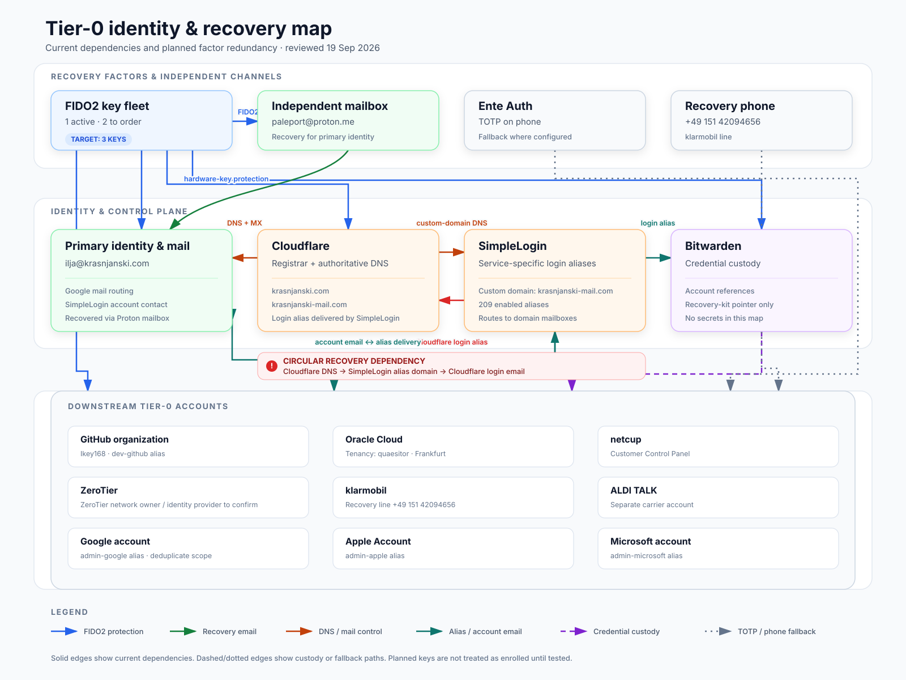

# Identity recovery

The owner's Tier-0 identity roots (mailboxes, DNS/registrar, alias service,
password vault, source hosting, cloud and carrier accounts), how each one is
recovered, which factors protect them, where recovery paths form cycles or
single points of failure, and the remediation plan. It is for the owner and a
designated recovery helper. It is the account-level companion to the
[incident-response playbooks](incident-response.md) and the first layer of the
[complete infrastructure loss](../infrastructure/recovery.md#complete-infrastructure-loss)
order.

## Handling rule

This page and the files in [identity-recovery/](identity-recovery/) contain only
non-secret identifiers and references. Never add passwords, passkeys, API keys,
private-key material, one-time codes, TOTP seeds or QR codes, recovery-code
contents, SIM PINs/PUKs, support or hotline PINs, or security-key secrets. When a
secret must be located, record only a pointer such as "Bitwarden item: ..." or
"sealed recovery kit: ...".

Treat every provider setting marked **Confirm** as an open defect until the live
console proves otherwise.

## Status

| Work item | State (last reviewed 2026-09-19) |
| --- | --- |
| 02 Tier-0 register (login URL, owner, safe identifiers, billing owner, recovery contact) | Done, accepted 2026-09-19; follow-up console checks remain |
| 03 Redundant MFA and recovery factors | In progress |
| 04 Identity and recovery dependency map | Done |
| 05 Cycle and single-point analysis with selected remediation | Done as analysis; the system itself is not yet remediated |
| 06-24 Enrollment, clean-session tests, offline packet | Open (worksheet for 07-08 below) |

## Dependency map

Editable vector: [04-tier0-identity-recovery-map.svg](identity-recovery/04-tier0-identity-recovery-map.svg);
portable preview: [04-tier0-identity-recovery-map.png](identity-recovery/04-tier0-identity-recovery-map.png).
The map has three layers (recovery factors, identity/control systems, downstream
Tier-0 accounts), distinguishes FIDO2 protection, recovery email, DNS/mail
control, alias delivery, credential custody, TOTP and phone recovery, makes the
Cloudflare-SimpleLogin cycle explicit, and keeps current state separate from
planned redundancy.

The supplied diagram establishes the following recovery/control shape:

- YubiKey protects the mailbox roots and the Tier-0 service accounts.
- `paleport@proton.me` is the independent recovery mailbox for `ilja@krasnjanski.com`.
- `ilja@krasnjanski.com` is the primary mailbox identity and the SimpleLogin account/recovery contact.
- Cloudflare controls DNS and registration for `krasnjanski.com` and `krasnjanski-mail.com`; therefore it is upstream of both the primary mailbox and SimpleLogin custom-domain delivery.
- SimpleLogin supplies the service-specific aliases used by the downstream accounts.
- Bitwarden holds the account references/credentials for the downstream accounts.

Arrows in the diagram are treated as dependency evidence, not proof of a provider's configured recovery field. Provider-console confirmation is still required where noted.

## Tier-0 register

Machine-readable copy: [02-tier0-identity-recovery-register.csv](identity-recovery/02-tier0-identity-recovery-register.csv).
Evidence labels: **Diagram** (supplied current-state diagram, 2026-09-19),
**Alias export** (`/home/ik/Downloads/aliases.csv`, 209 enabled aliases),
**Local** (non-secret local configuration or repository metadata), **Public**
(public DNS, RDAP or provider API, checked 2026-09-19), **Confirm** (private
console data not yet verified).

| System / asset | Canonical login | Account owner | Login identity / alias | Safe account or support identifier | Billing owner | Current recovery contact / dependency | Escalation channel | Evidence and status |
|---|---|---|---|---|---|---|---|---|
| Proton Mail root | https://account.proton.me/login | Ilja, personal account; exact legal owner string **Confirm** | `paleport@proton.me` | Account email only; plan/account number **Confirm** | **Confirm** in Proton account | `ilja@krasnjanski.com` per diagram; configured recovery method **Confirm** | https://proton.me/support/contact | **Diagram**; private settings unverified |
| Google primary identity / mail | https://accounts.google.com/ | Ilja, personal/domain account; exact legal owner string **Confirm** | `ilja@krasnjanski.com` | Domain `krasnjanski.com`; Google customer ID **Confirm** | **Confirm** in Google payments/admin | `paleport@proton.me` per diagram; configured recovery phone/email **Confirm** | https://accounts.google.com/signin/recovery | **Diagram**; MX is Google (`smtp.google.com`) **Public** |
| YubiKey recovery factors | N/A (hardware factor) | Ilja | N/A | Key model, serial suffix, firmware, and physical custody references **Confirm** | Ilja / purchaser **Confirm** | Record at least primary and spare-key custody references; no codes | https://support.yubico.com/ | **Diagram**; inventory details missing |
| Cloudflare registrar and DNS | https://dash.cloudflare.com/ | Ilja / Cloudflare account; exact member and legal owner **Confirm** | `admin-cloudflare@krasnjanski-mail.com` → `admin@krasnjanski.com` | Account ID **Confirm**; zones `krasnjanski.com`, `krasnjanski-mail.com`; both registrar: Cloudflare, Inc.; nameservers `kanye.ns.cloudflare.com`, `lindsey.ns.cloudflare.com` | Billing profile/contact **Confirm** | Login/account email appears to be the alias at left; verify it and at least one additional Super Administrator | https://developers.cloudflare.com/support/contacting-cloudflare-support/ and https://developers.cloudflare.com/fundamentals/user-profiles/account-recovery/ | Alias **Alias export**; registrar/NS **Public**; account settings unverified |
| SimpleLogin alias service | https://app.simplelogin.io/auth/login | Ilja, personal account **Confirm** | `ilja@krasnjanski.com` per diagram | Custom domain `krasnjanski-mail.com`; 209 enabled aliases in export | Plan/payment owner **Confirm** | `ilja@krasnjanski.com` per diagram; Proton-linked sign-in status and recovery method **Confirm** | https://simplelogin.io/contact/; `simplelogin@support.proton.me` | **Diagram**, **Alias export** |
| Bitwarden vault | https://vault.bitwarden.com/ or https://vault.bitwarden.eu/ (**Confirm region**) | Ilja, personal vault **Confirm** | `admin-bitwarden@krasnjanski-mail.com` → `admin@krasnjanski.com` | Server region, account fingerprint, organization name/ID **Confirm** | Subscription owner **Confirm** | Login alias at left; trusted emergency contact and organization recovery policy **Confirm** | https://bitwarden.com/help/ | Alias **Alias export**; private settings unverified |
| GitHub organization | https://github.com/login | Organization `Ikey168`; actual organization-owner user(s) **Confirm** | `dev-github@krasnjanski-mail.com` → `dev@krasnjanski.com`; security notices: `security-github@krasnjanski-mail.com` → `security@krasnjanski.com` | Org login `Ikey168`; org numeric ID `122488906`; node ID `O_kgDOB00ISg`; primary repo `Ikey168/Modulo` | Organization owner or billing manager **Confirm** | Account recovery email **Confirm**; dependency on SimpleLogin/primary mail and YubiKey per diagram | https://support.github.com/ | Org/API/remote **Public/Local**; owner membership is private and unverified |
| Oracle Cloud Infrastructure | https://cloud.oracle.com/?tenant=quaesitor&region=eu-frankfurt-1 | Ilja / OCI tenancy; legal owner **Confirm** | `admin-oracle@krasnjanski-mail.com` → `admin@krasnjanski.com` | Tenancy name `quaesitor`; tenancy OCID `ocid1.tenancy.oc1..aaaaaaaajpeg4y2x5wmpypro3c5lgdc3hv6rwmveemz6f3wwuwou7eofkowq`; home region `FRA` / `eu-frankfurt-1`; deploy IAM user OCID `ocid1.user.oc1..aaaaaaaabskztgop3jxf3lbapv77eyf57zg4zuelu3rxulj7cy7ykn5uqc3q`; CSI/support identifier **Confirm** | OCI billing-account owner/contact **Confirm** | Login alias at left; additional tenancy administrator and recovery contact **Confirm** | https://support.oracle.com/; sign-in trouble: https://docs.oracle.com/en-us/iaas/Content/GSG/Tasks/signinginIdentityDomain.htm | Alias **Alias export**; tenancy details **Local**, verified through OCI API |
| netcup Customer Control Panel | https://ccp.netcup.net/ | Ilja / contract holder; exact legal owner **Confirm** | `admin-netcup@krasnjanski-mail.com` → `admin@krasnjanski.com` | Customer number, CCP login name, and contract IDs **Confirm** | Contract/payment owner **Confirm** | Login/account email at left; recovery contact **Confirm** | https://www.netcup.com/en/helpcenter/support; customer support `+49 721 754 0 755 0`; outage emergency `+49 721 754 0 755 5` | Alias **Alias export**; identifiers unverified |
| ZeroTier network | https://my.zerotier.com/ | ZeroTier network Owner user **Confirm** | **Not present in alias export**; identity provider/login **Confirm** | ZeroTier network ID, DNS name, display name, plan, and owner user **Confirm** | Billing admin **Confirm** | Identity provider/domain and recovery path **Confirm**; YubiKey dependency per diagram | https://www.zerotier.com/contact/; domain-proof recovery guidance: https://www.zerotier.com/support/ | **Diagram**; local client currently `NeedsLogin`, so private fields unverified |
| klarmobil | Use “Mein Onlineservice” from https://www.klarmobil.de/service/kontakt/ | Ilja / contract holder; exact legal owner **Confirm** | `admin-klarmobil@krasnjanski-mail.com` → `admin@krasnjanski.com` | Customer number, contract number, and mobile number **Confirm** | Contract/payment owner **Confirm** | Login/account email at left; recovery phone/email **Confirm** | https://www.klarmobil.de/service/kontakt/ | Alias **Alias export**; contract fields unverified |
| ALDI TALK | “Mein ALDI TALK” from https://www.alditalk.de/tarifverwaltung | Ilja / registered SIM holder; exact legal owner **Confirm** | `admin-alditalk@krasnjanski-mail.com` → `admin@krasnjanski.com` | Mobile number and customer number **Confirm**; store only a reference to SIM/PUK paperwork | Top-up/payment owner **Confirm** | Login/account email at left; recovery contact **Confirm** | https://www.alditalk.de/contact; service `0177 177 1157` | Alias **Alias export**; registration fields unverified; never record hotline PIN/PUK here |
| Google service account (diagram lists Google separately) | https://accounts.google.com/ | Ilja; determine whether this is the same identity as the Google primary row | `admin-google@krasnjanski-mail.com` → `admin@krasnjanski.com` | Google account email/customer ID **Confirm** | Payments profile owner **Confirm** | Login alias at left; configured recovery phone/email **Confirm** | https://accounts.google.com/signin/recovery | **Diagram**, **Alias export**; possible duplicate scope needs reconciliation |
| Apple Account | https://account.apple.com/ | Ilja, personal account; exact legal owner **Confirm** | `admin-apple@krasnjanski-mail.com` → `admin@krasnjanski.com` | Apple Account email; trusted-device/phone references **Confirm** | Apple payment profile owner **Confirm** | Login alias at left; Apple Recovery Contact name/reference **Confirm** | https://support.apple.com/apple-account | **Diagram**, **Alias export**; private settings unverified |
| Microsoft account | https://account.microsoft.com/ | Ilja, personal account; exact legal owner **Confirm** | `admin-microsoft@krasnjanski-mail.com` → `admin@krasnjanski.com` | Microsoft account email; tenant/subscription ID if applicable **Confirm** | Microsoft billing profile owner **Confirm** | Login alias at left; security-info recovery email/phone **Confirm** | https://support.microsoft.com/account-billing | **Diagram**, **Alias export**; private settings unverified |

### Follow-up console checks

Useful maintenance checks when each provider is next reviewed:

1. Write the exact legal/account owner string once, then apply it to each personal account where it matches.
2. Cloudflare: account ID, both zone IDs, Super Administrator list, billing contact, account email, and recovery readiness. Confirm that both domains remain in the same intended account.
3. GitHub: all owners of organization `Ikey168`, billing managers, billing email, and each owner account's recovery email. GitHub recommends at least two organization owners.
4. Oracle: Customer Support Identifier (CSI), subscription/billing-account owner, billing contact, tenancy administrators, and recovery contact.
5. netcup: customer number, CCP login identity, contract owner, billing owner, and support-authorized email.
6. ZeroTier: ZeroTier network ID, ZeroTier network DNS name, identity provider/login, Owner user, Billing Admin, plan, and domain-proof recovery path.
7. Bitwarden: US/EU region, account fingerprint, emergency-access contact, organization owner(s), and billing owner. Record only references to the emergency kit.
8. Proton, Google, Apple, and Microsoft: configured recovery contacts, trusted devices/phones, billing profiles, and whether recovery creates a cycle.
9. klarmobil and ALDI TALK: customer/contract/mobile identifiers, registered holder, billing owner, and support-authorized contact. Keep PIN/PUK/hotline PIN out of this register.
10. Decide whether “Google” in the downstream box is the same account as `ilja@krasnjanski.com`; merge the duplicate row if so.

### Public verification notes

- Public DNS on 2026-09-19: both domains use Cloudflare nameservers; `krasnjanski.com` routes mail to Google and `krasnjanski-mail.com` routes mail to SimpleLogin.
- Verisign RDAP on 2026-09-19: Cloudflare, Inc. is registrar for both `.com` domains.
- GitHub public API on 2026-09-19: `Ikey168` is an Organization with numeric ID `122488906`; `Ikey168/Modulo` is the configured origin remote. `KrasForge` does not resolve as a public organization.
- ZeroTier documents that the ZeroTier network ID is visible under General in the admin console and that support can require DNS TXT proof when no administrator is reachable.
- Cloudflare documents that the account email is used for billing, usage notices, and account recovery; verify whether the present account follows that default or has separate billing/notification addresses.

## Recovery factors

Machine-readable copy: [03-tier0-mfa-recovery-factors.csv](identity-recovery/03-tier0-mfa-recovery-factors.csv).

| Factor / channel | Quantity / identity | State | Intended role | Safe notes |
|---|---|---|---|---|
| FIDO2 security key | 1 | In use | Primary phishing-resistant factor | Model, serial suffix, firmware, purchase date, and custody reference not yet recorded |
| Additional FIDO2 security keys | 2 | To order | Redundant enrolled keys | Target total: 3 keys |
| Ente Auth on phone | 1 phone installation | In use for TOTP | Supplemental TOTP factor where FIDO2 is unavailable or as an approved fallback | Ente login alias in the alias export: `admin-ente@krasnjanski-mail.com` → `admin@krasnjanski.com`; do not store TOTP seeds here |
| Recovery phone | `+4915142094656` | Current; klarmobil line | SMS/voice recovery where unavoidable | Do not treat as the only recovery path |
| Independent recovery mailbox | `paleport@proton.me` | Current | Independent recovery for `ilja@krasnjanski.com` | Protected by the active YubiKey per the supplied current-state diagram |
| Primary/domain mailbox | `ilja@krasnjanski.com` | Current | Primary identity and SimpleLogin recovery/contact mailbox | Depends on `krasnjanski.com` DNS and Google mail routing |

### Target key layout

| Key | Purpose | Custody target | Status |
|---|---|---|---|
| Key A | Daily primary key | With owner, separate from phone where practical | In use; inventory details to record |
| Key B | Local spare | Secure location separate from Key A and the daily phone | To order, then inventory, enroll, and test |
| Key C | Off-site recovery spare | Independent trusted/off-site secure location | To order, then inventory, enroll, and test |

### Enrollment matrix

Provider-by-provider enrollment is not yet evidenced. Record only enrollment
status and key labels, never recovery codes or key secrets.

The diagram shows YubiKey protection for the roots and downstream Tier-0 accounts, but provider-by-provider enrollment is not yet evidenced. Check each account and record only enrollment status and key labels—never recovery codes or key secrets.

| Account | Key A | Key B | Key C | Ente TOTP | Phone recovery | Recovery email | Notes |
|---|---|---|---|---|---|---|---|
| Proton (`paleport@proton.me`) | Confirm enrolled | Pending order | Pending order | Confirm | Confirm | `ilja@krasnjanski.com` | Keep independent of custom-domain email where possible |
| Google primary (`ilja@krasnjanski.com`) | Confirm enrolled | Pending order | Pending order | Confirm | `+4915142094656` — confirm configured | `paleport@proton.me` | Domain/DNS dependency remains |
| Cloudflare | Confirm enrolled | Pending order | Pending order | Confirm | Confirm | `admin-cloudflare@krasnjanski-mail.com` — confirm configured | Circular dependency with SimpleLogin/custom-domain delivery requires an independent admin/recovery path |
| SimpleLogin | Confirm enrolled/support | Pending order | Pending order | Confirm | Confirm | `ilja@krasnjanski.com` | Confirm whether sign-in is native or through Proton |
| Bitwarden | Confirm enrolled | Pending order | Pending order | Confirm | Confirm | `admin-bitwarden@krasnjanski-mail.com` | Also record emergency-access contact and offline recovery-kit location reference |
| GitHub organization owner account(s) | Confirm enrolled | Pending order | Pending order | Confirm | Confirm | `dev-github@krasnjanski-mail.com` — confirm configured | Record each human owner account separately when known |
| Oracle Cloud | Confirm enrolled | Pending order | Pending order | Confirm | Confirm | `admin-oracle@krasnjanski-mail.com` — confirm configured | Check tenancy break-glass administrator separately |
| netcup | Confirm support/enrollment | Pending order | Pending order | Confirm | Confirm | `admin-netcup@krasnjanski-mail.com` — confirm configured | Record provider-supported MFA methods |
| ZeroTier owner | Confirm enrolled through IdP | Pending order | Pending order | Confirm through IdP | Confirm | Confirm identity-provider account | ZeroTier network login/owner still needs mapping |
| klarmobil | Confirm support/enrollment | Pending order | Pending order | Confirm | `+4915142094656` — confirmed klarmobil line | `admin-klarmobil@krasnjanski-mail.com` — confirm configured | Never record service PIN values here |
| ALDI TALK | Confirm support/enrollment | Pending order | Pending order | Confirm | Not this recovery number; any separate line **Confirm** | `admin-alditalk@krasnjanski-mail.com` — confirm configured | Never record hotline PIN, SIM PIN, or PUK values here |
| Google service account (`admin-google`) | Confirm enrolled | Pending order | Pending order | Confirm | `+4915142094656` — confirm configured | Confirm | Merge with primary Google row if it is the same account |
| Apple Account | Confirm enrolled | Pending order | Pending order | Confirm | `+4915142094656` — confirm configured | `admin-apple@krasnjanski-mail.com` — confirm configured | Record Apple Recovery Contact by name/reference only |
| Microsoft account | Confirm enrolled | Pending order | Pending order | Confirm | `+4915142094656` — confirm configured | `admin-microsoft@krasnjanski-mail.com` — confirm configured | Record security-info channels without codes |

### Factor checklist

- [x] Record the current primary FIDO2-key count: 1.
- [ ] Order 2 additional FIDO2 keys of a compatible standard/model.
- [ ] Record model, serial suffix, firmware, purchase date, and custody reference for all 3 keys.
- [ ] Enroll Keys B and C on every Tier-0 account that supports FIDO2/passkeys/security keys.
- [ ] Test each key independently before moving Key C off-site.
- [ ] Confirm Ente Auth sync/recovery status and the Ente account login without exposing TOTP seeds.
- [x] Map `+4915142094656` to klarmobil.
- [ ] Verify klarmobil SIM-swap and support-account protections.
- [ ] Confirm `paleport@proton.me` and `ilja@krasnjanski.com` in each provider's actual recovery settings.
- [ ] Record safe pointers to offline recovery materials; never copy their contents into the workspace.
- [ ] Run a recovery drill using a spare key and an independent mailbox without disabling the working primary factor.

### Factor safety rules

- Do not remove Key A until Keys B and C are enrolled and tested.
- Do not place all three keys, the daily phone, and offline recovery material in one location.
- Prefer FIDO2 over TOTP and TOTP over SMS when the provider supports the stronger option.
- Do not store TOTP seeds, QR codes, backup codes, SIM PIN/PUK values, or provider support PINs in this register.
- A recovery email is only independent when its domain, mailbox, and second factor do not depend exclusively on the account being recovered.

## Recovery risks

- The primary mailbox, alias domain, DNS/registrar, password vault, and downstream accounts form a tightly coupled recovery graph. A Cloudflare or primary-mailbox loss can affect several recovery paths at once.
- ZeroTier has no matching alias in the export and its client is logged out, leaving its owner and identity provider undocumented.
- GitHub organization owner membership is not public. Public data confirms the organization and repository, not the human owner account.
- The diagram shows YubiKey coverage, but it does not prove that a spare key is enrolled everywhere or that custody is independent of the primary device/location.
- Bitwarden is zero-knowledge; provider support cannot recover a forgotten master password. Emergency access and an offline recovery-kit reference should therefore be recorded explicitly.
- Cloudflare's apparent login/recovery alias is hosted by SimpleLogin on `krasnjanski-mail.com`, while that custom domain's registrar and DNS are controlled by Cloudflare. This is a direct circular recovery dependency: a Cloudflare/DNS incident could interrupt the email path needed to recover Cloudflare itself.
- Avoid broader circular recovery: Cloudflare, `ilja@krasnjanski.com`, and SimpleLogin must not rely exclusively on one another without the independent Proton/YubiKey path.

## Remediation plan

Machine-readable copy: [05-tier0-recovery-remediation-plan.csv](identity-recovery/05-tier0-recovery-remediation-plan.csv).
Each cycle (C-) and single point (S-) below has a selected replacement path, an
owner, and a non-destructive verification method. A finding closes only after
its replacement is enrolled and its verification method has a dated pass in the
final recovery matrix.

### Non-removal gate

Do not remove or weaken any working recovery path until all four are true:

1. The replacement is enrolled at the provider.
2. A clean browser session has reached the intended account or tenant with the replacement.
3. A second independent method has also passed where the provider supports one.
4. The safe evidence reference and test date are recorded.

### Findings

| ID | Defect and affected roots | Current failure mode | Selected replacement recovery path | Owner | Verification method | State |
|---|---|---|---|---|---|---|
| C-01 | **Cloudflare ↔ SimpleLogin custom-domain cycle** | Cloudflare controls DNS for `krasnjanski-mail.com`; the Cloudflare login alias is delivered through that domain. A Cloudflare/DNS lockout can interrupt the email needed to recover Cloudflare. | Re-root the primary Cloudflare user to `paleport@proton.me`; invite a second, independently recoverable Cloudflare user as Super Administrator using an off-domain address. Keep the old alias until both pass. | Ilja | From a clean browser, sign in as each Super Administrator with its own factor, confirm both zones are visible, and receive a Cloudflare verification/recovery message at the off-domain mailbox while custom-domain delivery is not used. | Confirmed cycle; replacement selected |
| C-02 | **Proton recovery mailbox ↔ primary domain mailbox loop** | The primary mailbox is recovered through Proton, while the Task 02 register records the Proton recovery contact as `ilja@krasnjanski.com`. Loss of either side can block the other. | Make Proton independently recoverable through its offline recovery phrase plus recovery file, Keys B/C, and 2FA recovery codes. The domain mailbox may remain a notification channel, but must not be the only Proton reset path. | Ilja | Confirm Proton's safety review shows both password-reset and data-recovery methods enabled; sign in from a clean browser with each spare key; verify the sealed phrase/file references and checksums without exposing or consuming their contents. | Confirmed cycle; replacement selected |
| C-03 | **Bitwarden → email/alias → DNS/registrar → Bitwarden operational loop** | Bitwarden holds the credentials and references used to administer mail, SimpleLogin, and Cloudflare, while Bitwarden's login email is itself a SimpleLogin alias whose delivery depends on those systems. Provider support cannot substitute for the personal vault's master secret. | Maintain an offline Bitwarden emergency-kit pointer outside Bitwarden, Keys B/C, the Bitwarden 2FA recovery-code set, an encrypted vault export in separate protected storage, and a tested trusted emergency-access contact. Use `paleport@proton.me` for security/recovery notifications if the live account permits it. | Ilja; trusted emergency contact to be designated | Clean-browser sign-in with Key B and Key C; verify the offline kit can identify the correct server/account; import the encrypted export into an isolated test profile; have the emergency contact complete the non-destructive request/deny path. | Confirmed operational cycle; replacement selected |
| C-04 | **ZeroTier account ↔ network administration loop** | The ZeroTier organization Owner, login method, Central version, and plan are not yet recorded. Loss of the Owner account may also remove billing and ownership control. | Record the Owner and its independent account-recovery route. If the current plan supports multiple administrators, add a separately recoverable Administrator; otherwise document ZeroTier Support as the ownership-transfer escalation path. Do not assume passkey support unless the live account exposes it. | Ilja | With ordinary enrolled devices unavailable, use a clean browser to reach the correct organization and network as Owner. If a second Administrator is supported, test that account separately. Record the plan, Central version, roles, billing owner, and Support path without storing credentials. | Structural cycle; live account capabilities still to confirm |
| S-01 | **One active FIDO2 key** affects all roots | Loss, damage, or PIN lockout of the only key removes the only known phishing-resistant hardware factor. | Key A remains daily; order Key B for a separate home-safe location and Key C for an off-site location; enroll all three wherever supported. | Ilja | Label by neutral key ID, test each key independently from a clean browser on every supported Tier-0 account, then move Key C off-site. | Confirmed single point |
| S-02 | **One phone hosts Ente TOTP and receives klarmobil SMS** | One lost, damaged, or seized phone can remove both TOTP and SMS fallback at once. | Add Ente Auth on a second device and maintain a current encrypted Ente export in protected storage; prefer Keys A/B/C and provider recovery codes, leaving SMS only where unavoidable. | Ilja | Put the daily phone in airplane mode/offline, generate a valid TOTP on the second device for a designated test account, and restore the encrypted export into an isolated Ente profile. | Confirmed single device/common mode |
| S-03 | **One off-domain recovery mailbox** (`paleport@proton.me`) | It is the selected independent root for many accounts; losing it would fan out across the recovery graph. | Harden it as an offline-recoverable root using Keys A/B/C, Proton recovery phrase and recovery file, recovery codes, and two custody locations. Do not store its only recovery secret in Bitwarden or Proton Drive. | Ilja | Complete the checks in C-02, then run the compound-lockout tabletop with the daily phone, laptop, Key A, domain, and Bitwarden unavailable. | Confirmed concentration risk |
| S-04 | **Cloudflare has an unverified administrator set and both domains share one account** | A single user lockout or account suspension could remove registrar and DNS control for both the identity domain and alias domain. | Keep two independently recoverable Super Administrators; retain offline account/zone identifiers and billing proof; use off-domain addresses for both users. | Ilja; secondary administrator to be designated | Each administrator signs in separately and confirms access to both zones, Registrar, Members, and billing/support identifiers. | Open until console verified |
| S-05 | **SimpleLogin is the sole alias-delivery layer for downstream roots** | A SimpleLogin account outage, custom-domain DNS fault, or mailbox-routing error can suppress recovery messages for many accounts simultaneously. | Link the SimpleLogin account to the independent Proton account, add and verify `paleport@proton.me` as a mailbox, keep the alias export current, and move the highest-impact providers' authoritative recovery contacts off the custom alias domain. | Ilja | Sign into SimpleLogin with Proton from a clean browser; send test mail to representative aliases while the primary custom-domain mailbox is not the selected destination; validate a fresh alias export. | Confirmed common-mode point |
| S-06 | **Bitwarden is the sole credential store** | Vault lockout removes the working knowledge needed to reach multiple providers, even when their independent MFA still works. | Use the C-03 offline emergency kit, encrypted export, recovery-code pointer, and emergency-access contact. Store the offline material separately from the phone, laptop, Key A, and Proton account. | Ilja | Complete the isolated export restore and emergency-access request/deny test; compare the recovered item inventory count and date without publishing secret values. | Confirmed concentration risk |
| S-07 | **Primary Google/domain identity has unverified backup methods** | DNS, the Proton mailbox, the klarmobil phone, and the only current key may be the entire recovery set; the separate `admin-google` row may duplicate the same account. | Deduplicate the Google rows; set `paleport@proton.me` as the recovery email, enroll Keys A/B/C, print/store fresh backup codes offline, and add a trusted recovery contact where the account type permits it. For Google Workspace, add a separately protected break-glass Super Admin inside the tenant. | Ilja | Clean-browser sign-in with Key B, Key C, and one backup code (then regenerate the set); confirm recovery email/contact and, for Workspace, use the break-glass admin to view the Admin console. | Open until account type and console verified |
| S-08 | **GitHub organization ownership is unverified and may be single-owner** | Loss of the sole owner's personal account can strand `Ikey168`; GitHub Support cannot restore a 2FA account without configured recovery methods. | Maintain at least two organization owners whose personal accounts have independent recovery paths, Keys A/B/C, and offline GitHub recovery codes. Keep organization/billing identifiers outside GitHub. | Ilja; second owner to be designated | Each owner signs in from a clean browser, confirms Owner role for `Ikey168`, and verifies recovery-code/key availability; review the 2FA security view and organization audit log. | Open until owners verified |
| S-09 | **OCI tenancy administration appears to rely on one human identity** | A lost factor or mailbox could block `quaesitor`; a workload, deploy user, or API key is not a human break-glass path. | Create a second local identity-domain administrator/security administrator with an off-domain recovery email and Keys B/C; retain tenancy OCID, home region, CSI, billing, and escalation references offline. | Ilja; secondary admin to be designated | The secondary admin signs in from a clean browser, reaches tenancy `quaesitor` in `eu-frankfurt-1`, and demonstrates the ability to view/reset another test user's factors without changing the primary admin. | Open until console verified |
| S-10 | **netcup CCP has one unverified login/recovery identity** | Loss of the custom-domain alias or CCP credential can strand account, billing, and server-rescue control. | Set an off-domain authorized recovery/support address if netcup permits it; enroll provider-supported MFA; keep customer/contract numbers and the rescue/support procedure in the offline packet. | Ilja | Clean-browser CCP sign-in with the backup factor; verify the authorized contact and identifiers; initiate the password-reset flow only far enough to prove delivery to the off-domain mailbox, then cancel. | Open until provider capability verified |
| S-11 | **ZeroTier has one unknown Owner and no documented backup administration path** | ZeroTier organization ownership, login method, Central version, plan, and recovery route are not recorded. | Record the Owner and account-recovery method. Add a separately recoverable Administrator only when the plan supports multiple admins; otherwise record the Support-assisted ownership-transfer route. Keep the organization/network identifiers and billing/support references offline. | Ilja | Owner signs in from a clean browser and confirms the organization, network, plan, and billing role. A second Administrator signs in separately when supported; otherwise record the official Support channel and the evidence it would require. | Open; highest documentation gap |
| S-12 | **klarmobil number is a shared recovery factor** | SIM loss, SIM swap, carrier-account lockout, or porting fraud can affect Google, Apple, Microsoft, and any account still using SMS. | Protect the klarmobil account with a unique credential, account PIN and available port-out/SIM-swap controls; keep PUK/customer/contract references offline; remove SMS as the sole factor after keys/codes pass. | Ilja | From a device without the SIM, verify online-account access and the documented lost-SIM replacement/support route; confirm every Tier-0 account using the number has a non-SMS backup. | Confirmed common-mode point |
| S-13 | **ALDI TALK account recovery is unverified** | The custom-domain alias and missing customer/SIM references may be the only route to regain the account. | Set an off-domain recovery contact if supported and keep customer number plus SIM/PUK custody reference offline; do not use this line as a recovery root for other Tier-0 accounts. | Ilja | Clean-browser account sign-in and a non-destructive support identity check without receiving a code on the missing-SIM scenario. | Open until console verified |
| S-14 | **Apple may depend on one trusted phone/device** | Loss of the phone can remove both the trusted device and trusted number. | Enroll at least Keys A/B (Apple requires two when Security Keys is enabled), retain another trusted Apple device where practical, and designate a trusted recovery contact; keep Key C as an additional off-site key if compatible. | Ilja; recovery contact to be designated | Sign in at `account.apple.com` with each enrolled key and verify the recovery contact remains accepted; perform the trusted-device/number inventory from a second device. | Open until Apple settings verified |
| S-15 | **Microsoft security info may depend on the same phone and domain alias** | A phone loss or alias/DNS outage could remove all verification methods; support cannot bypass missing proof. | Add Keys A/B/C or equivalent passkeys, `paleport@proton.me` as independent security info, and a printed 25-digit Microsoft recovery code in the offline packet. | Ilja | Clean-browser sign-in with Key B and Key C; verify the off-domain address under security info; confirm the recovery-code issue date and sealed location without copying its value here. | Open until Microsoft settings verified |
| S-16 | **Provider-assisted recovery evidence is incomplete** | Missing CSI/customer numbers, legal owner strings, billing proof, and authorized contacts can make support escalation fail even when a provider offers it. | Complete the safe identifiers from Task 02 and place billing/identity proof references in the offline packet; use the off-domain mailbox as the authoritative support contact where providers allow it. | Ilja | Perform one support-channel dry run per provider, asking the provider to confirm which identifiers would be required without requesting a reset; record ticket/date and requirements only. | Open administrative single point |

### Remediation order

1. **Build redundancy before changing accounts:** order Keys B/C; create the offline packet structure; export Ente Auth and Bitwarden in encrypted form.
2. **Make Proton independently recoverable:** phrase, recovery file, recovery codes, and all three keys, with two custody locations.
3. **Break the registrar/DNS loop:** re-root Cloudflare to the off-domain mailbox and add the second Super Administrator.
4. **Break the alias loop:** connect SimpleLogin to Proton, verify the Proton mailbox, and retain a current alias export.
5. **Break the vault loop:** finish the Bitwarden emergency kit, export, spare-key tests, and emergency-access contact.
6. **Add provider administration redundancy:** GitHub second owner, OCI second administrator, a separate ZeroTier Administrator when the plan supports one (otherwise a documented Support escalation path), and a Google Workspace break-glass admin if applicable.
7. **Harden downstream recovery:** replace domain-alias/SMS-only recovery on Google, Apple, Microsoft, netcup, and carrier accounts.
8. **Only then retire obsolete paths:** remove stale addresses, devices, sessions, and SMS-only methods after the replacement passes twice.

## Recovery-mailbox and offline-packet worksheet

[task07_recovery_mailbox_worksheet.html](identity-recovery/task07_recovery_mailbox_worksheet.html)
is a printable A4 worksheet for tasks 07 (secure and test the recovery mailbox
`paleport@proton.me`) and 08 (assemble the offline root packet). Print it before
writing anything sensitive; handwrite secrets only on the paper-only sheets,
place them straight into the sealed offline packet, and never scan, photograph,
sync or upload them.

- Task 07 checks: unique high-entropy credential kept only in the password
  manager; primary and backup FIDO2/passkey enrolled and tested from a clean
  browser; fresh recovery-code set stored offline; security alerts on, obsolete
  sessions/recovery contacts/forwarding removed, no routine correspondence on the
  mailbox, mailbox independent of the primary domain/DNS; a recovery drill run
  while the normal workstation, domain, DNS and mail flow are treated as
  unavailable, without disabling the working primary factor.
- Task 08 packet: must let recovery start with no phone, computer, active
  session, personal domain/DNS, ordinary mail flow, or self-hosted service
  (Oracle, Netcup, Modulo, Noesis, ZeroTier). Manifest: recovery-mailbox
  instructions, current provider recovery-code sets, security-key inventory and
  custody map, provider customer/tenancy/support identifiers, the ordered
  recovery procedure, and a packet version/checksum label. Keep a protected home
  copy and a geographically separate copy; log every update and reseal.
- Ordered recovery from the packet: verify seal, version and checksum; use the
  independent-mailbox instructions and paper factor; sign in with a
  phishing-resistant factor from a clean device; use recovery codes only when the
  procedure calls for it; restore password-manager or provider access for the
  next root; escalate with the safe support identifiers without ordinary mail;
  re-enrol replacement factors and record only non-secret evidence; update,
  reseal and version both copies and the non-secret Modulo inventory.

## Provider capability references

- Cloudflare documents email-based recovery and recommends more than one Super Administrator: [account recovery](https://developers.cloudflare.com/fundamentals/user-profiles/account-recovery/), [change Super Administrator](https://developers.cloudflare.com/fundamentals/account/change-super-admin/).
- Proton distinguishes password reset from data recovery and recommends multiple methods, including a recovery phrase and recovery file: [account recovery](https://proton.me/support/set-account-recovery-methods), [recovery phrase](https://proton.me/support/recovery-phrase), [recovery file](https://proton.me/support/recovery-file).
- SimpleLogin can be connected to a Proton Account and can forward aliases to an added Proton mailbox: [connect Proton](https://proton.me/support/link-simplelogin-account-proton-account), [add mailbox](https://simplelogin.io/docs/mailbox/add-mailbox/).
- Bitwarden provides trusted emergency access; personal-vault recovery still requires preconfigured recovery material: [emergency access](https://bitwarden.com/help/emergency-access/).
- GitHub recommends at least two organization owners and warns that Support cannot restore a 2FA account without configured recovery methods: [ownership continuity](https://docs.github.com/en/organizations/managing-peoples-access-to-your-organization-with-roles/maintaining-ownership-continuity-for-your-organization), [2FA recovery](https://docs.github.com/en/authentication/securing-your-account-with-two-factor-authentication-2fa/recovering-your-account-if-you-lose-your-2fa-credentials).
- ZeroTier documents organization Owner and Administrator roles; multiple administrators are plan-dependent, and changing the Owner requires ZeroTier Support: [organizations and roles](https://docs.zerotier.com/organizations/), [change organization owner](https://docs.zerotier.com/faq/changeorgowner/), [support](https://docs.zerotier.com/support/).
- Ente documents encrypted Auth exports and automated backups: [exporting Ente Auth data](https://help.ente.io/auth/migration/export).
- Google documents spare security keys, backup codes, recovery email, and recovery contacts: [2-Step Verification recovery](https://support.google.com/accounts/answer/185834), [recovery options](https://support.google.com/accounts/answer/183723), [backup codes](https://support.google.com/accounts/answer/1187538).
- Apple requires at least two security keys when that feature is enabled and supports recovery contacts: [Security Keys](https://support.apple.com/en-gb/102637), [recovery contact](https://support.apple.com/en-ie/102641).
- Microsoft supports multiple security-info methods, FIDO2 keys/passkeys, and an offline recovery code: [security info](https://support.microsoft.com/en-US/accounts-billing/manage/microsoft-account-security-info-verification-codes), [security key](https://support.microsoft.com/en-us/security/sign-in-to-your-account-with-a-security-key), [recovery code](https://support.microsoft.com/en-us/accounts-billing/manage/how-to-get-a-microsoft-account-recovery-code).
- OCI IAM supports alternate recovery email and administrator-managed recovery settings: [OCI account recovery](https://docs.oracle.com/en-us/iaas/Content/Identity/accountrecovery/understand-account-recovery.htm).
