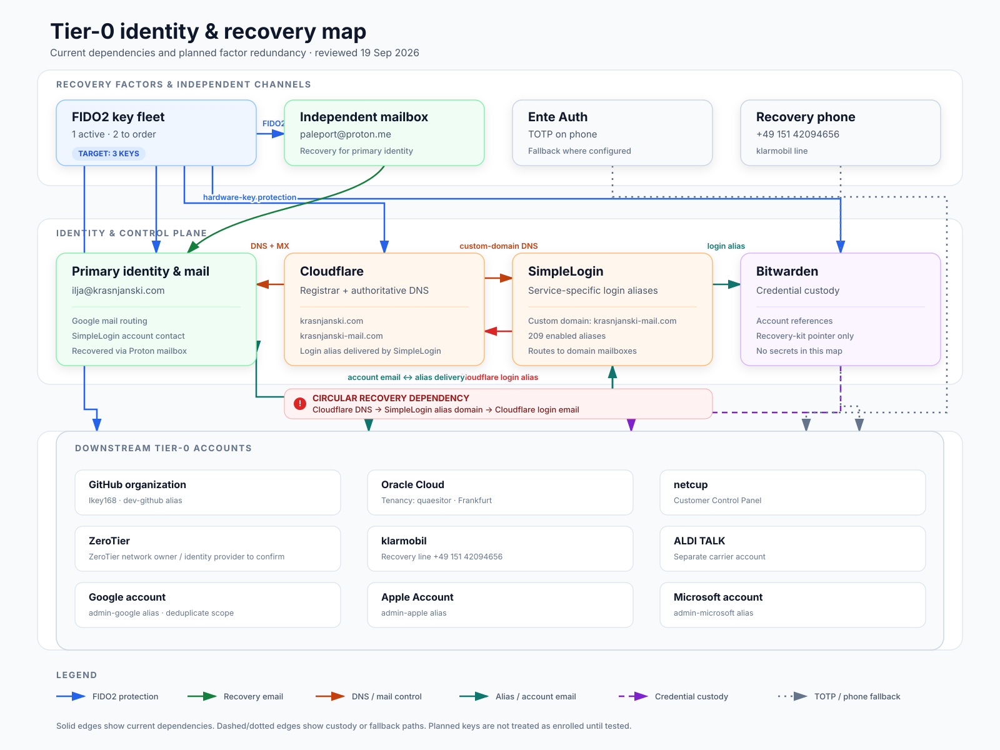

# Tier-0 identity and recovery map

Task: **04 · Maintain the identity and recovery dependency map**  
Project: Establish Identity Roots & Recovery  
Area: Security, Identity & Access  
Status: **Done**  
Last reviewed: 2026-09-19 (Europe/Berlin)

## What changed from the original sketch

- Separated recovery factors, identity/control systems, and downstream Tier-0 accounts into three layers.
- Added the confirmed current and planned FIDO2-key counts.
- Added Ente Auth as the phone-based TOTP factor.
- Added the confirmed klarmobil recovery number, `+4915142094656`.
- Distinguished FIDO2 protection, recovery email, DNS/mail control, alias delivery, credential custody, TOTP, and phone recovery.
- Made the Cloudflare–SimpleLogin circular dependency explicit.
- Kept current state and planned redundancy visibly distinct.

## Files

- Editable vector: `04-tier0-identity-recovery-map.svg`
- Portable preview: `04-tier0-identity-recovery-map.png`

No credentials, TOTP seeds, recovery codes, SIM PINs/PUKs, or security-key secrets are included.
